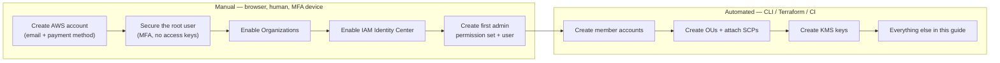

# Account Setup &amp; Service Enablement
{: .no_toc }

**Phase 2 — Foundation.** The manual, human, click-in-a-browser steps that must
happen before any automation can run. Plan these into a change window.
{: .fs-5 .fw-300 }

## On this page
{: .no_toc .text-delta }

1. TOC
{:toc}

---

## What cannot be automated, and why

Automation has a bootstrap problem: something must create the first identity that
the automation authenticates as. On AWS, that boundary looks like this:



Steps M1–M5 are one-time-per-organization. Everything to the right of them in
this guide is code.

## Step 1 — Create the AWS management account

{: .account }
> **Account creation step — browser required.**
>
> 1. Go to [https://portal.aws.amazon.com/billing/signup](https://portal.aws.amazon.com/billing/signup).
> 2. Use a **role-based email alias you control**, not a personal address —
>    e.g. `aws-root+management@yourcompany.com`. This address is the recovery
>    path for the most privileged identity you will ever have; it must survive
>    the departure of any individual.
> 3. Provide a payment method and complete identity verification (a phone/SMS
>    challenge). Verification can take a few minutes to a few hours.
> 4. Choose a support plan. **Business support or higher is a practical
>    prerequisite for CloudHSM**, because cluster and HSM issues are not
>    self-serviceable.

{: .warning }
> **This account will hold no workloads and no keys.** It exists to own the
> organization, consolidated billing, and service control policies. Resisting the
> temptation to build in it is the difference between a clean landing zone and a
> permanent mess.

## Step 2 — Lock down the root user

{: .account }
> **Portal step — do this immediately, before anything else.**
>
> 1. Sign in as root → **Security credentials**.
> 2. **Enable MFA.** Prefer a hardware FIDO2 security key. Register **two**
>    devices and store the backup in a safe — root MFA loss is a support-ticket
>    recovery process measured in days.
> 3. **Delete any root access keys.** There should be zero. Root should never
>    have programmatic credentials.
> 4. Set a strong, unique password in your password manager.
> 5. Set **alternate contacts** (Billing, Operations, Security) under **Account
>    settings** to team aliases.

Verify from the CLI later (this is one of the Config/Security Hub checks you will
automate in [Policy as Code]()):

```bash
# Should report AccountMFAEnabled = 1 and zero root access keys
aws iam get-account-summary \
  --query 'SummaryMap.{RootMFA:AccountMFAEnabled,RootKeys:AccountAccessKeysPresent}'
```

Expected output:

```json
{
    "RootMFA": 1,
    "RootKeys": 0
}
```

## Step 3 — Enable AWS Organizations

{: .account }
> **Portal step (first time only).** Console → **AWS Organizations** → **Create
> an organization** → choose **All features** (not "Consolidated billing only" —
> SCPs require all features).

Or, if you prefer the CLI from the root/admin session:

```bash
aws organizations create-organization --feature-set ALL

# Confirm
aws organizations describe-organization
```

### Create the organizational units

```bash
ROOT_ID=$(aws organizations list-roots --query 'Roots[0].Id' --output text)
echo "Organization root: $ROOT_ID"

for OU in Security Workloads Infrastructure Sandbox; do
  aws organizations create-organizational-unit \
    --parent-id "$ROOT_ID" \
    --name "$OU" \
    --query 'OrganizationalUnit.{Name:Name,Id:Id}' \
    --output table
done
```

### Create the member accounts

Account creation *is* automatable once the organization exists. Each account
needs a globally unique email address; the `+` sub-addressing trick works with
most mail providers.

```bash
create_account () {
  local NAME="$1" EMAIL="$2"
  aws organizations create-account \
    --account-name "$NAME" \
    --email "$EMAIL" \
    --role-name OrganizationAccountAccessRole \
    --iam-user-access-to-billing DENY \
    --query 'CreateAccountStatus.Id' --output text
}

REQ_SEC=$(create_account "Security"     "aws-root+security@yourcompany.com")
REQ_LOG=$(create_account "Log Archive"  "aws-root+logarchive@yourcompany.com")
REQ_PRD=$(create_account "Production"   "aws-root+prod@yourcompany.com")
REQ_DEV=$(create_account "Development"  "aws-root+dev@yourcompany.com")

# Account creation is asynchronous — poll until SUCCEEDED
for REQ in $REQ_SEC $REQ_LOG $REQ_PRD $REQ_DEV; do
  while true; do
    STATE=$(aws organizations describe-create-account-status \
      --create-account-request-id "$REQ" \
      --query 'CreateAccountStatus.State' --output text)
    echo "$REQ -> $STATE"
    [ "$STATE" = "SUCCEEDED" ] && break
    [ "$STATE" = "FAILED" ] && { \
      aws organizations describe-create-account-status \
        --create-account-request-id "$REQ"; exit 1; }
    sleep 10
  done
done
```

{: .note }
> `--role-name OrganizationAccountAccessRole` creates a role in the new account
> that the management account can assume. This is your break-glass path into a
> member account. Later, restrict who may assume it — by default any principal in
> the management account with `sts:AssumeRole` can.

### Move accounts into their OUs

```bash
ROOT_ID=$(aws organizations list-roots --query 'Roots[0].Id' --output text)

ou_id () {
  aws organizations list-organizational-units-for-parent --parent-id "$ROOT_ID" \
    --query "OrganizationalUnits[?Name=='$1'].Id" --output text
}
acct_id () {
  aws organizations list-accounts \
    --query "Accounts[?Name=='$1'].Id" --output text
}

aws organizations move-account --account-id "$(acct_id 'Security')" \
  --source-parent-id "$ROOT_ID" --destination-parent-id "$(ou_id Security)"
aws organizations move-account --account-id "$(acct_id 'Log Archive')" \
  --source-parent-id "$ROOT_ID" --destination-parent-id "$(ou_id Security)"
aws organizations move-account --account-id "$(acct_id 'Production')" \
  --source-parent-id "$ROOT_ID" --destination-parent-id "$(ou_id Workloads)"
aws organizations move-account --account-id "$(acct_id 'Development')" \
  --source-parent-id "$ROOT_ID" --destination-parent-id "$(ou_id Workloads)"
```

### Record the account IDs — you will need them constantly

```bash
aws organizations list-accounts \
  --query 'Accounts[].{Name:Name,Id:Id,Email:Email,Status:Status}' \
  --output table | tee ~/aws-account-inventory.txt
```

## Step 4 — Enable IAM Identity Center (SSO)

{: .account }
> **Portal step.** Console → **IAM Identity Center** → **Enable**. You must pick
> a Region for the Identity Center instance; it is **not** movable later, so
> choose your primary operating Region.
>
> Then choose an identity source:
> - **Identity Center directory** — built-in, fine for small teams and labs.
> - **External IdP (Okta, Entra ID, Ping)** via SAML 2.0 + SCIM — the right
>   answer for any real organization, because it makes joiner/mover/leaver
>   automatic.

### Create permission sets that reflect separation of duties

This is where the key-management separation of duties from
[Architecture]() becomes real. Create *at minimum*
these three:

```bash
SSO_INSTANCE=$(aws sso-admin list-instances \
  --query 'Instances[0].InstanceArn' --output text)
IDENTITY_STORE=$(aws sso-admin list-instances \
  --query 'Instances[0].IdentityStoreId' --output text)
echo "Instance: $SSO_INSTANCE"

# --- Permission set 1: Key Administrator (manages keys, CANNOT use them) ------
KEY_ADMIN_PS=$(aws sso-admin create-permission-set \
  --instance-arn "$SSO_INSTANCE" \
  --name "KeyAdministrator" \
  --description "Creates, tags, and lifecycle-manages KMS keys. Cannot decrypt." \
  --session-duration "PT4H" \
  --query 'PermissionSet.PermissionSetArn' --output text)

cat > /tmp/key-admin-inline.json <<'POLICY'
{
  "Version": "2012-10-17",
  "Statement": [
    {
      "Sid": "AdministerKeys",
      "Effect": "Allow",
      "Action": [
        "kms:CreateKey", "kms:CreateAlias", "kms:DeleteAlias", "kms:UpdateAlias",
        "kms:DescribeKey", "kms:List*", "kms:TagResource", "kms:UntagResource",
        "kms:EnableKey", "kms:DisableKey", "kms:PutKeyPolicy", "kms:GetKeyPolicy",
        "kms:EnableKeyRotation", "kms:DisableKeyRotation", "kms:GetKeyRotationStatus",
        "kms:ScheduleKeyDeletion", "kms:CancelKeyDeletion", "kms:ReplicateKey",
        "kms:UpdatePrimaryRegion", "kms:RotateKeyOnDemand"
      ],
      "Resource": "*"
    },
    {
      "Sid": "DenyCryptographicUse",
      "Effect": "Deny",
      "Action": [
        "kms:Encrypt", "kms:Decrypt", "kms:ReEncrypt*",
        "kms:GenerateDataKey*", "kms:Sign", "kms:Verify",
        "kms:GenerateMac", "kms:VerifyMac"
      ],
      "Resource": "*"
    }
  ]
}
POLICY

aws sso-admin put-inline-policy-to-permission-set \
  --instance-arn "$SSO_INSTANCE" \
  --permission-set-arn "$KEY_ADMIN_PS" \
  --inline-policy file:///tmp/key-admin-inline.json

# --- Permission set 2: Key Auditor (read + log access, no key material use) ---
KEY_AUDITOR_PS=$(aws sso-admin create-permission-set \
  --instance-arn "$SSO_INSTANCE" \
  --name "KeyAuditor" \
  --description "Read-only review of key configuration and usage logs." \
  --session-duration "PT4H" \
  --query 'PermissionSet.PermissionSetArn' --output text)

aws sso-admin attach-managed-policy-to-permission-set \
  --instance-arn "$SSO_INSTANCE" \
  --permission-set-arn "$KEY_AUDITOR_PS" \
  --managed-policy-arn "arn:aws:iam::aws:policy/SecurityAudit"

# --- Permission set 3: Break-glass administrator -----------------------------
BREAKGLASS_PS=$(aws sso-admin create-permission-set \
  --instance-arn "$SSO_INSTANCE" \
  --name "BreakGlassAdmin" \
  --description "Emergency full access. Alarmed on every use." \
  --session-duration "PT1H" \
  --query 'PermissionSet.PermissionSetArn' --output text)

aws sso-admin attach-managed-policy-to-permission-set \
  --instance-arn "$SSO_INSTANCE" \
  --permission-set-arn "$BREAKGLASS_PS" \
  --managed-policy-arn "arn:aws:iam::aws:policy/AdministratorAccess"
```

{: .important }
> **The `DenyCryptographicUse` statement is the whole point.** A key
> administrator who can also decrypt is not a separation of duties — it is one
> role with two names. An explicit `Deny` cannot be overridden by any key policy
> or grant, which is exactly the property you want. Auditors ask for this
> specifically under SOC 2 CC6.3 and PCI DSS 3.6.x.

### Assign permission sets to accounts

```bash
SEC_ACCOUNT=$(aws organizations list-accounts \
  --query "Accounts[?Name=='Security'].Id" --output text)

# Look up the group you created (or that SCIM synced) in the identity store
GROUP_ID=$(aws identitystore list-groups \
  --identity-store-id "$IDENTITY_STORE" \
  --filters "AttributePath=DisplayName,AttributeValue=key-administrators" \
  --query 'Groups[0].GroupId' --output text)

aws sso-admin create-account-assignment \
  --instance-arn "$SSO_INSTANCE" \
  --target-id "$SEC_ACCOUNT" \
  --target-type AWS_ACCOUNT \
  --permission-set-arn "$KEY_ADMIN_PS" \
  --principal-type GROUP \
  --principal-id "$GROUP_ID"
```

## Step 5 — Enable the supporting services

These are the services key management depends on. Enable them now so that every
key you create from here forward is logged and evaluated from birth.

### Organization CloudTrail

```bash
LOG_ACCOUNT=$(aws organizations list-accounts \
  --query "Accounts[?Name=='Log Archive'].Id" --output text)
TRAIL_BUCKET="org-cloudtrail-${LOG_ACCOUNT}"

# Run this in the Log Archive account
aws s3api create-bucket --bucket "$TRAIL_BUCKET" --region us-east-1
aws s3api put-bucket-versioning --bucket "$TRAIL_BUCKET" \
  --versioning-configuration Status=Enabled
aws s3api put-public-access-block --bucket "$TRAIL_BUCKET" \
  --public-access-block-configuration \
  "BlockPublicAcls=true,IgnorePublicAcls=true,BlockPublicPolicy=true,RestrictPublicBuckets=true"

# Object Lock in COMPLIANCE mode makes the audit trail immutable even to root.
# NOTE: Object Lock must be enabled at bucket creation with
#       --object-lock-enabled-for-bucket; see the Logging page for the full flow.
aws s3api put-object-lock-configuration --bucket "$TRAIL_BUCKET" \
  --object-lock-configuration \
  '{"ObjectLockEnabled":"Enabled","Rule":{"DefaultRetention":{"Mode":"COMPLIANCE","Days":2555}}}'
```

Then, from the **management account**, create the organization trail:

```bash
aws cloudtrail create-trail \
  --name org-management-trail \
  --s3-bucket-name "$TRAIL_BUCKET" \
  --is-organization-trail \
  --is-multi-region-trail \
  --enable-log-file-validation

aws cloudtrail start-logging --name org-management-trail
```

{: .note }
> `--enable-log-file-validation` produces signed digest files, letting you prove
> the log has not been altered. Combined with Object Lock, this is what turns
> CloudTrail from "logs" into "evidence." The full configuration, including the
> bucket policy CloudTrail requires, is in
> [Logging &amp; SIEM]().

### AWS Config (for the detective key controls)

```bash
aws configservice put-configuration-recorder \
  --configuration-recorder \
  'name=default,roleARN=arn:aws:iam::ACCOUNT_ID:role/aws-service-role/config.amazonaws.com/AWSServiceRoleForConfig,recordingGroup={allSupported=true,includeGlobalResourceTypes=true}'

aws configservice put-delivery-channel \
  --delivery-channel "name=default,s3BucketName=$TRAIL_BUCKET"

aws configservice start-configuration-recorder --configuration-recorder-name default
```

### Register the delegated administrator accounts

Delegating administration moves day-to-day security operations out of the
management account — which is exactly what you want, since the management account
should be nearly dormant.

```bash
SEC_ACCOUNT=$(aws organizations list-accounts \
  --query "Accounts[?Name=='Security'].Id" --output text)

for SVC in config.amazonaws.com \
           config-multiaccountsetup.amazonaws.com \
           securityhub.amazonaws.com \
           guardduty.amazonaws.com \
           access-analyzer.amazonaws.com; do
  aws organizations register-delegated-administrator \
    --account-id "$SEC_ACCOUNT" --service-principal "$SVC" \
    && echo "delegated: $SVC"
done
```

## Step 6 — Confirm quotas before you build

CloudHSM and KMS both have quotas that will stop a build cold. Check them now,
and open increase requests early — HSM quota increases are not instant.

```bash
# KMS: customer managed keys per Region (default 100,000)
aws service-quotas get-service-quota \
  --service-code kms --quota-code L-C1F76E1B \
  --query 'Quota.{Name:QuotaName,Value:Value,Adjustable:Adjustable}'

# KMS: cryptographic operations request rate (symmetric)
aws service-quotas list-service-quotas --service-code kms \
  --query 'Quotas[?contains(QuotaName,`request`)].{Name:QuotaName,Value:Value}' \
  --output table

# CloudHSM: HSMs per cluster / clusters per Region
aws service-quotas list-service-quotas --service-code cloudhsm \
  --query 'Quotas[].{Name:QuotaName,Value:Value,Adjustable:Adjustable}' \
  --output table
```

Request an increase where needed:

```bash
aws service-quotas request-service-quota-increase \
  --service-code cloudhsm \
  --quota-code L-7B5A2A0A \
  --desired-value 6
```

{: .warning }
> Quota codes differ per Region and change over time. Always resolve the code
> with `list-service-quotas` rather than hard-coding the value above.

## Foundation checklist

Do not proceed until every line is true.

| # | Check | Verify with |
|:--|:--|:--|
| 1 | Management account created, root MFA enabled, no root keys | `aws iam get-account-summary` |
| 2 | Organization created with **all features** | `aws organizations describe-organization` |
| 3 | Security, Log Archive, Prod, Dev accounts exist and are in OUs | `aws organizations list-accounts-for-parent` |
| 4 | IAM Identity Center enabled with an identity source | Console → IAM Identity Center |
| 5 | `KeyAdministrator` permission set exists **with the explicit Deny** | `aws sso-admin get-inline-policy-for-permission-set` |
| 6 | Organization CloudTrail is logging to an immutable bucket | `aws cloudtrail get-trail-status --name org-management-trail` |
| 7 | AWS Config recorder is running in the Security account | `aws configservice describe-configuration-recorder-status` |
| 8 | Quotas reviewed; increases requested if needed | `aws service-quotas list-service-quotas` |

---

[Next: Toolchain Setup](){: .btn .btn-primary }
