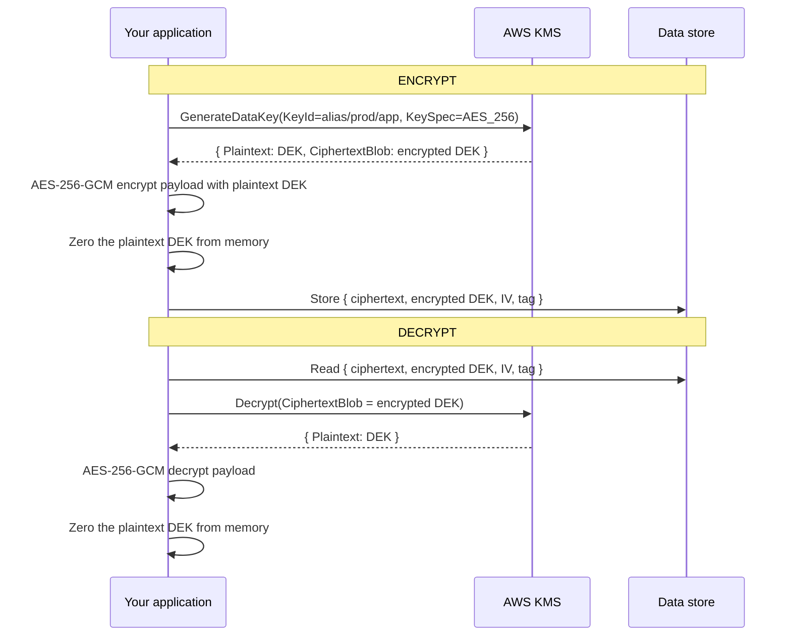
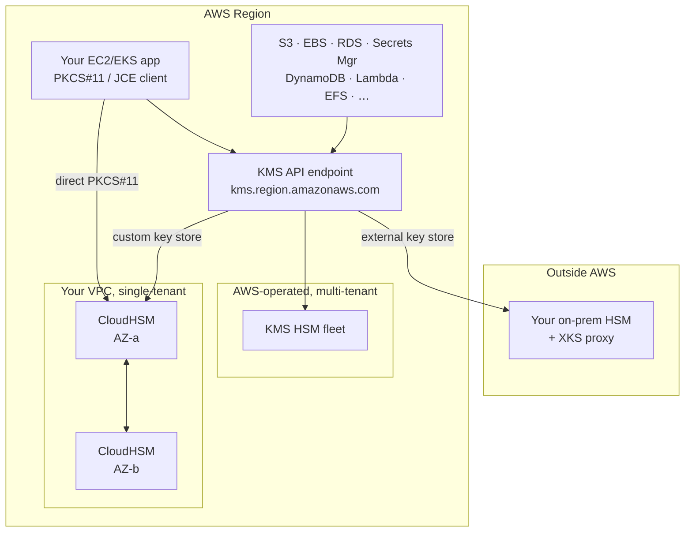
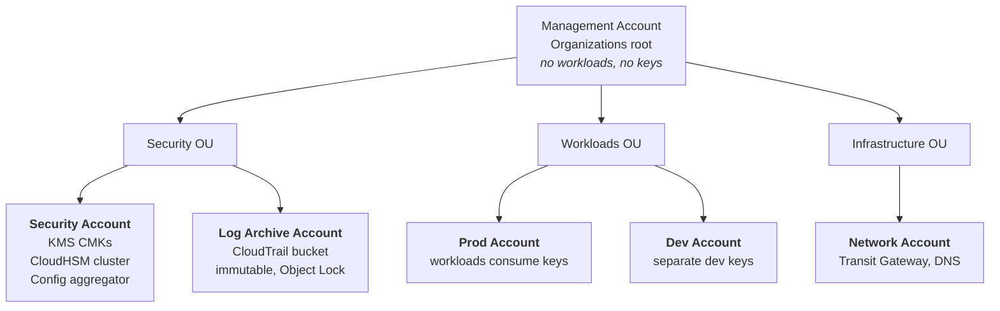

# Architecture &amp; Key Hierarchy
{: .no_toc }

**Phase 1 — Plan.** How KMS actually protects key material, why envelope
encryption exists, and the topology you are about to build.
{: .fs-5 .fw-300 }

## On this page
{: .no_toc .text-delta }

1. TOC
{:toc}

---

## The KMS root of trust

AWS KMS does not store your key material in a database it can read. Key material
lives inside FIPS 140-3 Level 3 validated hardware security modules, and is
protected by a chain of keys anchored in hardware.

```text
   ┌──────────────────────────────────────────────────────────────┐
   │                      AWS KMS HSM fleet                       │
   │            (FIPS 140-3 Level 3 validated hardware)           │
   │                                                              │
   │   Domain Key  ── quorum-controlled, per-Region, rotated      │
   │       │         by AWS operators in a witnessed ceremony     │
   │       │ wraps                                                │
   │       ▼                                                      │
   │   KMS Key (your CMK)  ── never leaves the HSM in plaintext   │
   │       │         Encrypt / Decrypt / GenerateDataKey / Sign   │
   │       │         all execute INSIDE this boundary             │
   └───────┼──────────────────────────────────────────────────────┘
           │ wraps (result crosses the boundary as ciphertext)
           ▼
   ┌──────────────────────────────────────────────────────────────┐
   │  Data Key (DEK)  ── AES-256, generated per object/volume/row │
   │       │          Plaintext copy used in your process memory  │
   │       │          Encrypted copy stored next to the data      │
   │       ▼ encrypts                                             │
   │  Your data                                                   │
   └──────────────────────────────────────────────────────────────┘
```

Three properties follow from this structure, and they are the reason the design
works:

1. **The CMK never leaves the HSM boundary in plaintext.** Not to AWS operators,
   not to you, not to a support engineer. There is no API that exports it.
2. **KMS only ever handles small payloads.** The `Encrypt` API is capped at
   4,096 bytes. This is deliberate: it forces envelope encryption for anything
   larger, which keeps bulk cryptography local and fast.
3. **Every use of the CMK is an API call**, which means every use is
   authorizable, rate-limited, and logged to CloudTrail. Bulk data encryption
   with the DEK happens in your process and is *not* logged — a distinction that
   matters enormously for forensics.

## Envelope encryption

This is the central pattern. Understand it once and every AWS encryption
integration becomes legible.



**Why not just call `Encrypt` on the data?** Three reasons: the 4 KB limit; the
network round-trip cost per byte; and the fact that KMS request throughput is
quota-limited per Region. Envelope encryption turns *N* bytes of data into a
single small KMS call plus local symmetric crypto at line rate.

{: .important }
> **The encrypted DEK must be stored with the ciphertext.** It is not secret —
> it is useless without the CMK — so store it in the same record, the same S3
> object metadata, or the same file header. Losing it is equivalent to losing the
> data. Every native AWS integration does exactly this for you.

### Encryption context — authenticated, logged metadata

`GenerateDataKey`, `Encrypt`, and `Decrypt` accept an **encryption context**: a
non-secret key/value map that is cryptographically bound to the ciphertext as
additional authenticated data (AAD).

```bash
aws kms generate-data-key \
  --key-id alias/prod/payments/pci-cardholder-data \
  --key-spec AES_256 \
  --encryption-context tenant=acme-corp,table=cardholders,purpose=at-rest
```

It does three jobs at once:

- **Integrity binding.** Decryption *fails* unless the exact same context is
  supplied. A ciphertext stolen from tenant A's row cannot be decrypted into
  tenant B's context, even by a principal allowed to use the key.
- **Authorization.** Key policies and grants can require specific context values
  via the `kms:EncryptionContext:<key>` condition key — so you can grant a
  principal decrypt rights *only* for its own tenant.
- **Auditability.** The context appears in the CloudTrail record, turning an
  opaque "someone called Decrypt" into "the reporting service decrypted
  acme-corp's cardholder table."

{: .tip }
> Use encryption context everywhere. It is free, it is the cheapest
> multi-tenancy safety net available, and it converts your CloudTrail from a
> volume metric into an actual forensic record.

## Where each service sits



Note the two distinct paths into CloudHSM. Through a **custom key store**, your
application talks ordinary KMS and never knows an HSM is involved. Through
**direct PKCS#11/JCE**, your application talks to the cluster itself and KMS is
not in the picture at all. You can do both against the same cluster, but the keys
are different objects.

## The account topology



| Account | Owns | Explicitly does *not* own |
|:--|:--|:--|
| Management | Organizations, SCPs, billing | Any key, any workload |
| Security | CMKs, CloudHSM cluster, key policies | Application data |
| Log Archive | CloudTrail bucket with Object Lock | Ability to decrypt workload data |
| Prod / Dev | Workloads that *use* keys | Ability to delete or re-policy keys |

{: .important }
> **The separation that matters:** workload accounts get `kms:Encrypt`,
> `kms:Decrypt`, `kms:GenerateDataKey*`, and `kms:DescribeKey`. They never get
> `kms:PutKeyPolicy`, `kms:ScheduleKeyDeletion`, `kms:DisableKey`, or
> `kms:CreateGrant` on their own keys. That single boundary means an attacker who
> fully owns the production account still cannot destroy your ability to recover
> the data — and cannot silently widen their own access.

## Key hierarchy for the reference build

```text
Security Account (us-east-1)
│
├── alias/prod/platform/s3-general ........ SYMMETRIC_DEFAULT, multi-Region
│      └── used by: workload S3 buckets (SSE-KMS), cross-account key policy
│
├── alias/prod/platform/ebs-default ....... SYMMETRIC_DEFAULT, single-Region
│      └── used by: EC2 EBS default encryption, EKS node volumes
│
├── alias/prod/data/rds-primary ........... SYMMETRIC_DEFAULT, multi-Region
│      └── used by: RDS storage encryption, automated snapshots, cross-Region DR
│
├── alias/prod/secrets/app-secrets ........ SYMMETRIC_DEFAULT, single-Region
│      └── used by: Secrets Manager, Parameter Store SecureString
│
├── alias/prod/payments/pci-chd ........... SYMMETRIC_DEFAULT, CUSTOM KEY STORE
│      └── used by: payment service envelope encryption (HSM-backed)
│      └── backed by: CloudHSM cluster-xxxxxxxx
│
├── alias/prod/signing/artifact-sign ...... ECC_NIST_P384, SIGN_VERIFY
│      └── used by: build pipeline artifact signing
│
└── alias/prod/integrity/token-mac ........ HMAC_256, GENERATE_VERIFY_MAC
       └── used by: session token integrity
```

This is deliberately **purpose-scoped**, not one-key-per-account and not
one-key-per-object. The right granularity is *one key per blast radius you want
to be able to sever independently*. If you would ever want to revoke access to
payments data without touching analytics data, they need different keys.

{: .warning }
> **Do not create a key per customer at scale without modeling the quota.** KMS
> has per-Region limits on both the number of keys and the request rate. A
> per-tenant key design with 50,000 tenants is a legitimate pattern, but it needs
> a quota increase, a caching strategy (the AWS Encryption SDK's caching CMM), and
> a plan for the `Decrypt` request storm on cold start. See
> [Cost Model]().

## What you are about to build, in order

| Step | Artifact | Page |
|:--|:--|:--|
| 1 | Organization, OUs, security account, IAM Identity Center | [Account Setup]() |
| 2 | CLI, Terraform, boto3, repo layout | [Toolchain]() |
| 3 | First CMK + alias, six ways | [Creating Keys]() |
| 4 | Least-privilege key policy + grants | [Key Policies]() |
| 5 | Envelope encryption in code | [Envelope Encryption]() |
| 6 | S3/EBS/RDS/Secrets Manager wired to CMKs | [Service Integrations]() |
| 7 | Rotation, BYOK import, multi-Region replicas | [Rotation]() |
| 8 | CloudHSM cluster + ceremony + custom key store | [CloudHSM]() |
| 9 | CloudTrail → Athena → SIEM | [Logging &amp; SIEM]() |
| 10 | SCPs, Config rules, CI policy gate | [Policy as Code]() |

---

[Next: Account Setup](){: .btn .btn-primary }
