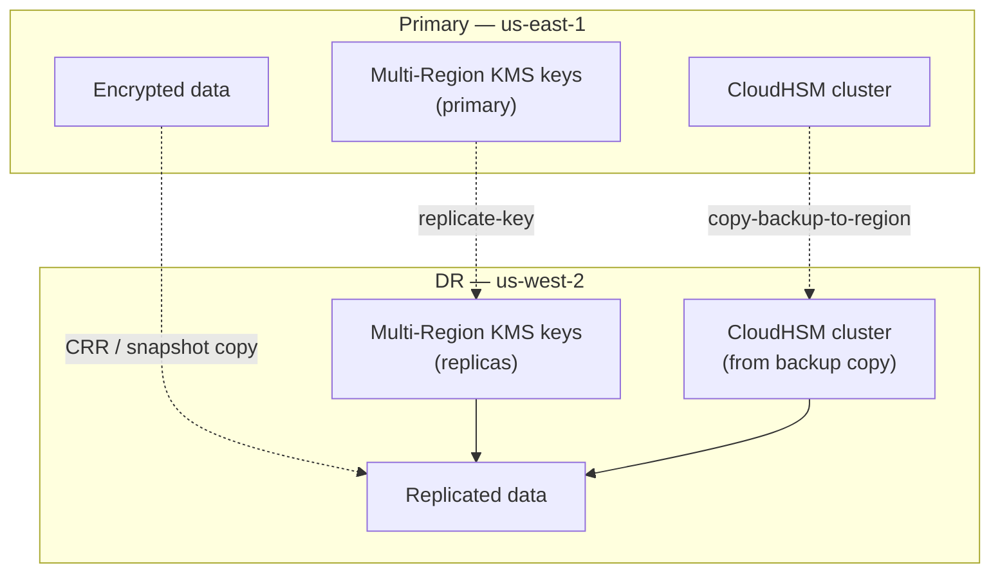
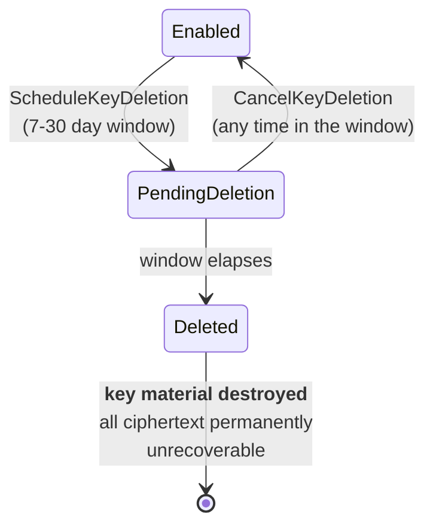

# Backup, Disaster Recovery &amp; Key Deletion
{: .no_toc }

**Phase 4 — Operate.** The asymmetry that defines key management: losing a key
loses the data, and there is no undo.
{: .fs-5 .fw-300 }

## On this page
{: .no_toc .text-delta }

1. TOC
{:toc}

---

## What can actually be backed up

| Asset | Backed up by | Your responsibility |
|:--|:--|:--|
| KMS key material | AWS, automatically and durably | Nothing — you cannot export it |
| KMS key **configuration** (policy, tags, aliases) | Nobody by default | **Export and version it** |
| CloudHSM key material | AWS, automatic cluster backups | Retention policy, cross-Region copies |
| CloudHSM trust anchor (`customerCA.key`) | Nobody | **Offline escrow** |
| Imported (BYOK) key material | Nobody — AWS holds a copy but you cannot retrieve it | **You hold the master copy** |
| XKS key material | Your HSM's backup regime | Everything |

{: .important }
> **For standard KMS keys there is no "key backup" and you do not need one.** AWS
> stores multiple durable copies of key material across facilities in the Region.
> What you *do* need to back up is the **configuration** — because a key policy
> deleted by a bad Terraform apply is just as much an outage as a lost key, and
> that one *is* your fault.

## Backing up KMS configuration

```bash
#!/usr/bin/env bash
# scripts/backup_kms_config.sh — export every key's full configuration
set -euo pipefail

REGIONS="${REGIONS:-us-east-1 us-west-2 eu-west-1}"
STAMP="$(date -u +%Y%m%dT%H%M%SZ)"
OUTDIR="kms-config-backup-${STAMP}"
mkdir -p "$OUTDIR"

for REGION in $REGIONS; do
  echo "== $REGION =="
  mkdir -p "$OUTDIR/$REGION"

  for KEY in $(aws kms list-keys --region "$REGION" --query 'Keys[].KeyId' --output text); do
    META=$(aws kms describe-key --region "$REGION" --key-id "$KEY" --output json 2>/dev/null) || continue
    [ "$(jq -r '.KeyMetadata.KeyManager' <<<"$META")" = "CUSTOMER" ] || continue

    ALIAS=$(aws kms list-aliases --region "$REGION" --key-id "$KEY" \
      --query 'Aliases[0].AliasName' --output text 2>/dev/null | sed 's|/|_|g')
    [ "$ALIAS" = "None" ] && ALIAS="key_$KEY"

    jq -n \
      --argjson metadata "$META" \
      --argjson policy "$(aws kms get-key-policy --region "$REGION" --key-id "$KEY" \
                            --policy-name default --query Policy --output text)" \
      --argjson aliases "$(aws kms list-aliases --region "$REGION" --key-id "$KEY" --output json)" \
      --argjson grants "$(aws kms list-grants --region "$REGION" --key-id "$KEY" --output json)" \
      --argjson tags "$(aws kms list-resource-tags --region "$REGION" --key-id "$KEY" --output json)" \
      --argjson rotation "$(aws kms get-key-rotation-status --region "$REGION" --key-id "$KEY" --output json 2>/dev/null || echo '{}')" \
      '{metadata: $metadata, policy: $policy, aliases: $aliases,
        grants: $grants, tags: $tags, rotation: $rotation}' \
      > "$OUTDIR/$REGION/${ALIAS}.json"

    echo "  saved $ALIAS"
  done
done

tar czf "${OUTDIR}.tar.gz" "$OUTDIR" && rm -rf "$OUTDIR"

aws s3 cp "${OUTDIR}.tar.gz" \
  "s3://keymgmt-artifacts-111122223333/kms-config-backups/${OUTDIR}.tar.gz" \
  --sse aws:kms --sse-kms-key-id alias/prod/platform/s3-general

echo "Backup: ${OUTDIR}.tar.gz"
```

Schedule it daily with EventBridge, and keep 90 days. When someone asks "what was
this key policy before the change?", you have the answer.

## CloudHSM backups

CloudHSM takes automatic backups of the whole cluster — every key, user, and
configuration object — on a schedule and after configuration changes.

```bash
aws cloudhsmv2 describe-backups \
  --filters clusterIds="$CLUSTER_ID" \
  --query 'Backups[].{Id:BackupId,State:BackupState,Created:CreateTimestamp,Copy:SourceCluster}' \
  --output table
```

```text
------------------------------------------------------------------------
|                           DescribeBackups                            |
+---------------------------+-------------+--------------------------+
|            Id             |    State    |         Created          |
+---------------------------+-------------+--------------------------+
|  backup-abcdefghijklmnop  |  READY      |  2026-08-18T03:14:22Z    |
|  backup-qrstuvwxyz123456  |  READY      |  2026-08-17T03:12:08Z    |
+---------------------------+-------------+--------------------------+
```

### Set the retention policy

```bash
aws cloudhsmv2 modify-backup-attributes \
  --backup-id backup-abcdefghijklmnop \
  --never-expires          # pin a known-good backup indefinitely

# Cluster-wide retention (7-379 days)
aws cloudhsmv2 modify-cluster \
  --cluster-id "$CLUSTER_ID" \
  --hsm-type hsm2m.medium
```

{: .tip }
> **Pin one known-good backup with `--never-expires` after every major change** —
> after the initialization ceremony, after creating production keys, after a
> user-management change. Rolling retention protects you from last week's
> mistake; a pinned backup protects you from a mistake you do not notice for a
> year.

### Copy backups cross-Region for DR

```bash
DEST_REGION=us-west-2

COPY=$(aws cloudhsmv2 copy-backup-to-region \
  --destination-region "$DEST_REGION" \
  --backup-id backup-abcdefghijklmnop \
  --tag-list Key=Purpose,Value=dr Key=SourceCluster,Value="$CLUSTER_ID" \
  --query 'DestinationBackup.BackupId' --output text)

aws cloudhsmv2 describe-backups --region "$DEST_REGION" \
  --filters backupIds="$COPY" \
  --query 'Backups[0].{Id:BackupId,State:BackupState,Source:SourceBackup}'
```

### Restore into a new cluster

```bash
NEW_CLUSTER=$(aws cloudhsmv2 create-cluster \
  --region "$DEST_REGION" \
  --hsm-type hsm2m.medium \
  --mode FIPS \
  --subnet-ids subnet-dr-a subnet-dr-b subnet-dr-c \
  --source-backup-id "$COPY" \
  --tag-list Key=Name,Value=dr-keymgmt-cluster \
  --query 'Cluster.ClusterId' --output text)

aws cloudhsmv2 create-hsm --region "$DEST_REGION" \
  --cluster-id "$NEW_CLUSTER" --availability-zone "${DEST_REGION}a"
```

{: .important }
> **A cluster restored from backup keeps the original's trust anchor, users,
> passwords, and keys.** It is a genuine clone — which is exactly what you want
> for DR, and exactly why backup access must be controlled as tightly as the
> cluster itself. Anyone who can restore your backup into their own account and
> knows a crypto-user password has your keys.

```json
{
  "Version": "2012-10-17",
  "Statement": [{
    "Sid": "DenyBackupSharingOutsideOrg",
    "Effect": "Deny",
    "Action": [
      "cloudhsm:CopyBackupToRegion",
      "cloudhsm:RestoreBackup",
      "cloudhsm:ModifyBackupAttributes",
      "cloudhsm:DeleteBackup"
    ],
    "Resource": "*",
    "Condition": {
      "StringNotEquals": { "aws:PrincipalOrgID": "o-exampleorgid" }
    }
  }]
}
```

## Disaster recovery design



### The DR matrix

| Failure | Impact on keys | Recovery |
|:--|:--|:--|
| One AZ lost | None — KMS is Regional; CloudHSM survives on the other HSM | Automatic; add an HSM in a third AZ |
| One HSM fails | Cluster degraded, still serving | `create-hsm` to replace; keys sync automatically |
| **All** HSMs in a cluster lost | Custom key store keys unusable | Restore a backup into a new cluster; reconnect the store |
| Region lost | Single-Region keys unreachable | Multi-Region replicas serve DR; single-Region keys do not |
| Custom key store disconnected | All its keys unusable | Fix the cause, `connect-custom-key-store` (~20 min) |
| XKS proxy down | All XKS keys unusable | Restore the proxy; no KMS-side mitigation |
| Key accidentally scheduled for deletion | None yet | `cancel-key-deletion` within the window |
| **Key deletion completes** | **Data permanently unrecoverable** | **None** |

### The RPO/RTO conversation

| Component | RPO | RTO | Driver |
|:--|:--|:--|:--|
| Multi-Region KMS key | 0 | 0 | Replicas serve continuously |
| Single-Region KMS key | n/a | ∞ in another Region | Cannot be replicated after creation |
| CloudHSM cluster | Up to 24 h | 1–2 h | Backup cadence + cluster build time |
| Custom key store | 0 | ~20 min | Reconnect time |
| XKS | 0 | Your proxy's RTO | Entirely yours |

{: .warning }
> **A DR plan that has never been exercised is a document, not a plan.** Once a
> year, in a DR account: restore a CloudHSM backup into a new Region, stand up
> the cluster, connect a custom key store to it, and decrypt a canary ciphertext
> produced by the primary. Record how long it took. That number is your real RTO,
> and it is usually longer than the one in the runbook.

## Key deletion — the irreversible operation



### The safe deletion procedure

```bash
KEY_ARN="arn:aws:kms:us-east-1:111122223333:key/1234abcd-…"

# --- Step 1: prove nothing has used it recently ------------------------------
# Athena over CloudTrail; see the Logging & SIEM section for table setup.
cat <<'SQL'
SELECT eventname,
       useridentity.arn AS principal,
       count(*)         AS calls,
       max(eventtime)   AS last_seen
FROM   cloudtrail_logs
WHERE  eventsource = 'kms.amazonaws.com'
  AND  element_at(resources, 1).arn = '<KEY_ARN>'
  AND  eventtime > date_format(current_date - interval '90' day, '%Y-%m-%dT%H:%i:%sZ')
GROUP  BY 1, 2
ORDER  BY calls DESC;
SQL

# --- Step 2: find resources still configured with it -------------------------
aws resourcegroupstaggingapi get-resources \
  --tag-filters "Key=kms:key,Values=$KEY_ARN" 2>/dev/null

aws s3api list-buckets --query 'Buckets[].Name' --output text | tr '\t' '\n' \
  | while read -r B; do
      ENC=$(aws s3api get-bucket-encryption --bucket "$B" 2>/dev/null \
        | jq -r '.ServerSideEncryptionConfiguration.Rules[0].ApplyServerSideEncryptionByDefault.KMSMasterKeyID // empty')
      [ "$ENC" = "$KEY_ARN" ] && echo "S3 bucket still using key: $B"
    done

# --- Step 3: check for live grants -------------------------------------------
aws kms list-grants --key-id "$KEY_ARN" --query 'length(Grants)'

# --- Step 4: DISABLE and soak (30 days minimum) ------------------------------
aws kms disable-key --key-id "$KEY_ARN"

# --- Step 5: schedule deletion with the maximum window -----------------------
aws kms schedule-key-deletion --key-id "$KEY_ARN" --pending-window-in-days 30
```

```json
{
    "KeyId": "arn:aws:kms:us-east-1:111122223333:key/1234abcd-…",
    "DeletionDate": "2026-09-17T00:00:00-04:00",
    "KeyState": "PendingDeletion",
    "PendingWindowInDays": 30
}
```

```bash
# Cancel if anything surfaces
aws kms cancel-key-deletion --key-id "$KEY_ARN"
aws kms enable-key --key-id "$KEY_ARN"   # cancel leaves it disabled
```

{: .important }
> **`cancel-key-deletion` leaves the key `Disabled`, not `Enabled`.** People
> cancel a deletion, breathe out, and forget the second command — then spend an
> hour debugging why decryption still fails. Always follow a cancel with an
> `enable-key` and a round-trip test.

### Alarm on every deletion request

```bash
aws events put-rule \
  --name kms-key-deletion-scheduled \
  --description "Fires when any KMS key is scheduled for deletion" \
  --event-pattern '{
    "source": ["aws.kms"],
    "detail-type": ["AWS API Call via CloudTrail"],
    "detail": {
      "eventSource": ["kms.amazonaws.com"],
      "eventName": ["ScheduleKeyDeletion", "DisableKey",
                    "DeleteImportedKeyMaterial", "DeleteCustomKeyStore"]
    }
  }'

aws events put-targets --rule kms-key-deletion-scheduled \
  --targets "Id=1,Arn=arn:aws:sns:us-east-1:111122223333:keymgmt-critical"
```

### Deletion of a multi-Region key

```bash
# Replicas must be deleted first; the primary refuses while replicas exist
aws kms schedule-key-deletion --region us-west-2 \
  --key-id "$REPLICA_ARN" --pending-window-in-days 30

# Only after every replica is gone
aws kms schedule-key-deletion --region us-east-1 \
  --key-id "$PRIMARY_ARN" --pending-window-in-days 30
```

## The deletion checklist

Require every line to be signed off before scheduling deletion of a production
key. This is the highest-consequence, lowest-frequency operation in the whole
system, which is exactly the combination that produces mistakes.

| # | Check | Evidence |
|:--|:--|:--|
| 1 | Zero KMS API calls against the key in 90 days | Athena query output |
| 2 | No S3 bucket, EBS volume, RDS instance, or secret references it | Inventory scan |
| 3 | No live grants | `list-grants` returns 0 |
| 4 | Key disabled for ≥ 30 days with no incident | CloudTrail + change record |
| 5 | Data owner has confirmed in writing that the data is expendable or already re-encrypted | Ticket |
| 6 | Configuration backup exists | S3 object |
| 7 | Deletion window set to 30 days | `schedule-key-deletion` output |
| 8 | Alarm configured so the team is notified | EventBridge rule |
| 9 | Calendar reminder for the deletion date | Calendar |

{: .warning }
> **There is no support ticket that recovers a deleted KMS key.** Not for
> enterprise support, not for a large customer, not for a regulator. The key
> material is destroyed. This checklist exists because the failure mode is
> unrecoverable and the operation takes ten seconds.

---

[Next: 10. Logging &amp; SIEM](){: .btn .btn-primary }
