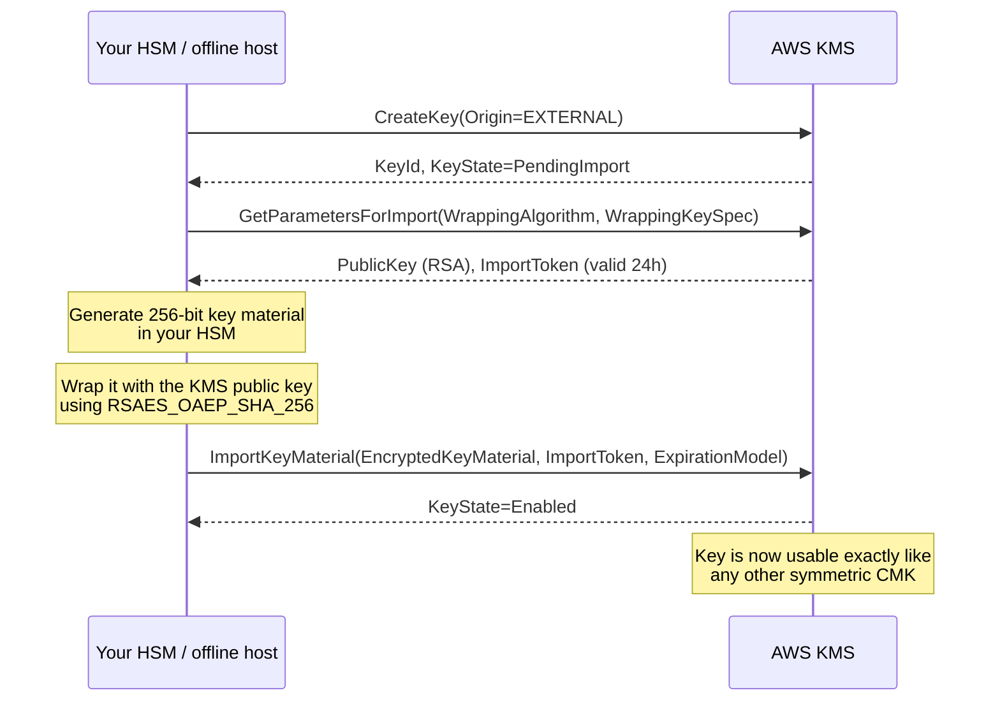

# Importing Your Own Key Material (BYOK)
{: .no_toc }

When the requirement is "we generate the key, AWS only holds it," you import
key material into a KMS key with `Origin=EXTERNAL`.
{: .fs-5 .fw-300 }

## On this page
{: .no_toc .text-delta }

1. TOC
{:toc}

---

## Why and why not

| Reason to import | Reason not to |
|:--|:--|
| Regulator or contract requires you to generate key material | You become responsible for secure generation, storage, and backup |
| You must hold a copy outside AWS for escrow or exit | **Automatic rotation is unavailable** |
| The same key must exist in AWS and on-premises | Material can expire, and expiry makes data undecryptable |
| Provable key provenance from your own HSM | Re-import after deletion requires you to still have the original |

{: .warning }
> **Importing key material makes *you* the single point of failure.** If your
> copy is lost and AWS's copy is deleted (expiry, `DeleteImportedKeyMaterial`, or
> a Region-wide event), the data is unrecoverable — permanently, by design. AWS
> cannot help. Before importing anything, write down where the master copy lives,
> who can reach it, how it is backed up, and how that backup is tested.

## The import flow



## Step 1 — Create the key shell

```bash
KEY_ARN=$(aws kms create-key \
  --origin EXTERNAL \
  --key-spec SYMMETRIC_DEFAULT \
  --key-usage ENCRYPT_DECRYPT \
  --description "BYOK key — material generated in on-prem Luna HSM" \
  --tags TagKey=Environment,TagValue=prod \
         TagKey=DataClass,TagValue=restricted \
         TagKey=Origin,TagValue=external-hsm \
         TagKey=ManagedBy,TagValue=byok-ceremony \
  --query 'KeyMetadata.Arn' --output text)

KEY_ID="${KEY_ARN##*/}"

aws kms describe-key --key-id "$KEY_ARN" \
  --query 'KeyMetadata.{State:KeyState,Origin:Origin,Expiration:ExpirationModel}'
```

```json
{
    "State": "PendingImport",
    "Origin": "EXTERNAL",
    "Expiration": null
}
```

```bash
aws kms create-alias --alias-name alias/prod/byok/hsm-generated \
  --target-key-id "$KEY_ARN"
```

## Step 2 — Get the wrapping public key and import token

```bash
aws kms get-parameters-for-import \
  --key-id "$KEY_ARN" \
  --wrapping-algorithm RSAES_OAEP_SHA_256 \
  --wrapping-key-spec RSA_4096 \
  --output json > /tmp/import-params.json

jq -r '.PublicKey'   /tmp/import-params.json | base64 -d > /tmp/wrapping-public.bin
jq -r '.ImportToken' /tmp/import-params.json | base64 -d > /tmp/import-token.bin

jq -r '{ParametersValidTo, KeyId}' /tmp/import-params.json
```

```json
{
  "ParametersValidTo": "2026-08-19T14:22:31.000000-04:00",
  "KeyId": "arn:aws:kms:us-east-1:111122223333:key/1234abcd-…"
}
```

| Wrapping algorithm | Notes |
|:--|:--|
| `RSAES_OAEP_SHA_256` | The standard choice for direct wrapping |
| `RSAES_OAEP_SHA_1` | Legacy; avoid unless your HSM cannot do SHA-256 |
| `RSA_AES_KEY_WRAP_SHA_256` | Two-step wrap; required for key material larger than the RSA modulus can carry, and for RSA/ECC private key import |
| `SM2PKE` | China Regions |

{: .important }
> **The import token and public key expire 24 hours after issue.** If the
> ceremony slips past that window, you must call `get-parameters-for-import`
> again and re-wrap. Do not schedule a multi-day key ceremony around a one-day
> token.

Convert the public key to PEM for use with OpenSSL:

```bash
openssl rsa -pubin -inform DER -in /tmp/wrapping-public.bin \
  -outform PEM -out /tmp/wrapping-public.pem

openssl rsa -pubin -in /tmp/wrapping-public.pem -text -noout | head -3
```

## Step 3 — Generate and wrap the key material

{: .account }
> **Ceremony step — perform this on an offline, hardened host or inside your
> HSM.** Two authorized custodians should be present, the session should be
> recorded in a ceremony log, and the plaintext key material must never touch
> shared storage, a terminal scrollback buffer that is retained, or a network
> filesystem.

### Option A — generate with OpenSSL (lab / non-production)

```bash
# 256 bits of key material from the OS CSPRNG
openssl rand -out /tmp/plaintext-key-material.bin 32

# Wrap it with the KMS public key
openssl pkeyutl -encrypt \
  -in /tmp/plaintext-key-material.bin \
  -out /tmp/wrapped-key-material.bin \
  -inkey /tmp/wrapping-public.pem \
  -keyform PEM -pubin \
  -pkeyopt rsa_padding_mode:oaep \
  -pkeyopt rsa_oaep_md:sha256 \
  -pkeyopt rsa_mgf1_md:sha256

ls -l /tmp/wrapped-key-material.bin     # 512 bytes for RSA_4096
```

### Option B — generate inside a Thales Luna HSM (production)

```bash
# Generate a non-extractable-by-default AES-256 key in the HSM partition,
# then wrap it for export under the KMS public key.
#
# 1. Import the KMS wrapping public key into the partition
cmu import -inputFile=/tmp/wrapping-public.pem -label=aws-kms-wrapping-key \
  -keyType=RSA -PKCS8

# 2. Generate the key material (CKA_EXTRACTABLE must be true to wrap it out)
cmu generatekey -keyType=AES -keySize=32 -label=aws-byok-2026-08 \
  -extractable=1 -sensitive=1 -modifiable=0

# 3. Wrap under the KMS public key with OAEP-SHA256
cmu wrapkey -handle=<AES_HANDLE> -wrappingHandle=<KMS_PUBKEY_HANDLE> \
  -mech=CKM_RSA_PKCS_OAEP -hashAlg=SHA256 -mgf=MGF1_SHA256 \
  -outputFile=/tmp/wrapped-key-material.bin
```

{: .note }
> Exact `cmu`/`ckdemo` syntax varies by Luna firmware and client version, and the
> equivalent commands differ for Entrust nShield (`generatekey`, `rocs`),
> Utimaco, and Azure/GCP-side tooling. Treat the block above as the shape of the
> operation, and follow your HSM vendor's current BYOK guide for the exact
> invocation. The invariant across all of them: **OAEP with SHA-256 and MGF1-SHA-256,
> wrapping under the KMS-supplied RSA public key.**

## Step 4 — Import

```bash
aws kms import-key-material \
  --key-id "$KEY_ARN" \
  --encrypted-key-material fileb:///tmp/wrapped-key-material.bin \
  --import-token fileb:///tmp/import-token.bin \
  --expiration-model KEY_MATERIAL_DOES_NOT_EXPIRE

aws kms describe-key --key-id "$KEY_ARN" \
  --query 'KeyMetadata.{State:KeyState,Origin:Origin,Expiration:ExpirationModel,ValidTo:ValidTo}'
```

```json
{
    "State": "Enabled",
    "Origin": "EXTERNAL",
    "Expiration": "KEY_MATERIAL_DOES_NOT_EXPIRE",
    "ValidTo": null
}
```

### Expiration model — choose deliberately

```bash
# Material expires; KMS deletes it automatically at ValidTo
aws kms import-key-material \
  --key-id "$KEY_ARN" \
  --encrypted-key-material fileb:///tmp/wrapped-key-material.bin \
  --import-token fileb:///tmp/import-token.bin \
  --expiration-model KEY_MATERIAL_EXPIRES \
  --valid-to 2027-08-18T00:00:00Z
```

| Model | Behavior | Use when |
|:--|:--|:--|
| `KEY_MATERIAL_DOES_NOT_EXPIRE` | Material persists until you delete it | Default for durable data-at-rest keys |
| `KEY_MATERIAL_EXPIRES` | KMS deletes the material at `ValidTo`; key goes to `PendingImport` | A hard cryptoperiod requirement, or a deliberate dead-man's switch |

{: .warning }
> **`KEY_MATERIAL_EXPIRES` is a scheduled outage unless you automate the
> re-import.** At `ValidTo`, every decrypt against the key fails with
> `KMSInvalidStateException` until you repeat the whole ceremony. If you choose
> it, build the alarm (see [Monitoring]()) *and* the
> runbook before you import — not after the first expiry.

## Clean up the ceremony material

```bash
# Overwrite before unlinking — a plain rm leaves the blocks readable
shred -vfzu -n 3 /tmp/plaintext-key-material.bin
rm -f /tmp/wrapped-key-material.bin /tmp/import-token.bin \
      /tmp/wrapping-public.bin /tmp/wrapping-public.pem /tmp/import-params.json

# Verify nothing is left
ls -l /tmp/*key-material* /tmp/import-* 2>/dev/null || echo "ceremony material removed"
```

{: .important }
> **`shred` is unreliable on modern storage.** Copy-on-write filesystems (btrfs,
> ZFS), SSD wear-levelling, and journaling all defeat overwrite-in-place. The
> real control is: generate the material on a host with an encrypted ephemeral
> volume, or in a RAM disk (`tmpfs`), that is destroyed when the ceremony ends.
> Record the destruction in the ceremony log.

## Deleting and re-importing material

Deleting imported material is the fastest reversible "off switch" in KMS — faster
and more complete than disabling the key.

```bash
# Make the key unusable immediately, without deleting the key resource
aws kms delete-imported-key-material --key-id "$KEY_ARN"

aws kms describe-key --key-id "$KEY_ARN" --query 'KeyMetadata.KeyState'
# -> "PendingImport"

# Restore by repeating steps 2-4 with the SAME original key material.
# A NEW import token is required; the material itself must be byte-identical.
```

{: .tip }
> This is a legitimate emergency control: it renders every ciphertext under the
> key undecryptable within seconds, worldwide, and is fully reversible **provided
> you still hold the original material.** Some organizations deliberately keep an
> imported key for exactly this property — a cryptographic kill switch for a
> jurisdiction or a tenant. If you build one, test the restore path on a schedule.

## Terraform

```hcl
resource "aws_kms_external_key" "byok" {
  description             = "BYOK key — material generated in on-prem Luna HSM"
  deletion_window_in_days = 30
  enabled                 = true

  # Terraform can pass the wrapped material, but doing so puts it in state.
  # Prefer importing out-of-band and letting Terraform manage only the shell.
  # key_material_base64 = var.wrapped_key_material   # <-- avoid

  policy = data.aws_iam_policy_document.byok.json

  tags = {
    Environment = "prod"
    DataClass   = "restricted"
    Origin      = "external-hsm"
    ManagedBy   = "terraform"
  }

  lifecycle {
    prevent_destroy = true
    ignore_changes  = [key_material_base64, valid_to]
  }
}

resource "aws_kms_alias" "byok" {
  name          = "alias/prod/byok/hsm-generated"
  target_key_id = aws_kms_external_key.byok.key_id
}
```

{: .warning }
> **Never put key material in Terraform state.** `key_material_base64` is
> persisted to the state file in plaintext. Even with an encrypted S3 backend,
> that widens the set of people who can reach your key material to everyone with
> state access — usually the entire platform team plus CI. Run the import
> ceremony out-of-band and use `ignore_changes` so Terraform manages the key
> resource without ever seeing the material.

## BYOK checklist

| # | Check | Evidence |
|:--|:--|:--|
| 1 | Key material generated in a FIPS-validated HSM, not a laptop | HSM audit log |
| 2 | Two custodians present; ceremony log signed | Ceremony record |
| 3 | Wrapping used OAEP-SHA-256 with the KMS-supplied public key | Command transcript |
| 4 | Master copy backed up to a second HSM / escrow | Backup attestation |
| 5 | Backup restore tested within the last 12 months | Test record |
| 6 | Expiration model chosen and documented | `describe-key` output |
| 7 | Alarm on `ValidTo` approaching, if material expires | CloudWatch alarm ARN |
| 8 | Plaintext material destroyed; destruction witnessed | Ceremony record |
| 9 | Terraform state contains no key material | `terraform state pull \| grep -c key_material` = 0 |

---

[Next: 7.5 Multi-Region Keys](){: .btn .btn-primary }
