# CI/CD Automation with GitHub Actions
{: .no_toc }

**Phase 7 — Govern.** Key infrastructure that changes only through a reviewed,
scanned, logged pipeline — authenticated with OIDC, so there are no long-lived
AWS credentials anywhere.
{: .fs-5 .fw-300 }

## On this page
{: .no_toc .text-delta }

1. TOC
{:toc}

---

## The pipeline

```mermaid
flowchart LR
    PR["Pull request"] --> FMT["terraform fmt<br/>terraform validate"]
    FMT --> SCAN["Checkov +<br/>Conftest/OPA"]
    SCAN --> PLAN["terraform plan"]
    PLAN --> POLICY["Policy gate on<br/>the plan JSON"]
    POLICY --> COMMENT["Plan posted<br/>as a PR comment"]
    COMMENT --> REVIEW["Human review<br/>+ CODEOWNERS approval"]
    REVIEW --> MERGE["Merge to main"]
    MERGE --> APPLY["terraform apply<br/>(environment gate)"]
    APPLY --> VERIFY["Post-apply<br/>canary + inventory"]
```



## OIDC federation — no stored credentials

GitHub Actions can exchange a short-lived OIDC token for AWS credentials. This
removes the single worst practice in cloud CI: a long-lived access key in a
repository secret.

### Register GitHub as an identity provider

```bash
export AWS_PROFILE=keyadmin
ACCOUNT_ID=$(aws sts get-caller-identity --query Account --output text)

aws iam create-open-id-connect-provider \
  --url "https://token.actions.githubusercontent.com" \
  --client-id-list "sts.amazonaws.com" \
  --thumbprint-list "6938fd4d98bab03faadb97b34396831e3780aea1"

aws iam list-open-id-connect-providers
```

{: .note }
> AWS now validates the GitHub OIDC endpoint against its own trust store, so the
> thumbprint is effectively vestigial — but the API still requires the parameter.
> If you see thumbprint-rotation advice in older documentation, it no longer
> applies to this provider.

### The deployment role

```bash
cat > /tmp/github-trust-policy.json <<TRUST
{
  "Version": "2012-10-17",
  "Statement": [{
    "Effect": "Allow",
    "Principal": {
      "Federated": "arn:aws:iam::${ACCOUNT_ID}:oidc-provider/token.actions.githubusercontent.com"
    },
    "Action": "sts:AssumeRoleWithWebIdentity",
    "Condition": {
      "StringEquals": {
        "token.actions.githubusercontent.com:aud": "sts.amazonaws.com"
      },
      "StringLike": {
        "token.actions.githubusercontent.com:sub":
          "repo:steven-smith-itnet/aws-key-management:ref:refs/heads/main"
      }
    }
  }]
}
TRUST

aws iam create-role \
  --role-name github-actions-keymgmt \
  --description "GitHub Actions deployment role for key management infrastructure" \
  --assume-role-policy-document file:///tmp/github-trust-policy.json \
  --max-session-duration 3600
```

{: .warning }
> **The `sub` condition is the entire security boundary.** A trust policy with
> `"token.actions.githubusercontent.com:sub": "repo:MyOrg/*"` — or worse, no
> `sub` condition at all — lets **any** workflow in **any** matching repository
> assume the role, including a pull request from a fork. Pin it to the exact
> repository *and* the exact ref. Use a separate, read-only role for pull
> requests (`ref:refs/heads/*` or `pull_request`), and reserve the write role for
> `refs/heads/main`.

### Two roles: plan and apply

```bash
# --- Read-only role for PR plans ---------------------------------------------
cat > /tmp/github-trust-plan.json <<TRUST
{
  "Version": "2012-10-17",
  "Statement": [{
    "Effect": "Allow",
    "Principal": {
      "Federated": "arn:aws:iam::${ACCOUNT_ID}:oidc-provider/token.actions.githubusercontent.com"
    },
    "Action": "sts:AssumeRoleWithWebIdentity",
    "Condition": {
      "StringEquals": { "token.actions.githubusercontent.com:aud": "sts.amazonaws.com" },
      "StringLike": {
        "token.actions.githubusercontent.com:sub":
          "repo:steven-smith-itnet/aws-key-management:pull_request"
      }
    }
  }]
}
TRUST

aws iam create-role --role-name github-actions-keymgmt-plan \
  --assume-role-policy-document file:///tmp/github-trust-plan.json

aws iam attach-role-policy --role-name github-actions-keymgmt-plan \
  --policy-arn arn:aws:iam::aws:policy/ReadOnlyAccess

# Plan still needs to read and lock state
aws iam put-role-policy --role-name github-actions-keymgmt-plan \
  --policy-name terraform-state-access \
  --policy-document "{
    \"Version\":\"2012-10-17\",\"Statement\":[
      {\"Effect\":\"Allow\",
       \"Action\":[\"s3:GetObject\",\"s3:PutObject\",\"s3:DeleteObject\",\"s3:ListBucket\"],
       \"Resource\":[\"arn:aws:s3:::tfstate-keymgmt-${ACCOUNT_ID}\",
                     \"arn:aws:s3:::tfstate-keymgmt-${ACCOUNT_ID}/*\"]},
      {\"Effect\":\"Allow\",
       \"Action\":[\"kms:Decrypt\",\"kms:GenerateDataKey\"],
       \"Resource\":\"*\",
       \"Condition\":{\"StringEquals\":{\"kms:ViaService\":\"s3.us-east-1.amazonaws.com\"}}}
    ]}"

# --- Write role for apply ----------------------------------------------------
aws iam put-role-policy --role-name github-actions-keymgmt \
  --policy-name kms-management \
  --policy-document '{
    "Version": "2012-10-17",
    "Statement": [
      {
        "Sid": "ManageKeys",
        "Effect": "Allow",
        "Action": [
          "kms:CreateKey","kms:CreateAlias","kms:DeleteAlias","kms:UpdateAlias",
          "kms:DescribeKey","kms:List*","kms:TagResource","kms:UntagResource",
          "kms:PutKeyPolicy","kms:GetKeyPolicy","kms:EnableKey","kms:DisableKey",
          "kms:EnableKeyRotation","kms:DisableKeyRotation","kms:GetKeyRotationStatus",
          "kms:ReplicateKey","kms:UpdateKeyDescription"
        ],
        "Resource": "*"
      },
      {
        "Sid": "DenyDestructiveAndCryptographic",
        "Effect": "Deny",
        "Action": [
          "kms:ScheduleKeyDeletion","kms:DeleteCustomKeyStore",
          "kms:DeleteImportedKeyMaterial",
          "kms:Decrypt","kms:Encrypt","kms:GenerateDataKey*",
          "kms:Sign","kms:GenerateMac"
        ],
        "Resource": "*"
      },
      {
        "Sid": "TerraformState",
        "Effect": "Allow",
        "Action": ["s3:GetObject","s3:PutObject","s3:DeleteObject","s3:ListBucket"],
        "Resource": ["arn:aws:s3:::tfstate-keymgmt-*","arn:aws:s3:::tfstate-keymgmt-*/*"]
      },
      {
        "Sid": "PublishKeyArns",
        "Effect": "Allow",
        "Action": ["ssm:PutParameter","ssm:GetParameter","ssm:AddTagsToResource"],
        "Resource": "arn:aws:ssm:*:*:parameter/keymgmt/*"
      }
    ]
  }'
```

{: .important }
> **The pipeline can create keys but cannot delete them, and cannot use them.**
> Deletion goes through the break-glass path with a human and a change record;
> cryptographic use belongs to workloads, not to CI. Automation that can destroy
> what it built is one bad merge away from an unrecoverable incident.

## Workflow: plan on pull request

`.github/workflows/terraform-plan.yml`


```yaml
name: Terraform Plan

on:
  pull_request:
    paths:
      - 'modules/**'
      - 'environments/**'
      - 'policies/**'
      - '.github/workflows/terraform-*.yml'

permissions:
  id-token: write        # required for OIDC
  contents: read
  pull-requests: write   # to post the plan as a comment

concurrency:
  group: terraform-plan-${{ github.ref }}
  cancel-in-progress: true

jobs:
  plan:
    runs-on: ubuntu-latest
    strategy:
      fail-fast: false
      matrix:
        environment: [security-prod, security-dev]

    defaults:
      run:
        working-directory: environments/${{ matrix.environment }}

    steps:
      - uses: actions/checkout@v4

      - uses: hashicorp/setup-terraform@v3
        with:
          terraform_version: 1.9.5
          terraform_wrapper: false

      - name: Configure AWS credentials (OIDC)
        uses: aws-actions/configure-aws-credentials@v4
        with:
          role-to-assume: arn:aws:iam::111122223333:role/github-actions-keymgmt-plan
          aws-region: us-east-1
          role-session-name: gha-plan-${{ github.run_id }}

      - name: Terraform fmt
        run: terraform fmt -check -recursive -diff

      - name: Terraform init
        run: terraform init -input=false

      - name: Terraform validate
        run: terraform validate -no-color

      # --- Static analysis on the source ---------------------------------
      - name: Checkov
        uses: bridgecrewio/checkov-action@master
        with:
          directory: .
          framework: terraform
          soft_fail: false
          skip_check: CKV_AWS_7   # rotation intentionally off for asymmetric keys
          output_format: cli,sarif
          output_file_path: console,checkov.sarif

      - name: Upload Checkov SARIF
        if: always()
        uses: github/codeql-action/upload-sarif@v3
        with:
          sarif_file: environments/${{ matrix.environment }}/checkov.sarif

      # --- Plan, then gate on the PLAN, not just the source ---------------
      - name: Terraform plan
        id: plan
        run: |
          terraform plan -input=false -no-color -lock-timeout=5m -out=tfplan
          terraform show -json tfplan > tfplan.json
          terraform show -no-color tfplan > plan.txt

      - name: Install Conftest
        run: |
          curl -fsSL https://github.com/open-policy-agent/conftest/releases/latest/download/conftest_Linux_x86_64.tar.gz \
            | sudo tar xz -C /usr/local/bin conftest
          conftest --version

      - name: Policy gate (OPA/Rego on the plan)
        run: conftest test --policy ../../policies/opa tfplan.json

      # --- Guard against key replacement or destruction -------------------
      - name: Fail on KMS key replacement or destroy
        run: |
          DANGEROUS=$(jq -r '
            [.resource_changes[]?
             | select(.type == "aws_kms_key"
                      or .type == "aws_kms_replica_key"
                      or .type == "aws_kms_external_key"
                      or .type == "aws_cloudhsm_v2_cluster")
             | select(.change.actions[] | . == "delete")
             | .address] | join(", ")' tfplan.json)
          if [ -n "$DANGEROUS" ]; then
            echo "::error::Plan would DESTROY or REPLACE key resources: $DANGEROUS"
            echo "This is never allowed from CI. Use the break-glass deletion runbook."
            exit 1
          fi
          echo "No destructive key changes in this plan."

      - name: Post plan to the pull request
        uses: actions/github-script@v7
        env:
          PLAN: ${{ steps.plan.outputs.stdout }}
        with:
          script: |
            const fs = require('fs');
            const dir = 'environments/${{ matrix.environment }}';
            let plan = fs.readFileSync(`${dir}/plan.txt`, 'utf8');
            if (plan.length > 60000) {
              plan = plan.substring(0, 60000) + '\n\n... truncated, see the job log ...';
            }
            const body = [
              `### Terraform plan — \`${{ matrix.environment }}\``,
              '',
              '<details><summary>Show plan</summary>',
              '',
              '```terraform',
              plan,
              '```',
              '',
              '</details>',
            ].join('\n');
            await github.rest.issues.createComment({
              issue_number: context.issue.number,
              owner: context.repo.owner,
              repo: context.repo.repo,
              body,
            });
```


## Workflow: apply on merge

`.github/workflows/terraform-apply.yml`


```yaml
name: Terraform Apply

on:
  push:
    branches: [main]
    paths:
      - 'modules/**'
      - 'environments/**'
  workflow_dispatch:
    inputs:
      environment:
        description: Environment to apply
        required: true
        type: choice
        options: [security-dev, security-prod]

permissions:
  id-token: write
  contents: read

concurrency:
  group: terraform-apply
  cancel-in-progress: false   # never cancel an in-flight apply

jobs:
  apply:
    runs-on: ubuntu-latest
    # A GitHub Environment with required reviewers turns this into a
    # human-approved gate for production.
    environment:
      name: ${{ inputs.environment || 'security-prod' }}

    defaults:
      run:
        working-directory: environments/${{ inputs.environment || 'security-prod' }}

    steps:
      - uses: actions/checkout@v4

      - uses: hashicorp/setup-terraform@v3
        with:
          terraform_version: 1.9.5
          terraform_wrapper: false

      - uses: aws-actions/configure-aws-credentials@v4
        with:
          role-to-assume: arn:aws:iam::111122223333:role/github-actions-keymgmt
          aws-region: us-east-1
          role-session-name: gha-apply-${{ github.run_id }}

      - name: Terraform init
        run: terraform init -input=false

      - name: Terraform apply
        run: terraform apply -input=false -auto-approve -lock-timeout=10m

      # --- Prove the applied infrastructure actually works ----------------
      - name: Post-apply canary
        run: |
          set -euo pipefail
          for ALIAS in $(terraform output -json key_arns | jq -r 'keys[]'); do
            ARN=$(terraform output -json key_arns | jq -r --arg k "$ALIAS" '.[$k]')
            SPEC=$(aws kms describe-key --key-id "$ARN" --query 'KeyMetadata.KeySpec' --output text)
            [ "$SPEC" = "SYMMETRIC_DEFAULT" ] || { echo "skip $ALIAS ($SPEC)"; continue; }

            CT=$(aws kms encrypt --key-id "$ARN" \
                   --plaintext "$(echo -n ci-canary | base64)" \
                   --encryption-context purpose=ci-canary \
                   --query CiphertextBlob --output text)
            echo "$CT" | base64 -d > /tmp/ct.bin
            OUT=$(aws kms decrypt --ciphertext-blob fileb:///tmp/ct.bin \
                    --encryption-context purpose=ci-canary \
                    --query Plaintext --output text | base64 -d)
            [ "$OUT" = "ci-canary" ] || { echo "::error::canary failed for $ALIAS"; exit 1; }
            echo "canary OK: $ALIAS"
          done
          rm -f /tmp/ct.bin

      - name: Export key inventory as evidence
        run: |
          pip install --quiet boto3
          python ../../scripts/key_inventory.py us-east-1 us-west-2 || true

      - uses: actions/upload-artifact@v4
        with:
          name: key-inventory-${{ github.run_id }}
          path: environments/*/kms-inventory-*.{json,csv}
          retention-days: 365
```


{: .tip }
> **The post-apply canary is what makes this pipeline trustworthy.** `terraform
> apply` succeeding means the API accepted your configuration; it does not mean
> the key works. A round-trip encrypt/decrypt takes two seconds and catches
> policy mistakes that Terraform is perfectly happy with — for example, a key
> policy that omits the CI role, so the very next operation fails.

## Workflow: nightly drift detection

`.github/workflows/drift-detect.yml`


```yaml
name: Drift Detection

on:
  schedule:
    - cron: '0 6 * * *'    # 06:00 UTC daily
  workflow_dispatch:

permissions:
  id-token: write
  contents: read
  issues: write

jobs:
  drift:
    runs-on: ubuntu-latest
    strategy:
      fail-fast: false
      matrix:
        environment: [security-prod, security-dev]

    defaults:
      run:
        working-directory: environments/${{ matrix.environment }}

    steps:
      - uses: actions/checkout@v4
      - uses: hashicorp/setup-terraform@v3
        with:
          terraform_version: 1.9.5
          terraform_wrapper: false

      - uses: aws-actions/configure-aws-credentials@v4
        with:
          role-to-assume: arn:aws:iam::111122223333:role/github-actions-keymgmt-plan
          aws-region: us-east-1

      - run: terraform init -input=false

      - name: Detect drift
        id: drift
        run: |
          set +e
          terraform plan -detailed-exitcode -no-color -input=false -out=drift.tfplan
          CODE=$?
          set -e
          echo "exitcode=$CODE" >> "$GITHUB_OUTPUT"
          if [ "$CODE" = "2" ]; then
            terraform show -no-color drift.tfplan > drift.txt
          fi
          # 0 = no changes, 1 = error, 2 = drift detected
          [ "$CODE" = "1" ] && exit 1 || exit 0

      - name: Open an issue when drift is found
        if: steps.drift.outputs.exitcode == '2'
        uses: actions/github-script@v7
        with:
          script: |
            const fs = require('fs');
            const dir = 'environments/${{ matrix.environment }}';
            const drift = fs.readFileSync(`${dir}/drift.txt`, 'utf8').substring(0, 60000);
            await github.rest.issues.create({
              owner: context.repo.owner,
              repo: context.repo.repo,
              title: `Key infrastructure drift detected — ${{ matrix.environment }}`,
              labels: ['drift', 'security', 'key-management'],
              body: [
                'Nightly drift detection found changes made outside Terraform.',
                '',
                '**Investigate before reconciling** — an unexplained change to a key',
                'policy or rotation setting may be an incident, not a mistake.',
                '',
                'Check CloudTrail for the responsible principal:',
                '```',
                'aws cloudtrail lookup-events \\',
                '  --lookup-attributes AttributeKey=EventSource,AttributeValue=kms.amazonaws.com \\',
                '  --start-time "$(date -u -d \'24 hours ago\' +%Y-%m-%dT%H:%M:%SZ)"',
                '```',
                '',
                '<details><summary>Drift plan</summary>',
                '',
                '```terraform',
                drift,
                '```',
                '',
                '</details>',
              ].join('\n'),
            });
```


{: .warning }
> **Do not auto-remediate drift on key infrastructure.** An automatic
> `terraform apply` that reverts drift will happily revert a legitimate
> emergency change — for example, a key policy grant added at 3 a.m. to restore
> service — and will just as happily revert an attacker's change *after* they
> have already used it. Open an issue, investigate, then reconcile deliberately.

## Repository controls

Pipeline security depends as much on repository settings as on the workflow YAML.

```bash
# CODEOWNERS: key changes require the security team's approval
cat > .github/CODEOWNERS <<'OWNERS'
# Every change to key infrastructure needs security review
/modules/kms-key/          @yourcompany/security-engineering
/modules/cloudhsm-cluster/ @yourcompany/security-engineering
/environments/             @yourcompany/security-engineering @yourcompany/platform
/policies/                 @yourcompany/security-engineering
/.github/workflows/        @yourcompany/security-engineering
OWNERS

# Branch protection
gh api -X PUT repos/steven-smith-itnet/aws-key-management/branches/main/protection \
  --input - <<'JSON'
{
  "required_status_checks": {
    "strict": true,
    "contexts": ["plan (security-prod)", "plan (security-dev)"]
  },
  "enforce_admins": true,
  "required_pull_request_reviews": {
    "required_approving_review_count": 2,
    "require_code_owner_reviews": true,
    "dismiss_stale_reviews": true
  },
  "restrictions": null,
  "required_linear_history": true,
  "allow_force_pushes": false,
  "allow_deletions": false,
  "required_signatures": true
}
JSON
```

| Control | Setting | Why |
|:--|:--|:--|
| Required reviewers | 2, including a code owner | No single person changes key access |
| `enforce_admins` | true | Admins are the most likely to bypass |
| `required_signatures` | true | Commits are attributable |
| `allow_force_pushes` | false | History cannot be rewritten to hide a change |
| Environment protection | Required reviewers on `security-prod` | Apply is a second, explicit approval |

---

[Next: 13. Policy as Code](){: .btn .btn-primary }
