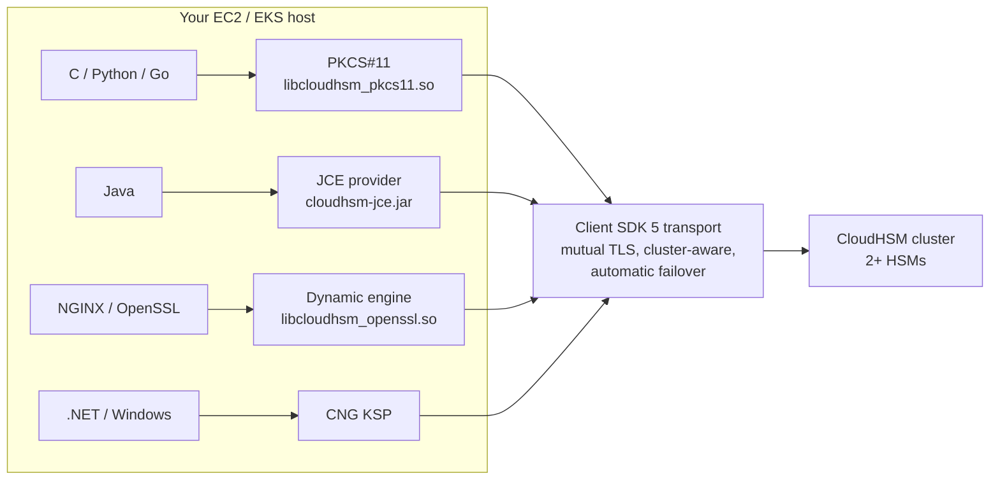

# Talking to the HSM from Applications
{: .no_toc }

PKCS#11, JCE, the OpenSSL engine, and Windows CNG — four interfaces onto the same
cluster, chosen by what your application already speaks.
{: .fs-5 .fw-300 }

## On this page
{: .no_toc .text-delta }

1. TOC
{:toc}

---

## Choosing an interface

| Interface | Library | Use when your application is | Typical workloads |
|:--|:--|:--|:--|
| **PKCS#11** | `/opt/cloudhsm/lib/libcloudhsm_pkcs11.so` | C/C++, Python, Go, or any language with a PKCS#11 binding | Custom crypto services, Oracle TDE, Thales/nCipher migrations |
| **JCE** | `/opt/cloudhsm/java/cloudhsm-jce-*.jar` | Java | Java signing services, Java CAs, Tomcat/Jetty TLS |
| **OpenSSL Dynamic Engine** | `/opt/cloudhsm/lib/libcloudhsm_openssl.so` | Anything that links OpenSSL | NGINX/Apache TLS offload, `openssl` command-line CA |
| **CNG / KSP** | Windows installer | .NET / Windows | Active Directory Certificate Services, IIS, Windows code signing |

All four require the same three things: the client SDK installed, `customerCA.crt`
present, and valid crypto-user credentials.



{: .note }
> **Client SDK 5 handles cluster awareness for you.** It discovers all HSMs, load
> balances across them, and fails over automatically when one becomes
> unavailable. You configure one IP; the SDK finds the rest. You do not need — and
> should not build — your own retry-and-failover layer on top.

## PKCS#11

### Install and verify

```bash
sudo dnf install -y https://s3.amazonaws.com/cloudhsmv2-software/CloudHsmClient/Amzn2023/cloudhsm-pkcs11-latest.amzn2023.x86_64.rpm

sudo /opt/cloudhsm/bin/configure-pkcs11 -a "$HSM_IP"

# The pkcs11-tool from opensc is the quickest smoke test
sudo dnf install -y opensc

export CLOUDHSM_ROLE=crypto-user
export CLOUDHSM_PIN="app-payments:<password>"

pkcs11-tool --module /opt/cloudhsm/lib/libcloudhsm_pkcs11.so --show-info
pkcs11-tool --module /opt/cloudhsm/lib/libcloudhsm_pkcs11.so \
  --login --pin "$CLOUDHSM_PIN" --list-objects
```

```text
Cryptoki version 2.40
Manufacturer     Cavium Networks
Library          Cavium PKCS#11 Interface (ver 5.x)

Secret Key Object; AES length 32
  label:      payments-dek-2026
  ID:         31
  Usage:      encrypt, decrypt
  Access:     sensitive, always sensitive, never extractable
Private Key Object; RSA
  label:      code-signing-2026-priv
  Usage:      sign
  Access:     sensitive, always sensitive, never extractable
```

### Python via `python-pkcs11`

```python
#!/usr/bin/env python3
"""Sign with a CloudHSM-resident RSA key. The private key never leaves the HSM."""
import os
import pkcs11
from pkcs11 import Mechanism, KeyType, ObjectClass

LIB = "/opt/cloudhsm/lib/libcloudhsm_pkcs11.so"

lib = pkcs11.lib(LIB)
token = lib.get_token()           # CloudHSM presents the cluster as one token

user, password = os.environ["CLOUDHSM_PIN"].split(":", 1)

with token.open(user_pin=password, rw=True) as session:
    # Look up the key by label — the handle is not stable across sessions
    priv = session.get_key(
        object_class=ObjectClass.PRIVATE_KEY,
        key_type=KeyType.RSA,
        label="code-signing-2026-priv",
    )
    pub = session.get_key(
        object_class=ObjectClass.PUBLIC_KEY,
        key_type=KeyType.RSA,
        label="code-signing-2026-pub",
    )

    payload = b"artifact-sha256:9f2c1a...e4"

    # The signing operation executes INSIDE the HSM. Only the signature
    # crosses the boundary.
    signature = priv.sign(payload, mechanism=Mechanism.SHA256_RSA_PKCS)
    print("signature:", signature.hex()[:64], "...")

    assert pub.verify(payload, signature, mechanism=Mechanism.SHA256_RSA_PKCS)
    print("verified in-HSM: OK")
```

```bash
pip install python-pkcs11
python3 hsm_sign.py
```

### AES encryption with a CloudHSM key

```python
import os, pkcs11
from pkcs11 import Mechanism, KeyType, ObjectClass

lib = pkcs11.lib("/opt/cloudhsm/lib/libcloudhsm_pkcs11.so")
token = lib.get_token()
user, password = os.environ["CLOUDHSM_PIN"].split(":", 1)

with token.open(user_pin=password, rw=True) as session:
    key = session.get_key(
        object_class=ObjectClass.SECRET_KEY,
        key_type=KeyType.AES,
        label="payments-dek-2026",
    )

    iv = session.generate_random(96)[:12]          # HSM RNG, FIPS-validated
    aad = b"tenant=acme-corp"

    ct = key.encrypt(b"4111111111111111", mechanism=Mechanism.AES_GCM,
                     mechanism_param=(iv, aad, 128))
    pt = key.decrypt(ct, mechanism=Mechanism.AES_GCM,
                     mechanism_param=(iv, aad, 128))
    assert pt == b"4111111111111111"
    print("AES-GCM round trip in HSM: OK")
```

{: .important }
> **This is the property KMS cannot give you.** With a non-extractable HSM key,
> the plaintext key material never enters your process's address space at all —
> not even briefly, as it does in the envelope-encryption pattern. A memory dump
> of your application yields no key. That is the concrete security difference you
> are paying the cluster-hour bill for.

## Java (JCE)

```bash
sudo dnf install -y https://s3.amazonaws.com/cloudhsmv2-software/CloudHsmClient/Amzn2023/cloudhsm-jce-latest.amzn2023.x86_64.rpm
sudo /opt/cloudhsm/bin/configure-jce -a "$HSM_IP"

ls /opt/cloudhsm/java/
# cloudhsm-jce-5.x.y.jar  log4j-api-*.jar  log4j-core-*.jar
```

```java
import com.amazonaws.cloudhsm.jce.provider.CloudHsmProvider;
import com.amazonaws.cloudhsm.jce.provider.authentication.ApplicationCredentials;
import com.amazonaws.cloudhsm.jce.provider.authentication.LoginManager;

import java.security.KeyStore;
import java.security.PrivateKey;
import java.security.Security;
import java.security.Signature;
import java.util.Base64;

public class HsmSigner {
    public static void main(String[] args) throws Exception {
        // 1. Register the CloudHSM JCE provider
        if (Security.getProvider(CloudHsmProvider.PROVIDER_NAME) == null) {
            Security.addProvider(new CloudHsmProvider());
        }

        // 2. Authenticate as a crypto user
        LoginManager.getInstance().login(
            "cluster",
            new ApplicationCredentials(
                System.getenv("HSM_USER"),
                System.getenv("HSM_PASSWORD")
            )
        );

        // 3. Load the key from the HSM keystore by label
        KeyStore ks = KeyStore.getInstance("CloudHSM");
        ks.load(null, null);
        PrivateKey signingKey = (PrivateKey) ks.getKey("code-signing-2026-priv", null);

        // 4. Sign — the operation runs inside the HSM
        Signature sig = Signature.getInstance("SHA256withRSA",
                                              CloudHsmProvider.PROVIDER_NAME);
        sig.initSign(signingKey);
        sig.update("artifact-sha256:9f2c1a...e4".getBytes("UTF-8"));

        System.out.println("signature: " +
            Base64.getEncoder().encodeToString(sig.sign()));
    }
}
```

```bash
javac -cp /opt/cloudhsm/java/cloudhsm-jce-5.x.y.jar HsmSigner.java

HSM_USER=app-payments HSM_PASSWORD='...' \
java -cp .:/opt/cloudhsm/java/'*' \
     -Djava.library.path=/opt/cloudhsm/lib \
     HsmSigner
```

{: .tip }
> Keys in the CloudHSM JCE keystore are addressed **by label**, and labels must
> be unique per user. Adopt a naming convention up front —
> `<env>-<purpose>-<year>-<pub|priv>` works well — because renaming a key in an
> HSM means creating a new one.

## OpenSSL Dynamic Engine — NGINX TLS offload

The private key stays in the HSM; NGINX terminates TLS using a key file that is
only a *reference*.

```bash
sudo dnf install -y https://s3.amazonaws.com/cloudhsmv2-software/CloudHsmClient/Amzn2023/cloudhsm-dyn-latest.amzn2023.x86_64.rpm

export CLOUDHSM_ROLE=crypto-user
export CLOUDHSM_PIN="app-payments:<password>"

# Confirm the engine loads
openssl engine -t -c cloudhsm
```

```text
(cloudhsm) CloudHSM hardware engine support
 [RSA, EC, RAND]
     [ available ]
```

```bash
# 1. Generate the TLS key inside the HSM and get a "fake PEM" reference file
/opt/cloudhsm/bin/cloudhsm-cli key generate-asymmetric-pair rsa \
  --public-label tls-www-pub --private-label tls-www-priv \
  --modulus-size-bits 2048 --public-exponent 65537 \
  --attributes sign=true verify=true extractable=false token=true

/opt/cloudhsm/bin/key_mgmt_util 2>/dev/null || true   # SDK3 legacy, not needed

# Export the PKCS#11 URI reference NGINX will use
sudo tee /etc/nginx/hsm-tls-key.pem >/dev/null <<'REF'
pkcs11:token=cavium;object=tls-www-priv;type=private
REF

# 2. CSR and certificate, signed by your CA — the private key never leaves
OPENSSL_CONF=/dev/null openssl req -new -engine cloudhsm -keyform engine \
  -key "pkcs11:token=cavium;object=tls-www-priv;type=private" \
  -out /tmp/www.csr \
  -subj "/C=US/ST=Utah/O=Your Company/CN=www.yourcompany.com"
```

```nginx
# /etc/nginx/conf.d/tls.conf
ssl_engine cloudhsm;

server {
    listen 443 ssl;
    http2 on;
    server_name www.yourcompany.com;

    ssl_certificate     /etc/nginx/certs/www.crt;
    ssl_certificate_key "engine:cloudhsm:pkcs11:token=cavium;object=tls-www-priv;type=private";

    ssl_protocols       TLSv1.2 TLSv1.3;
    ssl_ciphers         ECDHE-RSA-AES256-GCM-SHA384:ECDHE-RSA-AES128-GCM-SHA256;
    ssl_prefer_server_ciphers off;
}
```

```bash
# NGINX must see the HSM credentials
sudo systemctl edit nginx
```

```ini
[Service]
Environment="CLOUDHSM_ROLE=crypto-user"
EnvironmentFile=/etc/nginx/hsm-credentials    # chmod 600, root-owned
```

```bash
sudo nginx -t && sudo systemctl restart nginx

# Verify the handshake works and measure the cost
openssl s_client -connect www.yourcompany.com:443 -servername www.yourcompany.com </dev/null 2>/dev/null | head -12
```

{: .warning }
> **TLS offload to an HSM costs latency on every handshake.** Each new TLS
> connection requires an RSA private-key operation in the HSM, over the network,
> instead of ~50 µs locally. With session resumption and TLS 1.3 this is usually
> fine, but benchmark it under your real connection-establishment rate before
> going live. Clusters have a finite operations-per-second budget, and TLS
> offload is the workload most likely to exhaust it.

## Windows CNG / KSP

```powershell
# Download and install the Windows client from the CloudHSM downloads page
Start-Process -Wait -FilePath msiexec.exe `
  -ArgumentList '/i AWSCloudHSMClient-latest.msi /qn'

# Configure with an HSM IP and the trust anchor
& "C:\Program Files\Amazon\CloudHSM\bin\configure-cli.exe" -a 10.20.10.15

# Register the KSP
& "C:\Program Files\Amazon\CloudHSM\import_key.exe" -from HSM

# Verify the provider is visible to CNG
certutil -csplist | Select-String -Pattern "Cavium|CloudHSM"
```

Typical use: **Active Directory Certificate Services** with the CA private key in
the HSM.

```powershell
Install-AdcsCertificationAuthority `
  -CAType EnterpriseRootCa `
  -CryptoProviderName "Cavium Key Storage Provider" `
  -KeyLength 4096 `
  -HashAlgorithmName SHA256 `
  -ValidityPeriod Years -ValidityPeriodUnits 10 `
  -Force
```

{: .note }
> An AD CS root whose private key lives in a FIPS 140-3 Level 3 HSM is one of the
> strongest arguments for CloudHSM over KMS: KMS cannot serve a CNG/KSP consumer
> at all, so this workload has no KMS equivalent.

## Health checking from an application

```bash
#!/usr/bin/env bash
# scripts/cloudhsm/healthcheck.sh — for a load balancer target or a cron canary
set -euo pipefail

export CLOUDHSM_ROLE=crypto-user
export CLOUDHSM_PIN="$(aws secretsmanager get-secret-value \
  --secret-id prod/cloudhsm/app-payments --query SecretString --output text \
  | jq -r '"\(.username):\(.password)"')"

OUT=$(/opt/cloudhsm/bin/cloudhsm-cli cluster identify 2>&1) || {
  echo "CRITICAL: cannot reach cluster"; echo "$OUT"; exit 2; }

CONNECTED=$(jq -r '[.data.hsms[] | select(.state=="connected")] | length' <<<"$OUT")
TOTAL=$(jq -r '.data.hsms | length' <<<"$OUT")

echo "HSMs connected: $CONNECTED/$TOTAL"

[ "$CONNECTED" -eq 0 ]  && { echo "CRITICAL: no HSMs reachable"; exit 2; }
[ "$CONNECTED" -lt 2 ]  && { echo "WARNING: cluster not redundant"; exit 1; }

# Prove we can actually perform an operation, not just connect
/opt/cloudhsm/bin/cloudhsm-cli key list --filter attr.label=payments-dek-2026 \
  >/dev/null || { echo "CRITICAL: authenticated but cannot list keys"; exit 2; }

echo "OK: cluster healthy and usable"
```

{: .tip }
> **Connectivity is not health.** A cluster can accept TCP connections while
> authentication is broken (expired trust anchor, locked user, partial
> `cluster-coverage`). The `key list` at the end is what makes this a real
> health check rather than a port test.

---

[Next: 8.5 KMS Custom Key Store](){: .btn .btn-primary }
