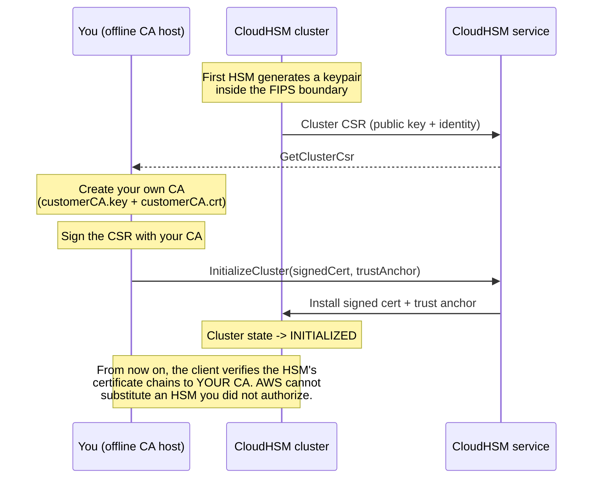

# The Cluster Initialization Ceremony
{: .no_toc }

The step that makes the cluster *yours*. You create a certificate authority,
sign the cluster's CSR with it, and hand AWS the trust anchor — after which your
client software will only trust HSMs your CA has signed.
{: .fs-5 .fw-300 }

## On this page
{: .no_toc .text-delta }

1. TOC
{:toc}

---

## What initialization actually establishes



The security property this buys you: **AWS operators cannot transparently insert
an HSM into your cluster.** Your client SDK refuses to talk to any HSM whose
certificate does not chain to your trust anchor. It is the cryptographic
expression of "single tenant."

{: .important }
> **This is the ceremony to take seriously.** The `customerCA.key` you are about
> to generate is the root of trust for the entire cluster. Whoever holds it can
> mint a certificate for an HSM they control and present it to your clients as
> genuine. Treat it exactly as you would an offline root CA key — because that is
> what it is.

## Ceremony preparation

{: .account }
> **Ceremony step — humans, offline, witnessed.**
>
> **Before you begin:**
> 1. Schedule a change window; this is not a background task.
> 2. Assemble **two custodians** plus a witness/scribe.
> 3. Prepare the CA host: an air-gapped machine, or at minimum an EC2 instance
>    with an encrypted ephemeral volume that will be terminated afterwards, with
>    Session Manager logging enabled.
> 4. Prepare the escrow destination for `customerCA.key` — an offline HSM, a
>    safe with a tamper-evident envelope, or a split-knowledge scheme.
> 5. Open a ceremony log document. Every command and its output goes in it.

## Step 1 — Retrieve the cluster CSR

```bash
export AWS_PROFILE=keyadmin
export AWS_REGION=us-east-1
CLUSTER_ID="cluster-abcdefghijk"

WORKDIR="$(mktemp -d /dev/shm/hsm-ceremony.XXXXXX)"   # RAM-backed, not on disk
cd "$WORKDIR"
echo "Ceremony workdir: $WORKDIR"

aws cloudhsmv2 describe-clusters --filters clusterIds="$CLUSTER_ID" \
  --output text \
  --query 'Clusters[].Certificates.ClusterCsr' > "${CLUSTER_ID}_ClusterCsr.csr"

# Sanity-check the CSR before signing anything
openssl req -in "${CLUSTER_ID}_ClusterCsr.csr" -noout -text | head -20
```

```text
Certificate Request:
    Data:
        Version: 1 (0x0)
        Subject: C=US, ST=CA, L=San Jose, O=Cavium, OU=N3FIPS, CN=HSM:<serial>:PARTN:<n>, ...
        Subject Public Key Info:
            Public Key Algorithm: rsaEncryption
                Public-Key: (2048 bit)
```

{: .tip }
> Record the CSR's subject and public-key fingerprint in the ceremony log. If you
> ever need to prove which physical HSM you anchored, this is the evidence.
>
> ```bash
> openssl req -in "${CLUSTER_ID}_ClusterCsr.csr" -noout -pubkey \
>   | openssl pkey -pubin -outform DER \
>   | openssl dgst -sha256
> ```

## Step 2 — Create your certificate authority

{: .account }
> **Offline step.** Ideally this key is generated on, and never leaves, an HSM
> you already own. The OpenSSL path below is correct for a lab and acceptable for
> many production environments *provided* the escrow is real.

### Option A — OpenSSL CA (documented, straightforward)

```bash
# 1. Generate the CA private key. AES-256 encrypted at rest with a passphrase
#    held by split knowledge between the two custodians.
openssl genpkey -algorithm RSA -pkeyopt rsa_keygen_bits:4096 \
  -aes-256-cbc -out customerCA.key

# 2. Self-signed CA certificate, 10-year validity
openssl req -new -x509 -days 3650 \
  -key customerCA.key \
  -out customerCA.crt \
  -subj "/C=US/ST=Utah/L=Salt Lake City/O=Your Company/OU=Key Management/CN=CloudHSM Trust Anchor 2026"

openssl x509 -in customerCA.crt -noout -text | head -15
```

```text
Certificate:
    Data:
        Version: 3 (0x2)
        Serial Number: 5f:3a:...:9c
        Signature Algorithm: sha256WithRSAEncryption
        Issuer: C=US, ST=Utah, L=Salt Lake City, O=Your Company, OU=Key Management, CN=CloudHSM Trust Anchor 2026
        Validity
            Not Before: Aug 18 18:40:12 2026 GMT
            Not After : Aug 16 18:40:12 2036 GMT
```

### Option B — Sign from an existing HSM-backed CA (preferred)

If you already run an offline root CA in a Luna, nShield, or Utimaco HSM, issue
the trust anchor from it instead. The signing command differs by vendor, but the
inputs and outputs are identical: you sign `${CLUSTER_ID}_ClusterCsr.csr` with a
CA private key that never leaves hardware, and you produce a
`customerCA.crt`-equivalent trust anchor.

{: .warning }
> **A 10-year CA certificate is a 10-year commitment with a hard cliff.** When
> `customerCA.crt` expires, the CloudHSM client stops trusting the cluster and
> every application that uses it fails to connect. Put the expiry date in your
> certificate-expiry monitoring on the day you create it — not in a wiki page.
> Renewal means a fresh ceremony, so start it months ahead.

## Step 3 — Sign the cluster CSR

```bash
openssl x509 -req -days 3650 -sha256 \
  -in "${CLUSTER_ID}_ClusterCsr.csr" \
  -CA customerCA.crt \
  -CAkey customerCA.key \
  -CAcreateserial \
  -out "${CLUSTER_ID}_CustomerHsmCertificate.crt"

# Verify the chain BEFORE sending it to AWS
openssl verify -CAfile customerCA.crt \
  "${CLUSTER_ID}_CustomerHsmCertificate.crt"
```

```text
cluster-abcdefghijk_CustomerHsmCertificate.crt: OK
```

```bash
# Confirm the signed certificate carries the same public key as the CSR
diff <(openssl req  -in "${CLUSTER_ID}_ClusterCsr.csr" -noout -pubkey) \
     <(openssl x509 -in "${CLUSTER_ID}_CustomerHsmCertificate.crt" -noout -pubkey) \
  && echo "public keys match — safe to submit"
```

{: .important }
> **Run both verifications.** `openssl verify` proves the chain; the `diff`
> proves you signed the *cluster's* key rather than some other CSR left in the
> working directory. Submitting a certificate for the wrong key wastes the
> cluster — initialization is one-shot, and a failed initialization means
> deleting and rebuilding.

## Step 4 — Initialize the cluster

This is irreversible.

```bash
aws cloudhsmv2 initialize-cluster \
  --cluster-id "$CLUSTER_ID" \
  --signed-cert "file://${CLUSTER_ID}_CustomerHsmCertificate.crt" \
  --trust-anchor file://customerCA.crt
```

```json
{
    "State": "INITIALIZE_IN_PROGRESS",
    "StateMessage": "Cluster is initializing. State will change to INITIALIZED upon completion."
}
```

```bash
while true; do
  STATE=$(aws cloudhsmv2 describe-clusters --filters clusterIds="$CLUSTER_ID" \
    --query 'Clusters[0].State' --output text)
  echo "$(date -u +%H:%M:%SZ) $STATE"
  [ "$STATE" = "INITIALIZED" ] && break
  [ "$STATE" = "INITIALIZE_IN_PROGRESS" ] || { echo "unexpected: $STATE"; exit 1; }
  sleep 20
done
```

## Step 5 — Escrow and destroy

{: .account }
> **Ceremony step — the part people skip, and regret.**

```bash
# 1. Record the fingerprints in the ceremony log
echo "=== CEREMONY RECORD $(date -u +%Y-%m-%dT%H:%M:%SZ) ==="
echo "Cluster:        $CLUSTER_ID"
echo "CA subject:     $(openssl x509 -in customerCA.crt -noout -subject)"
echo "CA fingerprint: $(openssl x509 -in customerCA.crt -noout -fingerprint -sha256)"
echo "CA notAfter:    $(openssl x509 -in customerCA.crt -noout -enddate)"
echo "HSM cert fp:    $(openssl x509 -in "${CLUSTER_ID}_CustomerHsmCertificate.crt" -noout -fingerprint -sha256)"

# 2. The trust anchor CERTIFICATE (not the key) is needed by every client host
#    and by the KMS custom key store. It is public — store it in Git/S3.
aws s3 cp customerCA.crt "s3://keymgmt-artifacts-111122223333/cloudhsm/${CLUSTER_ID}/customerCA.crt"

# 3. Escrow the PRIVATE KEY offline. This is a physical, witnessed step.
#    Write it to removable media, seal it, log the seal number.
#    DO NOT put it in S3, Secrets Manager, or Git.

# 4. Destroy the working copy and the RAM disk
shred -vfzu -n 3 customerCA.key 2>/dev/null || rm -f customerCA.key
cd / && rm -rf "$WORKDIR"
ls "$WORKDIR" 2>/dev/null || echo "ceremony workdir destroyed"
```

| Artifact | Sensitivity | Where it goes |
|:--|:--|:--|
| `customerCA.crt` | **Public** | Git, S3, every client host, KMS custom key store |
| `${CLUSTER_ID}_CustomerHsmCertificate.crt` | Public | Git / S3, for the record |
| `${CLUSTER_ID}_ClusterCsr.csr` | Public | Git / S3, for the record |
| **`customerCA.key`** | **Root of trust** | **Offline escrow only** |

{: .warning }
> **Losing `customerCA.key` is survivable; leaking it is not.** If you lose it,
> you can still operate the existing cluster — the trust anchor is already
> installed — but you cannot initialize a *new* cluster with the same anchor,
> which complicates DR. If it leaks, an attacker who can also reach your client
> hosts can impersonate your HSMs. Escrow it properly, and put its existence and
> location in your DR runbook.

## Step 6 — Add the remaining HSMs

Now that the cluster is initialized, additional HSMs sync automatically. Each
inherits the cluster's identity and key material.

```bash
HSM2=$(aws cloudhsmv2 create-hsm \
  --cluster-id "$CLUSTER_ID" \
  --availability-zone us-east-1b \
  --query 'Hsm.HsmId' --output text)

while true; do
  aws cloudhsmv2 describe-clusters --filters clusterIds="$CLUSTER_ID" \
    --query 'Clusters[0].Hsms[].{Id:HsmId,AZ:AvailabilityZone,IP:EniIp,State:State}' \
    --output table
  READY=$(aws cloudhsmv2 describe-clusters --filters clusterIds="$CLUSTER_ID" \
    --query 'length(Clusters[0].Hsms[?State==`ACTIVE`])' --output text)
  [ "$READY" -ge 2 ] && break
  sleep 30
done
```

```text
--------------------------------------------------------------
|                      DescribeClusters                      |
+------------+----------------+---------------+--------------+
|     AZ     |      Id        |      IP       |    State     |
+------------+----------------+---------------+--------------+
| us-east-1a | hsm-abcdefghijk| 10.20.10.15   |  ACTIVE      |
| us-east-1b | hsm-lmnopqrstuv| 10.20.11.22   |  ACTIVE      |
+------------+----------------+---------------+--------------+
```

{: .note }
> **Two HSMs is the production minimum**, and it is also the minimum AWS requires
> before you can attach a KMS custom key store. Three gives you a maintenance
> window during which you are still redundant, and is the right answer for
> anything on the payment or authentication critical path.

## Initialization checklist

| # | Check | Evidence |
|:--|:--|:--|
| 1 | Two custodians and a witness present | Ceremony log signatures |
| 2 | CA key generated with ≥ 4096-bit RSA, passphrase-protected | Command transcript |
| 3 | `openssl verify` returned OK before submission | Transcript |
| 4 | CSR and signed-certificate public keys matched | `diff` output |
| 5 | Cluster state is `INITIALIZED` | `describe-clusters` |
| 6 | `customerCA.crt` published to the artifact store | S3 object |
| 7 | `customerCA.key` escrowed offline; seal number logged | Physical record |
| 8 | Working copies destroyed; RAM disk removed | Transcript |
| 9 | CA expiry date added to certificate monitoring | Monitoring config |
| 10 | Second HSM `ACTIVE` in a different AZ | `describe-clusters` |

---

[Next: 8.3 Users &amp; Keys](){: .btn .btn-primary }
