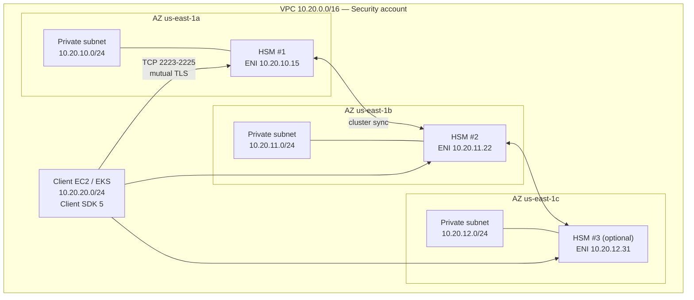

# Provisioning a CloudHSM Cluster
{: .no_toc }

Network design first, then the cluster, then the HSMs. Getting the subnets wrong
is the mistake that costs you a rebuild.
{: .fs-5 .fw-300 }

## On this page
{: .no_toc .text-delta }

1. TOC
{:toc}

---

## Network design

A CloudHSM cluster places one **elastic network interface per HSM** into a
subnet you specify. Client instances reach the HSMs over TLS on those ENI
addresses.



### Design rules

| Rule | Why |
|:--|:--|
| **Minimum two HSMs, in two AZs** | One HSM is a single point of failure with no SLA; AWS requires two for a custom key store |
| **Private subnets only** | HSMs have no public path and need none |
| **One subnet per AZ, dedicated to HSMs** | Keeps the security group blast radius tight; makes flow logs legible |
| **Subnets sized ≥ /24** | Small, but leave room to add HSMs |
| **The subnets cannot be changed later** | Choose the AZs you will still want in three years |
| **Avoid AZ `us-east-1e`-style capacity-constrained zones** | CloudHSM is not available in every AZ of every Region |

{: .warning }
> **The subnets you pass to `create-cluster` are permanent.** You cannot add an
> HSM in an AZ whose subnet was not registered at cluster creation. Register a
> subnet in **three** AZs even if you only intend to run two HSMs — it costs
> nothing and preserves your ability to grow or to survive an AZ being
> capacity-constrained on the day you need to replace an HSM.

## Step 1 — Build the network

```bash
export AWS_PROFILE=keyadmin
export AWS_REGION=us-east-1

VPC_ID=$(aws ec2 create-vpc --cidr-block 10.20.0.0/16 \
  --tag-specifications 'ResourceType=vpc,Tags=[{Key=Name,Value=keymgmt-vpc}]' \
  --query 'Vpc.VpcId' --output text)

aws ec2 modify-vpc-attribute --vpc-id "$VPC_ID" --enable-dns-hostnames
aws ec2 modify-vpc-attribute --vpc-id "$VPC_ID" --enable-dns-support

declare -A SUBNETS
i=10
for AZ in us-east-1a us-east-1b us-east-1c; do
  SUBNETS[$AZ]=$(aws ec2 create-subnet \
    --vpc-id "$VPC_ID" \
    --cidr-block "10.20.${i}.0/24" \
    --availability-zone "$AZ" \
    --tag-specifications "ResourceType=subnet,Tags=[{Key=Name,Value=cloudhsm-${AZ}}]" \
    --query 'Subnet.SubnetId' --output text)
  echo "$AZ -> ${SUBNETS[$AZ]} (10.20.${i}.0/24)"
  i=$((i+1))
done

SUBNET_LIST="${SUBNETS[us-east-1a]} ${SUBNETS[us-east-1b]} ${SUBNETS[us-east-1c]}"
```

{: .tip }
> Client instances do not need internet access to reach the HSMs, but they **do**
> need to reach the CloudHSM service endpoint to download configuration. Either
> add a NAT gateway, or — better — create an interface VPC endpoint for
> `com.amazonaws.<region>.cloudhsmv2` so the traffic never leaves the VPC.

```bash
# Interface endpoint so client hosts need no internet path
SG_ENDPOINT=$(aws ec2 create-security-group \
  --group-name cloudhsm-vpce --description "CloudHSM API VPC endpoint" \
  --vpc-id "$VPC_ID" --query GroupId --output text)

aws ec2 authorize-security-group-ingress --group-id "$SG_ENDPOINT" \
  --protocol tcp --port 443 --cidr 10.20.0.0/16

aws ec2 create-vpc-endpoint \
  --vpc-id "$VPC_ID" \
  --vpc-endpoint-type Interface \
  --service-name "com.amazonaws.${AWS_REGION}.cloudhsmv2" \
  --subnet-ids $SUBNET_LIST \
  --security-group-ids "$SG_ENDPOINT" \
  --private-dns-enabled
```

## Step 2 — Create the cluster

```bash
CLUSTER_ID=$(aws cloudhsmv2 create-cluster \
  --hsm-type hsm2m.medium \
  --mode FIPS \
  --subnet-ids $SUBNET_LIST \
  --tag-list Key=Name,Value=prod-keymgmt-cluster \
             Key=Environment,Value=prod \
             Key=Owner,Value=platform@yourcompany.com \
             Key=Compliance,Value=pci \
  --query 'Cluster.ClusterId' --output text)

echo "Cluster: $CLUSTER_ID"
```

| Parameter | Options | Notes |
|:--|:--|:--|
| `--hsm-type` | `hsm2m.medium` (current), `hsm1.medium` (previous generation) | Availability varies by Region |
| `--mode` | `FIPS`, `NON_FIPS` | `hsm2m` only. **Immutable.** `FIPS` restricts the mechanism set to FIPS-approved algorithms |
| `--subnet-ids` | one subnet per AZ | **Immutable** |
| `--source-backup-id` | a backup ID | Creates the cluster from an existing backup — see [Backup &amp; DR]() |
| `--backup-retention-policy` | `Type=DAYS,Value=90` | 7–379 days |

{: .important }
> **`--mode FIPS` vs `NON_FIPS` is immutable and consequential.** FIPS mode
> restricts the HSM to FIPS 140-3 approved algorithms — which is what you want
> for a compliance claim, but it *excludes* some mechanisms (certain padding
> schemes, some curve/hash combinations, and key-derivation functions) that
> legacy applications rely on. Test your actual workload against a FIPS-mode
> cluster before committing. Changing your mind means building a new cluster and
> migrating keys.

```bash
# Wait for the cluster to leave CREATE_IN_PROGRESS
while true; do
  STATE=$(aws cloudhsmv2 describe-clusters \
    --filters clusterIds="$CLUSTER_ID" \
    --query 'Clusters[0].State' --output text)
  echo "$(date -u +%H:%M:%SZ) cluster state: $STATE"
  [ "$STATE" = "UNINITIALIZED" ] && break
  [ "$STATE" = "CREATE_IN_PROGRESS" ] || { echo "unexpected: $STATE"; exit 1; }
  sleep 30
done
```

## Step 3 — Create the first HSM

The cluster is an empty container until you add an HSM. Creating the first one is
what generates the cluster CSR.

```bash
HSM1=$(aws cloudhsmv2 create-hsm \
  --cluster-id "$CLUSTER_ID" \
  --availability-zone us-east-1a \
  --query 'Hsm.HsmId' --output text)

echo "HSM 1: $HSM1"

# Poll until ACTIVE (typically 5-10 minutes)
while true; do
  read -r STATE EIP <<<"$(aws cloudhsmv2 describe-clusters \
    --filters clusterIds="$CLUSTER_ID" \
    --query 'Clusters[0].Hsms[0].[State,EniIp]' --output text)"
  echo "$(date -u +%H:%M:%SZ) HSM state: $STATE  ip: $EIP"
  [ "$STATE" = "ACTIVE" ] && break
  [ "$STATE" = "DEGRADED" ] && { echo "HSM degraded — investigate"; exit 1; }
  sleep 30
done

HSM1_IP="$EIP"
echo "HSM 1 ENI IP: $HSM1_IP"
```

```bash
aws cloudhsmv2 describe-clusters --filters clusterIds="$CLUSTER_ID" \
  --query 'Clusters[0].{State:State,Type:HsmType,Mode:Mode,VPC:VpcId,HSMs:Hsms[].{Id:HsmId,AZ:AvailabilityZone,IP:EniIp,State:State}}'
```

```json
{
    "State": "UNINITIALIZED",
    "Type": "hsm2m.medium",
    "Mode": "FIPS",
    "VPC": "vpc-0a1b2c3d4e5f67890",
    "HSMs": [
        {
            "Id": "hsm-abcdefghijk",
            "AZ": "us-east-1a",
            "IP": "10.20.10.15",
            "State": "ACTIVE"
        }
    ]
}
```

The cluster is now `UNINITIALIZED` with an HSM waiting. **Do not create the
second HSM yet** — initialize the cluster first, then add HSMs. HSMs added after
initialization automatically sync from the existing cluster.

## Step 4 — Security groups

CloudHSM creates a security group for the cluster automatically. Your client
instances must be allowed to reach it.

```bash
CLUSTER_SG=$(aws cloudhsmv2 describe-clusters --filters clusterIds="$CLUSTER_ID" \
  --query 'Clusters[0].SecurityGroup' --output text)
echo "Cluster SG: $CLUSTER_SG"

# A security group for the client instances
CLIENT_SG=$(aws ec2 create-security-group \
  --group-name cloudhsm-clients \
  --description "Instances permitted to talk to the CloudHSM cluster" \
  --vpc-id "$VPC_ID" --query GroupId --output text)

# Allow the client SG into the cluster SG on the CloudHSM ports
aws ec2 authorize-security-group-ingress \
  --group-id "$CLUSTER_SG" \
  --protocol tcp --port 2223-2225 \
  --source-group "$CLIENT_SG"

aws ec2 describe-security-groups --group-ids "$CLUSTER_SG" \
  --query 'SecurityGroups[0].IpPermissions'
```

{: .warning }
> **Do not widen the cluster security group to a CIDR.** Source it from the
> client security group only. An HSM reachable from the whole VPC is an HSM
> reachable from every instance an attacker lands on — and the HSM's own
> authentication is then the only thing between them and your key material. Defence
> in depth applies here as much as anywhere.

## Step 5 — Launch a client instance

You need a host to run the CloudHSM CLI and the initialization ceremony.

```bash
AMI=$(aws ssm get-parameter \
  --name /aws/service/ami-amazon-linux-latest/al2023-ami-kernel-default-x86_64 \
  --query 'Parameter.Value' --output text)

CLIENT_SUBNET="${SUBNETS[us-east-1a]}"

INSTANCE_ID=$(aws ec2 run-instances \
  --image-id "$AMI" \
  --instance-type t3.medium \
  --subnet-id "$CLIENT_SUBNET" \
  --security-group-ids "$CLIENT_SG" \
  --iam-instance-profile Name=cloudhsm-client-profile \
  --metadata-options "HttpTokens=required,HttpEndpoint=enabled" \
  --block-device-mappings '[{"DeviceName":"/dev/xvda","Ebs":{"Encrypted":true,"VolumeSize":30,"VolumeType":"gp3"}}]' \
  --tag-specifications 'ResourceType=instance,Tags=[{Key=Name,Value=cloudhsm-client}]' \
  --query 'Instances[0].InstanceId' --output text)

aws ec2 wait instance-running --instance-ids "$INSTANCE_ID"

# Connect with Session Manager — no SSH keys, no bastion, and the session
# is logged to CloudTrail, which is exactly what you want for a key ceremony.
aws ssm start-session --target "$INSTANCE_ID"
```

{: .tip }
> Use **Session Manager**, not SSH, for the ceremony host. Session logging can be
> streamed to S3 and CloudWatch Logs, giving you a verbatim, tamper-evident
> transcript of the key ceremony — which is precisely the evidence an auditor
> asks for and the hardest thing to produce after the fact.

## Terraform

```hcl
resource "aws_cloudhsm_v2_cluster" "prod" {
  hsm_type   = "hsm2m.medium"
  subnet_ids = [for s in aws_subnet.cloudhsm : s.id]
  mode       = "FIPS"

  tags = {
    Name        = "prod-keymgmt-cluster"
    Environment = "prod"
    Compliance  = "pci"
  }

  lifecycle {
    prevent_destroy = true
    # subnet_ids and hsm_type are immutable; guard against accidental replacement
    ignore_changes = [subnet_ids, hsm_type]
  }
}

resource "aws_cloudhsm_v2_hsm" "primary" {
  cluster_id        = aws_cloudhsm_v2_cluster.prod.cluster_id
  availability_zone = "us-east-1a"

  lifecycle { prevent_destroy = true }
}

# Add the second HSM only AFTER the cluster is initialized and activated.
# Terraform cannot perform the initialization ceremony — that is manual.
resource "aws_cloudhsm_v2_hsm" "secondary" {
  count             = var.cluster_initialized ? 1 : 0
  cluster_id        = aws_cloudhsm_v2_cluster.prod.cluster_id
  availability_zone = "us-east-1b"

  depends_on = [aws_cloudhsm_v2_hsm.primary]
  lifecycle { prevent_destroy = true }
}

output "cluster_id" { value = aws_cloudhsm_v2_cluster.prod.cluster_id }
output "cluster_csr" { value = aws_cloudhsm_v2_cluster.prod.cluster_certificates }
output "cluster_state" { value = aws_cloudhsm_v2_cluster.prod.cluster_state }
```

{: .important }
> **Terraform cannot initialize the cluster.** There is no
> `aws_cloudhsm_v2_cluster_initialization` resource, because initialization
> requires signing a CSR with a private key that must never be in Terraform's
> reach. The workflow is therefore hybrid: Terraform provisions the cluster and
> the first HSM, a human performs the ceremony in
> [8.2](), and then Terraform manages the
> remaining HSMs. The `var.cluster_initialized` flag above is how you gate that.

## Provisioning checklist

| # | Check | Command |
|:--|:--|:--|
| 1 | VPC has subnets in ≥ 3 AZs registered to the cluster | `describe-clusters --query 'Clusters[0].SubnetMapping'` |
| 2 | Cluster state is `UNINITIALIZED` | `describe-clusters --query 'Clusters[0].State'` |
| 3 | Exactly one HSM, state `ACTIVE` | `describe-clusters --query 'Clusters[0].Hsms'` |
| 4 | Cluster SG allows 2223–2225 from the client SG only | `describe-security-groups` |
| 5 | Client instance reachable via Session Manager | `aws ssm start-session` |
| 6 | Backup retention policy set to your standard | `describe-clusters --query 'Clusters[0].BackupPolicy'` |

---

[Next: 8.2 Initialization Ceremony](){: .btn .btn-primary }
