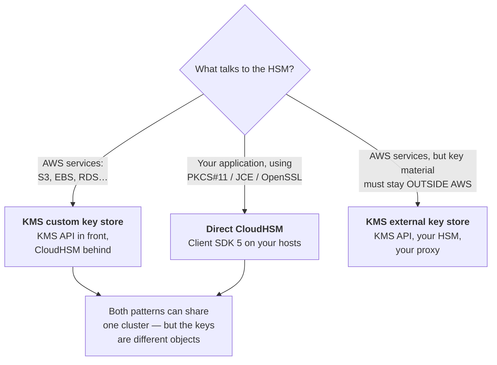
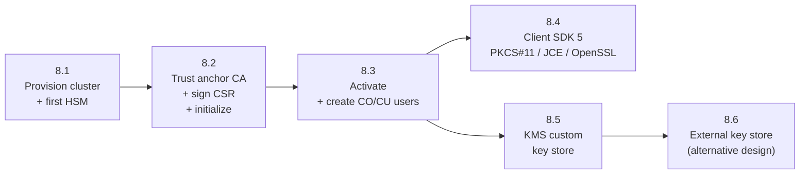

# CloudHSM &amp; HSM-Backed Tiers
{: .no_toc }

**Phase 5 — HSM tier.** Single-tenant, FIPS 140-3 Level 3 hardware you control,
and the two ways to put KMS in front of it.
{: .fs-5 .fw-300 }

---

## What you are taking on

CloudHSM is not "KMS with better hardware." It is a different operating model,
and the responsibility shift is the main thing to understand before you start.

| Responsibility | AWS KMS | AWS CloudHSM |
|:--|:--|:--|
| HSM hardware and firmware | AWS | AWS |
| Cluster sizing and HA | AWS | **You** |
| Cryptographic user management | N/A (IAM) | **You** — CO/CU accounts inside the HSM |
| Password and quorum management | N/A | **You** |
| Backup retention policy | AWS | **You** (7–379 days) |
| Client software on your instances | N/A | **You** |
| Availability if you misconfigure it | AWS's problem | **Your problem** |
| Losing access to key material | Essentially impossible | **Entirely possible** |

{: .warning }
> **CloudHSM will let you destroy your keys permanently.** Lose the crypto-user
> password with no quorum recovery, delete the last HSM and all backups, or lose
> the trust anchor — and the key material is gone. AWS cannot recover it; that is
> what single-tenancy means. Everything in this section that looks like paperwork
> (ceremony logs, password escrow, backup verification) is the actual control.

## Which HSM-backed pattern



| Pattern | Application sees | Key material | Use for |
|:--|:--|:--|:--|
| **Custom key store** | The ordinary KMS API | In your CloudHSM cluster | S3/EBS/RDS encryption that must be single-tenant HSM-backed |
| **Direct CloudHSM** | PKCS#11, JCE, OpenSSL, CNG | In your CloudHSM cluster | Certificate authorities, code signing, payment HSM workloads, Oracle TDE, SSL offload |
| **External key store** | The ordinary KMS API | In *your* HSM, outside AWS | Hold-your-own-key and key-custody mandates |

## The build sequence



## Pages in this section

| Page | What it covers |
|:--|:--|
| [8.1 Provisioning]() | VPC design, subnets, security groups, cluster and HSM creation |
| [8.2 Initialization Ceremony]() | The trust anchor CA, CSR signing, and `initialize-cluster` |
| [8.3 Users &amp; Keys]() | Activation, CO/CU/AU roles, quorum, and key generation |
| [8.4 Application Integration]() | PKCS#11, JCE, OpenSSL engine, Windows CNG/KSP |
| [8.5 KMS Custom Key Store]() | Putting the KMS API in front of your cluster |
| [8.6 External Key Store (XKS)]() | Keeping key material entirely outside AWS |

## Cost reality check

CloudHSM is billed per HSM-hour, and a production cluster needs at least two.
Before you start, price it:

```bash
# List the HSM types available in your Region
aws cloudhsmv2 describe-clusters \
  --query 'Clusters[].{Id:ClusterId,Type:HsmType,State:State,HSMs:length(Hsms)}' \
  --output table

# Current on-demand pricing (check the live pricing page — this returns the
# authoritative value for your Region)
aws pricing get-products --region us-east-1 \
  --service-code AWSCloudHSM \
  --filters "Type=TERM_MATCH,Field=location,Value=US East (N. Virginia)" \
  --max-results 1 --query 'PriceList[0]' --output text | jq -r '.terms.OnDemand'
```

{: .important }
> A two-HSM cluster runs continuously — there is no "stop" state. Multiply the
> hourly rate by 730 hours by two HSMs, then add a third for the dev cluster you
> will inevitably need. That number, not the technical work, is usually what
> decides whether CloudHSM is the right answer. Compare it honestly against KMS
> at a few dollars per key per month before committing. See
> [Cost Model]().

---

[Next: 8.1 Provisioning](){: .btn .btn-primary }
