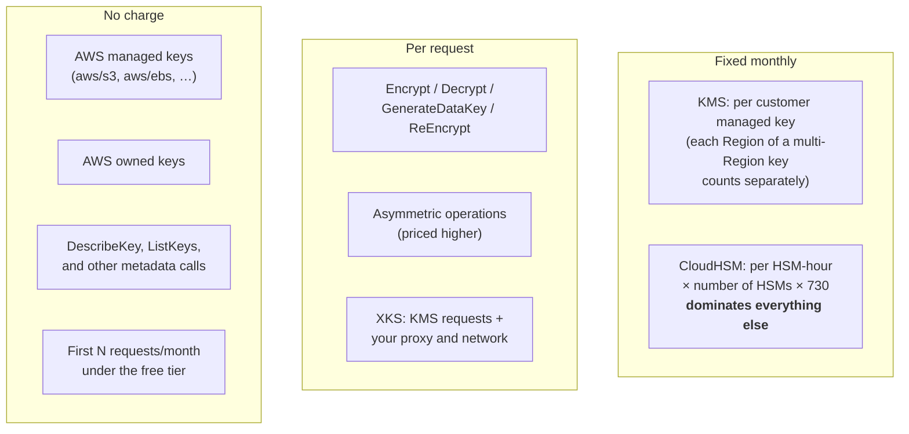

# Cost Model
{: .no_toc }

What each component actually costs, where the surprises are, and the levers that
move the bill by orders of magnitude.
{: .fs-5 .fw-300 }

## On this page
{: .no_toc .text-delta }

1. TOC
{:toc}

---

{: .warning }
> **Every figure on this page must be verified against current pricing.** Cloud
> pricing changes, varies by Region, and this guide is not authoritative for it.
> Use the commands below to pull live numbers for *your* Region before building a
> business case.

## Getting authoritative numbers

```bash
# KMS pricing for your Region
aws pricing get-products --region us-east-1 \
  --service-code awskms \
  --filters "Type=TERM_MATCH,Field=location,Value=US East (N. Virginia)" \
  --max-results 20 \
  | jq -r '.PriceList[] | fromjson
           | {desc: .product.attributes.usagetype,
              price: (.terms.OnDemand | to_entries[0].value.priceDimensions
                      | to_entries[0].value | {unit: .unit, usd: .pricePerUnit.USD, desc: .description})}'

# CloudHSM pricing
aws pricing get-products --region us-east-1 \
  --service-code AWSCloudHSM \
  --filters "Type=TERM_MATCH,Field=location,Value=US East (N. Virginia)" \
  --max-results 10 \
  | jq -r '.PriceList[] | fromjson
           | {type: .product.attributes.instanceType,
              price: (.terms.OnDemand | to_entries[0].value.priceDimensions
                      | to_entries[0].value.pricePerUnit.USD)}'
```

## The cost structure



## Where the surprises are

### 1. S3 without Bucket Keys

The classic. Every object written to an SSE-KMS bucket triggers a
`GenerateDataKey` call; every object read triggers `Decrypt`.

| Scenario | KMS requests/month | Relative cost |
|:--|:--|:--|
| 50 M objects written, no Bucket Key | 50 M | **Baseline** |
| Same, `BucketKeyEnabled: true` | Small fraction of the above | Dramatically lower |

```bash
# Find every bucket using SSE-KMS WITHOUT a Bucket Key — usually the single
# biggest KMS cost saving available in an account.
aws s3api list-buckets --query 'Buckets[].Name' --output text | tr '\t' '\n' \
| while read -r B; do
    CFG=$(aws s3api get-bucket-encryption --bucket "$B" 2>/dev/null) || continue
    ALG=$(jq -r '.ServerSideEncryptionConfiguration.Rules[0].ApplyServerSideEncryptionByDefault.SSEAlgorithm' <<<"$CFG")
    BK=$(jq -r '.ServerSideEncryptionConfiguration.Rules[0].BucketKeyEnabled // false' <<<"$CFG")
    if [ "$ALG" = "aws:kms" ] && [ "$BK" != "true" ]; then
      echo "  NO BUCKET KEY: $B"
    fi
  done
```

Fix them all:

```bash
aws s3api list-buckets --query 'Buckets[].Name' --output text | tr '\t' '\n' \
| while read -r B; do
    CFG=$(aws s3api get-bucket-encryption --bucket "$B" 2>/dev/null) || continue
    ALG=$(jq -r '...ApplyServerSideEncryptionByDefault.SSEAlgorithm' <<<"$CFG")
    KEY=$(jq -r '...ApplyServerSideEncryptionByDefault.KMSMasterKeyID' <<<"$CFG")
    BK=$(jq -r '...BucketKeyEnabled // false' <<<"$CFG")
    [ "$ALG" = "aws:kms" ] && [ "$BK" != "true" ] || continue
    aws s3api put-bucket-encryption --bucket "$B" \
      --server-side-encryption-configuration "{\"Rules\":[{
        \"ApplyServerSideEncryptionByDefault\":{\"SSEAlgorithm\":\"aws:kms\",
        \"KMSMasterKeyID\":\"$KEY\"},\"BucketKeyEnabled\":true}]}"
    echo "enabled Bucket Key: $B"
  done
```

### 2. Per-record envelope encryption with no cache

An application that calls `GenerateDataKey` once per row, at 1,000 rows/second,
issues 2.6 billion KMS requests a month — and will be throttled long before the
bill arrives.

**Fix:** data key caching via the AWS Encryption SDK's
`CachingCryptoMaterialsManager`. See
[Envelope Encryption](#tuning-the-cache).
The trade-off is cryptographic isolation, and it is a documented risk decision.

### 3. SQS with a 60-second data key reuse period

```bash
# Find queues at or near the minimum reuse period
aws sqs list-queues --query 'QueueUrls[]' --output text | tr '\t' '\n' \
| while read -r Q; do
    ATTRS=$(aws sqs get-queue-attributes --queue-url "$Q" \
      --attribute-names KmsMasterKeyId KmsDataKeyReusePeriodSeconds \
      --query Attributes --output json 2>/dev/null) || continue
    KEY=$(jq -r '.KmsMasterKeyId // empty' <<<"$ATTRS")
    PER=$(jq -r '.KmsDataKeyReusePeriodSeconds // "300"' <<<"$ATTRS")
    [ -n "$KEY" ] && [ "$PER" -lt 300 ] && echo "  $Q reuse=${PER}s"
  done
```

### 4. Multi-Region keys you did not need

Every replica is a separate billable key. Making everything multi-Region "just in
case" multiplies your fixed key cost by the number of Regions, and widens the
blast radius for free.

```bash
# Multi-Region keys and their replica count
aws kms list-keys --query 'Keys[].KeyId' --output text | tr '\t' '\n' \
| while read -r K; do
    CFG=$(aws kms describe-key --key-id "$K" \
      --query 'KeyMetadata.MultiRegionConfiguration' --output json 2>/dev/null)
    [ "$CFG" = "null" ] && continue
    TYPE=$(jq -r '.MultiRegionKeyType' <<<"$CFG")
    [ "$TYPE" = "PRIMARY" ] || continue
    N=$(jq -r '.ReplicaKeys | length' <<<"$CFG")
    ALIAS=$(aws kms list-aliases --key-id "$K" --query 'Aliases[0].AliasName' --output text)
    echo "  $ALIAS: $N replica(s)"
  done
```

### 5. CloudHSM running in a dev account nobody uses

A cluster has no stop state. A forgotten two-HSM dev cluster bills continuously.

```bash
# Every cluster in every Region, with HSM count
for R in $(aws ec2 describe-regions --query 'Regions[].RegionName' --output text); do
  OUT=$(aws cloudhsmv2 describe-clusters --region "$R" \
    --query 'Clusters[].{Id:ClusterId,State:State,HSMs:length(Hsms),Type:HsmType}' \
    --output text 2>/dev/null)
  [ -n "$OUT" ] && echo "$R: $OUT"
done
```

{: .tip }
> **For non-production, share one CloudHSM cluster across dev and staging rather
> than running two.** Use separate crypto users and key labels for isolation. The
> cluster is the expensive part; users and keys are free.

## Cost attribution

```bash
# Enable cost allocation tags (once, in the management account)
aws ce update-cost-allocation-tags-status \
  --cost-allocation-tags-status \
    'TagKey=Environment,Status=Active' \
    'TagKey=Owner,Status=Active' \
    'TagKey=CostCenter,Status=Active' \
    'TagKey=DataClass,Status=Active'

# KMS spend by cost centre, last month
aws ce get-cost-and-usage \
  --time-period Start=2026-07-01,End=2026-08-01 \
  --granularity MONTHLY \
  --metrics UnblendedCost \
  --filter '{"Dimensions":{"Key":"SERVICE","Values":["AWS Key Management Service"]}}' \
  --group-by Type=TAG,Key=CostCenter \
  --query 'ResultsByTime[0].Groups[].{Tag:Keys[0],Cost:Metrics.UnblendedCost.Amount}' \
  --output table

# KMS + CloudHSM combined, by account
aws ce get-cost-and-usage \
  --time-period Start=2026-07-01,End=2026-08-01 \
  --granularity MONTHLY --metrics UnblendedCost \
  --filter '{"Dimensions":{"Key":"SERVICE","Values":["AWS Key Management Service","AWS CloudHSM"]}}' \
  --group-by Type=DIMENSION,Key=LINKED_ACCOUNT Type=DIMENSION,Key=SERVICE \
  --output table
```

### Budget alerts

```bash
aws budgets create-budget \
  --account-id 111122223333 \
  --budget '{
    "BudgetName": "key-management-monthly",
    "BudgetLimit": {"Amount": "5000", "Unit": "USD"},
    "TimeUnit": "MONTHLY",
    "BudgetType": "COST",
    "CostFilters": {
      "Service": ["AWS Key Management Service", "AWS CloudHSM"]
    }
  }' \
  --notifications-with-subscribers '[{
    "Notification": {
      "NotificationType": "FORECASTED",
      "ComparisonOperator": "GREATER_THAN",
      "Threshold": 80,
      "ThresholdType": "PERCENTAGE"
    },
    "Subscribers": [{"SubscriptionType": "EMAIL",
                     "Address": "platform@yourcompany.com"}]
  }]'
```

## The optimization checklist

| # | Lever | Typical impact |
|:--|:--|:--|
| 1 | Enable S3 Bucket Keys on every SSE-KMS bucket | **Very large** for high-object-count buckets |
| 2 | Enable data key caching in application envelope encryption | **Very large** for per-record workloads |
| 3 | Raise `KmsDataKeyReusePeriodSeconds` on SQS from 60 s | Large for busy queues |
| 4 | Consolidate purpose-scoped keys instead of per-tenant keys | Large at high tenant counts |
| 5 | Use multi-Region keys only where cross-Region decrypt is required | Moderate; also reduces blast radius |
| 6 | Delete unused keys found by the Athena usage query | Moderate, and reduces attack surface |
| 7 | Share one CloudHSM cluster across non-production environments | **Very large** where CloudHSM is in use |
| 8 | Use AWS managed keys for genuinely low-sensitivity data | Moderate; costs you policy control |
| 9 | Right-size CloudHSM to the ops-per-second you actually need | Large |
| 10 | Cache `DescribeKey` results — they are free, but the round trip is not | Latency, not cost |

{: .important }
> **Do not optimize item 8 by default.** AWS managed keys are free, but you get no
> key policy, no rotation control, and no way to deny a principal independently
> of the service. For anything with a compliance obligation or a separation-of-duties
> requirement, the customer managed key is the point. Save the money somewhere
> that is not a control.

## Deciding between tiers

The commercial question underneath the whole guide:

| | KMS only | KMS + custom key store | KMS + XKS |
|:--|:--|:--|:--|
| Fixed monthly | Per key | Per key + **cluster hours** | Per key + your HSM + proxy hosting |
| Request cost | Per request | Per request | Per request + your egress |
| Staff time | Near zero | Meaningful — cluster ops, ceremonies, backups | Substantial — you run an HA service |
| Availability risk | AWS's | **Yours** | **Entirely yours** |
| What you get | Managed, FIPS 140-3 L3, multi-tenant | Single-tenancy, key custody in your cluster | Key material never enters AWS |

{: .tip }
> Frame the decision as: *what is the annual cost of the HSM tier, and what
> specific written requirement does it satisfy that KMS does not?* If the answer
> is "it feels safer," the answer is KMS. If the answer is a named clause in a
> regulation, a contract, or an internal standard, quote the clause in the
> business case — that is what turns a cost into a justified control.

---

[Next: Sources](){: .btn .btn-primary }
