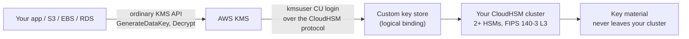

# KMS Custom Key Store (CloudHSM-Backed)
{: .no_toc }

The best of both: the ordinary KMS API — so S3, EBS, and RDS integrations just
work — with key material that lives only in your single-tenant HSM cluster.
{: .fs-5 .fw-300 }

## On this page
{: .no_toc .text-delta }

1. TOC
{:toc}

---

## What it is



| Property | Standard KMS key | Custom key store key |
|:--|:--|:--|
| API surface | KMS | **Identical KMS** |
| Works with S3/EBS/RDS/etc. | Yes | **Yes** |
| Key material location | AWS multi-tenant HSMs | **Your cluster** |
| Automatic rotation | Yes | **No** — manual replacement |
| Availability depends on | AWS | **Your cluster's health** |
| Multi-Region keys | Yes | **No** |
| Imported material | Yes | No |
| Cost | Per key + requests | Per key + requests + **cluster hours** |

{: .warning }
> **You now own the availability of every service that uses these keys.** If the
> cluster goes `DEGRADED` or the custom key store disconnects, `Decrypt` fails —
> and so does reading the S3 bucket, mounting the EBS volume, and starting the
> RDS instance. AWS's KMS SLA does not cover a custom key store's dependency on
> your cluster. Run at least two HSMs across two AZs, alarm on cluster health,
> and rehearse the reconnect procedure.

## Prerequisites

| # | Requirement | Verify |
|:--|:--|:--|
| 1 | Cluster is `ACTIVE` | `aws cloudhsmv2 describe-clusters` |
| 2 | **At least two HSMs**, in different AZs | Same command |
| 3 | A crypto user named exactly `kmsuser` exists | `cloudhsm-cli user list` |
| 4 | `kmsuser` is **not logged in anywhere** | See the note below |
| 5 | You have `customerCA.crt` | From the ceremony |
| 6 | Cluster is in the same account and Region as KMS | — |

{: .important }
> **KMS takes over the `kmsuser` account.** When you connect the custom key
> store, KMS logs in as `kmsuser`, **changes its password**, and holds the session
> for as long as the store is connected. You will not be able to use that account
> yourself afterwards, and if you log in as `kmsuser` while the store is
> connected, KMS's session is disrupted and the store disconnects. Create
> `kmsuser` for KMS's exclusive use and never touch it again.

## Step 1 — Create the `kmsuser` crypto user

```bash
export CLOUDHSM_ROLE=admin
export CLOUDHSM_PIN="admin:<admin-password>"

/opt/cloudhsm/bin/cloudhsm-cli interactive
```

```text
aws-cloudhsm > login --username admin --role admin
aws-cloudhsm > user create --username kmsuser --role crypto-user
Enter password:            # remember this — it is the --key-store-password
Confirm password:
aws-cloudhsm > user list
# confirm kmsuser shows cluster-coverage: full
aws-cloudhsm > logout
aws-cloudhsm > quit
```

## Step 2 — Create the custom key store

```bash
export AWS_PROFILE=keyadmin
CLUSTER_ID="cluster-abcdefghijk"

# Retrieve the trust anchor published during the ceremony
aws s3 cp "s3://keymgmt-artifacts-111122223333/cloudhsm/${CLUSTER_ID}/customerCA.crt" \
  /tmp/customerCA.crt

CKS_ID=$(aws kms create-custom-key-store \
  --custom-key-store-name "prod-cloudhsm-cks" \
  --cloud-hsm-cluster-id "$CLUSTER_ID" \
  --trust-anchor-certificate "$(cat /tmp/customerCA.crt)" \
  --key-store-password "<the kmsuser password>" \
  --query CustomKeyStoreId --output text)

echo "Custom key store: $CKS_ID"
```

{: .tip }
> `--trust-anchor-certificate` takes the **contents** of the PEM, not a file
> path. `"$(cat ...)"` is correct; `file://...` is not, and produces a confusing
> validation error.

## Step 3 — Connect it

```bash
aws kms connect-custom-key-store --custom-key-store-id "$CKS_ID"

# Connection takes ~20 minutes on the first attempt
while true; do
  read -r STATE CODE <<<"$(aws kms describe-custom-key-stores \
    --custom-key-store-id "$CKS_ID" \
    --query 'CustomKeyStores[0].[ConnectionState,ConnectionErrorCode]' --output text)"
  echo "$(date -u +%H:%M:%SZ) state=$STATE error=$CODE"
  [ "$STATE" = "CONNECTED" ] && break
  [ "$STATE" = "FAILED" ] && { echo "connection failed: $CODE"; exit 1; }
  sleep 60
done
```

```bash
aws kms describe-custom-key-stores --custom-key-store-id "$CKS_ID" \
  --query 'CustomKeyStores[0].{Name:CustomKeyStoreName,Type:CustomKeyStoreType,Cluster:CloudHsmClusterId,State:ConnectionState,Created:CreationDate}'
```

```json
{
    "Name": "prod-cloudhsm-cks",
    "Type": "AWS_CLOUDHSM",
    "Cluster": "cluster-abcdefghijk",
    "State": "CONNECTED",
    "Created": "2026-08-18T19:04:11.882000-04:00"
}
```

### Connection error codes and what they mean

| `ConnectionErrorCode` | Cause | Fix |
|:--|:--|:--|
| `INVALID_CREDENTIALS` | Wrong `kmsuser` password, or the account is locked | `user change-password`, then `update-custom-key-store --key-store-password` |
| `CLUSTER_NOT_FOUND` | Cluster deleted or in another account/Region | Check the cluster ID |
| `INSUFFICIENT_CLOUDHSM_HSMS` | Fewer than two HSMs | `create-hsm` in a second AZ |
| `USER_LOCKED_OUT` | Too many failed logins | A CO must unlock: `user change-password` |
| `USER_NOT_FOUND` | No `kmsuser` crypto user | Create it |
| `USER_LOGGED_IN` | Someone is logged in as `kmsuser` | Log that session out and reconnect |
| `NETWORK_ERRORS` | Security group or ENI problem | Check the cluster SG allows 2223–2225 |
| `SUBNET_NOT_FOUND` | Cluster subnets deleted | Rebuild the cluster |
| `XKS_PROXY_*` | External key store only | See [8.6]() |

## Step 4 — Create a key in the store

```bash
KEY_ARN=$(aws kms create-key \
  --custom-key-store-id "$CKS_ID" \
  --origin AWS_CLOUDHSM \
  --key-spec SYMMETRIC_DEFAULT \
  --key-usage ENCRYPT_DECRYPT \
  --description "PCI cardholder data key — CloudHSM-backed" \
  --policy file:///tmp/key-policy-pci.json \
  --tags TagKey=Environment,TagValue=prod \
         TagKey=DataClass,TagValue=restricted \
         TagKey=Compliance,TagValue=pci \
         TagKey=Backing,TagValue=cloudhsm \
  --query 'KeyMetadata.Arn' --output text)

aws kms create-alias --alias-name alias/prod/payments/pci-chd \
  --target-key-id "$KEY_ARN"

aws kms describe-key --key-id "$KEY_ARN" \
  --query 'KeyMetadata.{Arn:Arn,Origin:Origin,CKS:CustomKeyStoreId,HSMKeyId:CloudHsmClusterId,State:KeyState}'
```

```json
{
    "Arn": "arn:aws:kms:us-east-1:111122223333:key/9876fedc-98fe-76dc-54ba-9876543210fe",
    "Origin": "AWS_CLOUDHSM",
    "CKS": "cks-1234567890abcdef0",
    "State": "Enabled"
}
```

{: .note }
> **Only `SYMMETRIC_DEFAULT` with `ENCRYPT_DECRYPT` is supported in a CloudHSM
> custom key store.** Asymmetric keys, HMAC keys, multi-Region keys, and imported
> material are all unavailable. If you need an HSM-backed signing key, use
> [direct PKCS#11/JCE]() against the same cluster
> instead.

### Confirm the key material really is in your cluster

```bash
# KMS created a corresponding key in the HSM, owned by kmsuser
export CLOUDHSM_ROLE=crypto-user
export CLOUDHSM_PIN="app-payments:<password>"

/opt/cloudhsm/bin/cloudhsm-cli key list --verbose \
  | jq '.data.matched_keys[] | select(.attributes.label | startswith("kms"))
        | {label: .attributes.label, type: .attributes."key-type",
           extractable: .attributes.extractable}'
```

You should see an AES key labelled with the KMS key ID, `extractable: false`.
That object *is* your CMK's key material — it exists nowhere else.

## Step 5 — Use it exactly like any other CMK

The whole point: nothing downstream changes.

```bash
# Round-trip test
CT=$(aws kms encrypt --key-id alias/prod/payments/pci-chd \
  --plaintext "$(echo -n 'pan-canary' | base64)" \
  --encryption-context app=payments \
  --query CiphertextBlob --output text)

echo "$CT" | base64 -d > /tmp/cks-test.bin
aws kms decrypt --ciphertext-blob fileb:///tmp/cks-test.bin \
  --encryption-context app=payments \
  --query Plaintext --output text | base64 -d; echo
rm -f /tmp/cks-test.bin

# Encrypt a DynamoDB table with an HSM-backed key
aws dynamodb create-table \
  --table-name prod-cardholders \
  --attribute-definitions AttributeName=pk,AttributeType=S \
  --key-schema AttributeName=pk,KeyType=HASH \
  --billing-mode PAY_PER_REQUEST \
  --sse-specification Enabled=true,SSEType=KMS,KMSMasterKeyId=alias/prod/payments/pci-chd

# Or an S3 bucket
aws s3api put-bucket-encryption --bucket prod-pci-evidence \
  --server-side-encryption-configuration "{
    \"Rules\":[{\"ApplyServerSideEncryptionByDefault\":{
      \"SSEAlgorithm\":\"aws:kms\",\"KMSMasterKeyID\":\"$KEY_ARN\"},
      \"BucketKeyEnabled\":true}]}"
```

## Operations

### Rotating a custom key store key

Automatic rotation is unavailable, so use the manual replacement flow from
[Rotation](#manual-rotation--replacing-a-key-entirely):
create a new key in the same store, re-encrypt, retarget the alias, then disable
and delete the old one.

```bash
NEW_ARN=$(aws kms create-key --custom-key-store-id "$CKS_ID" \
  --origin AWS_CLOUDHSM --key-spec SYMMETRIC_DEFAULT \
  --description "PCI cardholder data key — rotation $(date -u +%Y-%m)" \
  --policy file:///tmp/key-policy-pci.json \
  --query 'KeyMetadata.Arn' --output text)

# ... re-encrypt data ...

aws kms update-alias --alias-name alias/prod/payments/pci-chd \
  --target-key-id "$NEW_ARN"
```

### Disconnecting — the emergency stop

```bash
aws kms disconnect-custom-key-store --custom-key-store-id "$CKS_ID"
```

{: .warning }
> **Disconnecting makes every key in the store unusable immediately, worldwide.**
> Every `Decrypt`, every S3 read of an object encrypted with those keys, every
> EBS volume attach — all fail with `CustomKeyStoreInvalidStateException`. It is a
> genuine cryptographic kill switch and a genuine outage button; they are the
> same button. Reconnecting takes ~20 minutes. Know which workloads are affected
> before you press it.

### Rotating the `kmsuser` password

```bash
# 1. Disconnect
aws kms disconnect-custom-key-store --custom-key-store-id "$CKS_ID"

# 2. Change the password in the HSM (as a CO)
/opt/cloudhsm/bin/cloudhsm-cli interactive
#   login --username admin --role admin
#   user change-password --username kmsuser --role crypto-user

# 3. Tell KMS the new password
aws kms update-custom-key-store \
  --custom-key-store-id "$CKS_ID" \
  --key-store-password "<new-password>"

# 4. Reconnect
aws kms connect-custom-key-store --custom-key-store-id "$CKS_ID"
```

### Deleting a custom key store

```bash
# All keys must be deleted (not just disabled) first
aws kms list-keys --query 'Keys[].KeyId' --output text | tr '\t' '\n' | while read -r K; do
  CKS=$(aws kms describe-key --key-id "$K" \
    --query 'KeyMetadata.CustomKeyStoreId' --output text 2>/dev/null)
  [ "$CKS" = "$CKS_ID" ] && echo "still present: $K"
done

aws kms disconnect-custom-key-store --custom-key-store-id "$CKS_ID"
aws kms delete-custom-key-store --custom-key-store-id "$CKS_ID"
```

{: .important }
> **Deleting the custom key store does not delete the key material in the HSM,
> and deleting the CMK does not either.** The AES objects created by `kmsuser`
> remain in the cluster. That is good for recovery and bad for hygiene — if you
> decommission a store, plan a separate cleanup of the orphaned HSM key objects,
> and record it, or your cluster slowly fills with material nothing references.

## Terraform

```hcl
resource "aws_kms_custom_key_store" "prod" {
  cloud_hsm_cluster_id  = aws_cloudhsm_v2_cluster.prod.cluster_id
  custom_key_store_name = "prod-cloudhsm-cks"
  key_store_password    = var.kmsuser_password        # from a secrets backend
  trust_anchor_certificate = file("${path.module}/customerCA.crt")

  lifecycle { prevent_destroy = true }
}

resource "aws_kms_key" "pci_chd" {
  description             = "PCI cardholder data key — CloudHSM-backed"
  custom_key_store_id     = aws_kms_custom_key_store.prod.id
  deletion_window_in_days = 30
  policy                  = data.aws_iam_policy_document.pci.json

  # Rotation is not supported in a custom key store
  enable_key_rotation = false

  tags = {
    Environment = "prod"
    DataClass   = "restricted"
    Compliance  = "pci"
    Backing     = "cloudhsm"
  }

  lifecycle { prevent_destroy = true }
}

resource "aws_kms_alias" "pci_chd" {
  name          = "alias/prod/payments/pci-chd"
  target_key_id = aws_kms_key.pci_chd.key_id
}
```

{: .warning }
> `key_store_password` lands in Terraform state in plaintext. Source it from
> Secrets Manager via a data source at plan time and restrict state access
> tightly, or create the custom key store out-of-band with the CLI and manage
> only the keys in Terraform.

## Monitoring the store

```bash
# Alarm on the store leaving CONNECTED
aws cloudwatch put-metric-alarm \
  --alarm-name "kms-custom-key-store-disconnected" \
  --alarm-description "CloudHSM-backed custom key store is not CONNECTED" \
  --namespace "AWS/CloudHSM" \
  --metric-name "HsmUnhealthy" \
  --dimensions "Name=ClusterId,Value=${CLUSTER_ID}" \
  --statistic Maximum --period 300 --evaluation-periods 1 \
  --threshold 0 --comparison-operator GreaterThanThreshold \
  --alarm-actions "arn:aws:sns:us-east-1:111122223333:keymgmt-critical"
```

A scheduled connection check is more reliable than any single metric:

```bash
#!/usr/bin/env bash
# scripts/check_cks.sh — run every 5 minutes from EventBridge + Lambda
set -euo pipefail
CKS_ID="${1:?usage: check_cks.sh <cks-id>}"

read -r STATE CODE <<<"$(aws kms describe-custom-key-stores \
  --custom-key-store-id "$CKS_ID" \
  --query 'CustomKeyStores[0].[ConnectionState,ConnectionErrorCode]' --output text)"

if [ "$STATE" != "CONNECTED" ]; then
  aws sns publish \
    --topic-arn arn:aws:sns:us-east-1:111122223333:keymgmt-critical \
    --subject "CRITICAL: custom key store $CKS_ID is $STATE" \
    --message "ConnectionState=$STATE ConnectionErrorCode=$CODE

Every KMS key in this store is currently unusable. Runbook:
https://itnet-steven-smith.github.io/aws-kms-cloudhsm-key-management-guide/docs/verification/"
  exit 2
fi
echo "OK: $CKS_ID CONNECTED"
```

---

[Next: 8.6 External Key Store](){: .btn .btn-primary }
