# Envelope Encryption in Application Code
{: .no_toc }

The pattern every AWS encryption integration uses internally, implemented
directly so you can apply it to data those integrations do not reach.
{: .fs-5 .fw-300 }

## On this page
{: .no_toc .text-delta }

1. TOC
{:toc}

---

## Why you cannot just call `Encrypt`

| Constraint | Value | Consequence |
|:--|:--|:--|
| `Encrypt` max plaintext | 4,096 bytes | Anything larger needs a data key |
| Network round trip | ~10–50 ms | Per-record KMS calls destroy throughput |
| Request rate quota | Per-Region, shared across the account | High-volume workloads throttle |
| Cost | Per 10,000 requests | Per-record calls are the classic surprise bill |

Envelope encryption solves all four: one KMS call yields a data key you use
locally, at memory speed, for as many records as your caching policy allows.

## Doing it by hand

`scripts/envelope_encrypt.py`

```python
#!/usr/bin/env python3
"""Envelope encryption with KMS + AES-256-GCM, written out step by step.

The self-describing envelope format keeps everything needed for decryption
except the KMS key itself, so ciphertext is portable across services.
"""
from __future__ import annotations

import base64
import json
import os
import struct
from dataclasses import dataclass

import boto3
from cryptography.hazmat.primitives.ciphers.aead import AESGCM

ENVELOPE_MAGIC = b"ENV1"
NONCE_BYTES = 12          # 96-bit nonce is the AES-GCM standard


@dataclass
class Envelope:
    encrypted_data_key: bytes
    nonce: bytes
    ciphertext: bytes           # includes the 16-byte GCM tag
    encryption_context: dict[str, str]

    def serialize(self) -> bytes:
        """MAGIC | ctx_len | ctx | edk_len | edk | nonce | ciphertext"""
        ctx = json.dumps(self.encryption_context, sort_keys=True).encode()
        return b"".join([
            ENVELOPE_MAGIC,
            struct.pack(">H", len(ctx)), ctx,
            struct.pack(">H", len(self.encrypted_data_key)), self.encrypted_data_key,
            self.nonce,
            self.ciphertext,
        ])

    @classmethod
    def deserialize(cls, blob: bytes) -> "Envelope":
        if blob[:4] != ENVELOPE_MAGIC:
            raise ValueError("Not an ENV1 envelope")
        off = 4
        (ctx_len,) = struct.unpack(">H", blob[off:off + 2]); off += 2
        ctx = json.loads(blob[off:off + ctx_len]); off += ctx_len
        (edk_len,) = struct.unpack(">H", blob[off:off + 2]); off += 2
        edk = blob[off:off + edk_len]; off += edk_len
        nonce = blob[off:off + NONCE_BYTES]; off += NONCE_BYTES
        return cls(encrypted_data_key=edk, nonce=nonce,
                   ciphertext=blob[off:], encryption_context=ctx)


class EnvelopeCrypto:
    def __init__(self, key_id: str, region: str = "us-east-1") -> None:
        self.kms = boto3.client("kms", region_name=region)
        self.key_id = key_id

    def encrypt(self, plaintext: bytes, context: dict[str, str]) -> bytes:
        # 1. Ask KMS for a data key. We get BOTH a plaintext copy (to use now)
        #    and an encrypted copy (to store alongside the ciphertext).
        resp = self.kms.generate_data_key(
            KeyId=self.key_id,
            KeySpec="AES_256",
            EncryptionContext=context,
        )
        data_key: bytes = resp["Plaintext"]
        try:
            # 2. Encrypt locally. The encryption context is passed as AES-GCM
            #    additional authenticated data so it is bound at BOTH layers.
            nonce = os.urandom(NONCE_BYTES)
            aad = json.dumps(context, sort_keys=True).encode()
            ciphertext = AESGCM(data_key).encrypt(nonce, plaintext, aad)
        finally:
            # 3. Remove the plaintext key from our reference as early as
            #    possible. Python cannot guarantee zeroization of immutable
            #    bytes — see the note below.
            del data_key

        return Envelope(
            encrypted_data_key=resp["CiphertextBlob"],
            nonce=nonce,
            ciphertext=ciphertext,
            encryption_context=context,
        ).serialize()

    def decrypt(self, blob: bytes) -> bytes:
        env = Envelope.deserialize(blob)

        # 1. Ask KMS to unwrap the data key. The encryption context MUST match.
        resp = self.kms.decrypt(
            CiphertextBlob=env.encrypted_data_key,
            EncryptionContext=env.encryption_context,
        )
        data_key: bytes = resp["Plaintext"]
        try:
            # 2. Decrypt locally, with the same AAD.
            aad = json.dumps(env.encryption_context, sort_keys=True).encode()
            return AESGCM(data_key).decrypt(env.nonce, env.ciphertext, aad)
        finally:
            del data_key


if __name__ == "__main__":
    crypto = EnvelopeCrypto("alias/prod/platform/s3-general")

    context = {"tenant": "acme-corp", "table": "cardholders", "purpose": "at-rest"}
    secret = b"4111 1111 1111 1111 | exp 12/29 | Jane Q. Customer"

    sealed = crypto.encrypt(secret, context)
    print("envelope size:", len(sealed), "bytes")
    print("envelope b64 :", base64.b64encode(sealed)[:72].decode(), "...")

    opened = crypto.decrypt(sealed)
    assert opened == secret
    print("round trip    : OK")

    # Prove the context is binding: tamper with it and decryption must fail.
    tampered = Envelope.deserialize(sealed)
    tampered.encryption_context["tenant"] = "evil-corp"
    try:
        crypto.decrypt(tampered.serialize())
        raise SystemExit("SECURITY FAILURE: context was not enforced")
    except Exception as exc:
        print("context binding:", type(exc).__name__, "(expected)")
```

```text
envelope size: 269 bytes
envelope b64 : RU5WMQBGeyJwdXJwb3NlIjogImF0LXJlc3QiLCAidGFibGUiOiAiY2FyZGhvbGRlcnMi ...
round trip    : OK
context binding: InvalidCiphertextException (expected)
```

{: .warning }
> **Python cannot reliably zeroize key material.** `bytes` objects are immutable;
> `del` drops the reference but the bytes stay in the heap until the garbage
> collector reclaims them, and may have been copied by the allocator. For
> workloads where memory-scraping is in your threat model, use a language with
> explicit memory control, or use the **AWS Encryption SDK**, which handles this
> more carefully — and prefer keeping keys in an HSM via
> [CloudHSM PKCS#11](), where the plaintext key
> never enters your process at all.

## Using the AWS Encryption SDK instead

For production, do not hand-roll the envelope format. The AWS Encryption SDK
handles framing, algorithm suites, key commitment, multi-key ("multi-CMK")
setups, and — critically — **data key caching**.

```python
#!/usr/bin/env python3
"""Production envelope encryption with the AWS Encryption SDK."""
import aws_encryption_sdk
from aws_encryption_sdk import CommitmentPolicy
from aws_encryption_sdk.caches.local import LocalCryptoMaterialsCache
from aws_encryption_sdk.materials_managers.caching import (
    CachingCryptoMaterialsManager,
)

KEY_ARN = "arn:aws:kms:us-east-1:111122223333:key/1234abcd-12ab-34cd-56ef-1234567890ab"

client = aws_encryption_sdk.EncryptionSDKClient(
    commitment_policy=CommitmentPolicy.REQUIRE_ENCRYPT_REQUIRE_DECRYPT
)

kms_keyring = aws_encryption_sdk.StrictAwsKmsMasterKeyProvider(key_ids=[KEY_ARN])

# Data key caching: reuse one data key across many messages, bounded by
# time, message count, and total bytes. This is what makes per-record
# encryption economically and operationally viable.
cache = LocalCryptoMaterialsCache(capacity=100)
caching_cmm = CachingCryptoMaterialsManager(
    master_key_provider=kms_keyring,
    cache=cache,
    max_age=300.0,             # seconds a cached data key may be reused
    max_messages_encrypted=1000,
    max_bytes_encrypted=10 * 1024 * 1024,
)

context = {"tenant": "acme-corp", "table": "cardholders"}

ciphertext, header = client.encrypt(
    source=b"sensitive payload",
    materials_manager=caching_cmm,
    encryption_context=context,
)

plaintext, dec_header = client.decrypt(
    source=ciphertext,
    key_provider=kms_keyring,
)

# The SDK stores the context in the message header and returns it on decrypt.
assert all(dec_header.encryption_context.get(k) == v for k, v in context.items())
print("round trip OK;", len(ciphertext), "bytes of ciphertext")
```

### Tuning the cache

```mermaid
flowchart LR
    A["No cache<br/>1 KMS call per record"] -->|"cost ↑↑<br/>latency ↑↑<br/>throttling risk ↑↑"| B["Bounded cache<br/>max_age=300s<br/>max_messages=1000"]
    B -->|"key reuse ↑<br/>blast radius ↑"| C["Unbounded cache<br/>one key forever"]
    style B fill:#1e4620,stroke:#4ade80
    style A fill:#4a1e1e,stroke:#f87171
    style C fill:#4a1e1e,stroke:#f87171
```



| Setting | Too low | Too high | Reasonable start |
|:--|:--|:--|:--|
| `max_age` | KMS cost and throttling | Longer window where one leaked data key is useful | 60–300 s |
| `max_messages_encrypted` | Same | More records share a blast radius | 100–10,000 |
| `max_bytes_encrypted` | Same | Approaches AES-GCM safe-usage limits | ≤ 2³² blocks per key |

{: .important }
> **Caching trades cryptographic isolation for cost and throughput, and that is a
> risk decision, not a performance tuning knob.** Write the chosen values down
> with a justification. An auditor asking "how many records could a single
> compromised data key decrypt?" is asking for `max_messages_encrypted`, and
> "I don't know" is the wrong answer.

## Choosing a data key spec

```bash
# AES-256 data key — the default and correct choice
aws kms generate-data-key --key-id alias/prod/platform/s3-general --key-spec AES_256

# Encrypted copy ONLY — for a producer that must never see plaintext
# (e.g. a component that encrypts but is not allowed to decrypt)
aws kms generate-data-key-without-plaintext \
  --key-id alias/prod/platform/s3-general --key-spec AES_256

# Random bytes from the KMS HSM's FIPS-validated RNG — no key involved
aws kms generate-random --number-of-bytes 32 --query Plaintext --output text | base64 -d | xxd
```

{: .tip }
> `generate-data-key-without-plaintext` supports a genuinely useful pattern:
> a data-ingest tier that can *only* encrypt. It receives an encrypted data key
> it cannot open, hands it to a worker tier that has `Decrypt`, and never holds
> plaintext key material itself. Combined with `kms:ViaService` and encryption
> context, this makes the ingest tier's compromise far less valuable.

---

[Next: 7.2 Service Integrations](){: .btn .btn-primary }
