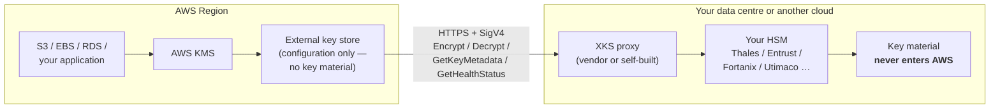
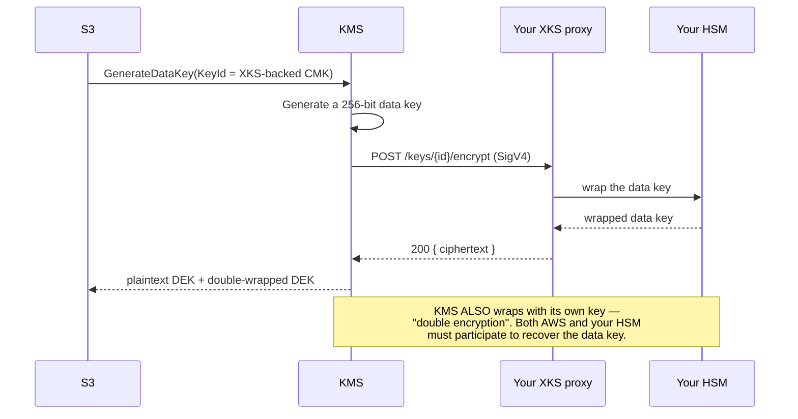
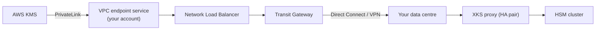

# KMS External Key Store (XKS)
{: .no_toc }

The hold-your-own-key tier. Key material lives in *your* HSM, outside AWS
entirely, and KMS calls out to you for every cryptographic operation.
{: .fs-5 .fw-300 }

## On this page
{: .no_toc .text-delta }

1. TOC
{:toc}

---

## The architecture



Every `Decrypt` against an XKS key becomes a synchronous HTTPS request from KMS
to your proxy. That single sentence contains all of this design's benefits and
all of its costs.

| | Custom key store | External key store |
|:--|:--|:--|
| Key material location | Your CloudHSM cluster (in AWS) | **Your HSM, outside AWS** |
| Who operates the HSM | AWS (you configure) | **You, entirely** |
| Network path per operation | Within AWS | **AWS → your proxy → your HSM** |
| Added latency | Low | **Tens to hundreds of ms** |
| Availability dependency | Your cluster | **Your proxy + HSM + network + DNS** |
| Can you revoke AWS's access? | Delete the cluster | **Turn off the proxy — instantly** |

{: .warning }
> **XKS is the highest-control and highest-risk option in this guide.** Your
> proxy becomes a hard dependency of every AWS service reading that data. A proxy
> outage is an outage of your S3 buckets, your EBS volumes, and your databases —
> and KMS will not cache around it. Build the proxy to the same availability
> standard as the workload it gates, then test that assumption with a game day.

## When it is the right answer

| Driver | Why XKS fits |
|:--|:--|
| Regulatory requirement that keys never reside with the cloud provider | Material genuinely never enters AWS |
| A contractual right to unilaterally revoke provider access | Turning off the proxy is instant, verifiable revocation |
| Data sovereignty rules pinning key custody to a jurisdiction | The HSM sits where the law requires |
| Existing enterprise HSM estate that must remain the system of record | One key hierarchy across cloud and on-prem |

If none of those apply, use a custom key store or plain KMS. XKS bought "because
it sounds more secure" is a self-inflicted availability problem.

## The proxy

KMS speaks a documented **XKS proxy API** over HTTPS with SigV4 authentication.
You have three options:

| Option | Effort | Notes |
|:--|:--|:--|
| **Vendor proxy** | Lowest | Thales CipherTrust, Entrust KeyControl, Fortanix DSM, and others ship XKS-compatible proxies |
| **AWS reference implementation** | Medium | AWS publishes an open-source proxy you deploy against your own HSM |
| **Build your own** | Highest | You implement the spec; only sensible if you have an unusual HSM |

### The API surface you must implement

| Endpoint | Purpose |
|:--|:--|
| `POST /kms/xks/v1/keys/{keyId}/encrypt` | Encrypt a data key |
| `POST /kms/xks/v1/keys/{keyId}/decrypt` | Decrypt a data key |
| `POST /kms/xks/v1/keys/{keyId}/metadata` | Report key spec and usage |
| `POST /kms/xks/v1/health` | Health status KMS polls |



{: .important }
> **XKS keys are double-wrapped.** KMS encrypts the data key with its own
> internal key *and* sends it to your external key for a second wrap. That means
> neither AWS alone nor your HSM alone can recover the plaintext — a genuinely
> strong property, and the reason "we can revoke AWS's access" is a truthful claim
> rather than marketing.

## Connectivity options

| Mode | How KMS reaches you | Use when |
|:--|:--|:--|
| `PUBLIC_ENDPOINT` | Public internet to a TLS endpoint you publish | Simplest; requires a publicly resolvable, certificate-valid endpoint |
| `VPC_ENDPOINT_SERVICE` | AWS PrivateLink to an NLB in your VPC, then Direct Connect/VPN to your data centre | Production; keeps the path off the public internet |



## Step 1 — Prepare the proxy endpoint

Requirements KMS enforces:

| Requirement | Detail |
|:--|:--|
| TLS 1.2+ | With a certificate from a CA in the AWS-trusted store |
| Certificate CN/SAN | Must match the endpoint hostname exactly |
| Path prefix | Your chosen `--xks-proxy-uri-path`, e.g. `/kms/xks/v1` |
| SigV4 credentials | An access key ID and secret you generate — **not** AWS IAM credentials |
| Latency | Requests must complete well within KMS's timeout budget |
| Availability | Whatever your workload requires; there is no KMS-side cache |

```bash
# Generate the SigV4 credential pair the proxy will validate.
# These are arbitrary strings, not IAM credentials — but they must meet
# the length constraints KMS enforces.
XKS_ACCESS_KEY_ID="$(openssl rand -hex 12 | tr 'a-f' 'A-F')"      # 20-30 chars
XKS_SECRET="$(openssl rand -base64 32 | tr -d '/+=' | head -c 43)" # 43-64 chars

echo "XKS_ACCESS_KEY_ID=$XKS_ACCESS_KEY_ID"
echo "XKS_SECRET=$XKS_SECRET"

# Store them for the proxy and for KMS
aws secretsmanager create-secret \
  --name prod/xks/proxy-credentials \
  --kms-key-id alias/prod/secrets/app-secrets \
  --secret-string "{\"accessKeyId\":\"$XKS_ACCESS_KEY_ID\",\"secretAccessKey\":\"$XKS_SECRET\"}"
```

## Step 2 — Create the external key store

### Public endpoint

```bash
XKS_ID=$(aws kms create-custom-key-store \
  --custom-key-store-name "prod-onprem-xks" \
  --custom-key-store-type EXTERNAL_KEY_STORE \
  --xks-proxy-connectivity PUBLIC_ENDPOINT \
  --xks-proxy-uri-endpoint "https://xks.yourcompany.com" \
  --xks-proxy-uri-path "/kms/xks/v1" \
  --xks-proxy-authentication-credential \
    "AccessKeyId=${XKS_ACCESS_KEY_ID},RawSecretAccessKey=${XKS_SECRET}" \
  --query CustomKeyStoreId --output text)

echo "XKS: $XKS_ID"
```

### PrivateLink (production)

```bash
# 1. Create the VPC endpoint service in front of your NLB
VPCE_SERVICE=$(aws ec2 create-vpc-endpoint-service-configuration \
  --network-load-balancer-arns "$NLB_ARN" \
  --acceptance-required \
  --query 'ServiceConfiguration.ServiceName' --output text)

# 2. Allow the KMS service principal to discover it
aws ec2 modify-vpc-endpoint-service-permissions \
  --service-id "${VPCE_SERVICE##*/}" \
  --add-allowed-principals "cks.kms.${AWS_REGION}.amazonaws.com"

# 3. Create the store pointing at it
XKS_ID=$(aws kms create-custom-key-store \
  --custom-key-store-name "prod-onprem-xks" \
  --custom-key-store-type EXTERNAL_KEY_STORE \
  --xks-proxy-connectivity VPC_ENDPOINT_SERVICE \
  --xks-proxy-vpc-endpoint-service-name "$VPCE_SERVICE" \
  --xks-proxy-uri-endpoint "https://xks.internal.yourcompany.com" \
  --xks-proxy-uri-path "/kms/xks/v1" \
  --xks-proxy-authentication-credential \
    "AccessKeyId=${XKS_ACCESS_KEY_ID},RawSecretAccessKey=${XKS_SECRET}" \
  --query CustomKeyStoreId --output text)
```

{: .note }
> With `VPC_ENDPOINT_SERVICE`, the `--xks-proxy-uri-endpoint` hostname must still
> resolve and match the TLS certificate presented by your proxy — but resolution
> happens inside the PrivateLink path, so a private DNS name is correct there.

## Step 3 — Connect and verify

```bash
aws kms connect-custom-key-store --custom-key-store-id "$XKS_ID"

while true; do
  read -r STATE CODE <<<"$(aws kms describe-custom-key-stores \
    --custom-key-store-id "$XKS_ID" \
    --query 'CustomKeyStores[0].[ConnectionState,ConnectionErrorCode]' --output text)"
  echo "$(date -u +%H:%M:%SZ) $STATE $CODE"
  [ "$STATE" = "CONNECTED" ] && break
  [ "$STATE" = "FAILED" ] && exit 1
  sleep 30
done
```

### XKS connection error codes

| Code | Meaning |
|:--|:--|
| `XKS_PROXY_ACCESS_DENIED` | SigV4 credential mismatch |
| `XKS_PROXY_NOT_REACHABLE` | DNS, routing, firewall, or the proxy is down |
| `XKS_PROXY_TIMED_OUT` | Proxy too slow, or the HSM behind it is |
| `XKS_PROXY_INVALID_RESPONSE` | Proxy returned a malformed body — a spec-compliance bug |
| `XKS_PROXY_INVALID_TLS_CONFIGURATION` | Certificate not trusted, expired, or CN/SAN mismatch |
| `XKS_PROXY_INVALID_CONFIGURATION` | URI path or endpoint wrong |
| `XKS_VPC_ENDPOINT_SERVICE_NOT_FOUND` | Endpoint service missing or KMS principal not permitted |
| `XKS_VPC_ENDPOINT_SERVICE_INVALID_CONFIGURATION` | NLB or acceptance settings wrong |

## Step 4 — Create an XKS-backed key

The external key must already exist in your HSM, and you reference it by the ID
your proxy exposes.

```bash
KEY_ARN=$(aws kms create-key \
  --custom-key-store-id "$XKS_ID" \
  --origin EXTERNAL_KEY_STORE \
  --xks-key-id "onprem-hsm-key-0042" \
  --key-spec SYMMETRIC_DEFAULT \
  --key-usage ENCRYPT_DECRYPT \
  --description "Sovereign data key — material held on-premises" \
  --policy file:///tmp/key-policy-sovereign.json \
  --tags TagKey=Environment,TagValue=prod \
         TagKey=DataClass,TagValue=restricted \
         TagKey=Custody,TagValue=on-premises \
  --query 'KeyMetadata.Arn' --output text)

aws kms create-alias --alias-name alias/prod/sovereign/eu-data \
  --target-key-id "$KEY_ARN"

aws kms describe-key --key-id "$KEY_ARN" \
  --query 'KeyMetadata.{Origin:Origin,CKS:CustomKeyStoreId,XKS:XksKeyConfiguration,State:KeyState}'
```

```json
{
    "Origin": "EXTERNAL_KEY_STORE",
    "CKS": "cks-0987654321fedcba0",
    "XKS": { "Id": "onprem-hsm-key-0042" },
    "State": "Enabled"
}
```

{: .important }
> **The external key must be AES-256 and must support the operations KMS asks
> for.** `create-key` calls your proxy's metadata endpoint to verify this before
> succeeding, which is a useful early failure. If it reports
> `XksKeyInvalidConfigurationException`, the key in your HSM is the wrong type or
> its usage attributes are too narrow.

## Step 5 — Test it end to end, then test the failure

```bash
# Normal operation
CT=$(aws kms encrypt --key-id alias/prod/sovereign/eu-data \
  --plaintext "$(echo -n 'sovereign-canary' | base64)" \
  --query CiphertextBlob --output text)
echo "$CT" | base64 -d > /tmp/xks.bin
aws kms decrypt --ciphertext-blob fileb:///tmp/xks.bin \
  --query Plaintext --output text | base64 -d; echo

# --- The important test: what happens when the proxy is unavailable? ---------
# Stop the proxy (in a NON-PRODUCTION store), then:
aws kms decrypt --ciphertext-blob fileb:///tmp/xks.bin 2>&1 | tail -2
```

```text
An error occurred (KMSInvalidStateException) when calling the Decrypt operation:
The external key store proxy rejected the request because it could not reach the external key manager.
```

{: .warning }
> **Run this failure test deliberately, in a non-production store, before you go
> live.** Watch what your dependent services do — how S3 reports the error, how
> your application handles it, whether your alarms fire, how long recovery takes
> once the proxy returns. An XKS design that has never been failure-tested is an
> untested single point of failure sitting under your most sensitive data.

## Revocation — the capability you bought

```bash
# Option 1: disconnect the store (KMS-side, reversible in ~20 min)
aws kms disconnect-custom-key-store --custom-key-store-id "$XKS_ID"

# Option 2: stop the proxy (your side, instant, and provable to a regulator)
#   systemctl stop xks-proxy

# Option 3: disable the key inside your HSM (finest-grained)
```

{: .tip }
> Option 2 is the one that matters for the compliance story. You can demonstrate
> to an auditor or regulator that access is revoked by an action taken entirely
> within your own infrastructure, requiring no cooperation from AWS and verifiable
> in your own logs. That is a stronger statement than any contractual clause, and
> it is the reason XKS exists.

## Operational requirements before production

| # | Requirement | Why |
|:--|:--|:--|
| 1 | Proxy deployed HA across ≥ 2 sites | It is now on the critical path of your data |
| 2 | HSM cluster behind it is redundant | Same |
| 3 | Latency budget measured under peak load | KMS times out; slow is the same as down |
| 4 | Network path redundant (2× Direct Connect or DX + VPN) | A fibre cut becomes a data outage |
| 5 | TLS certificate expiry monitored | Expiry disconnects the store |
| 6 | SigV4 credential rotation procedure written and rehearsed | Requires `update-custom-key-store` + reconnect |
| 7 | Proxy request/error metrics in your SIEM | KMS-side visibility is limited to error codes |
| 8 | Game day: proxy failure, HSM failure, network failure | Untested DR is not DR |
| 9 | Documented RTO for reconnection | Reconnect is ~20 minutes at best |
| 10 | Every dependent workload inventoried | You must know the blast radius before you revoke |

---

[Next: 9. Backup, DR &amp; Deletion](){: .btn .btn-primary }
