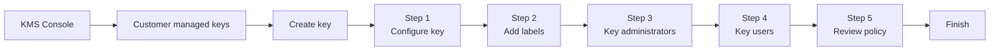

# Creating a CMK in the Console
{: .no_toc }

The Console is the wrong tool for production, and the right tool for
understanding what production is doing. Every field here maps to a CLI parameter
and a Terraform argument.
{: .fs-5 .fw-300 }

## On this page
{: .no_toc .text-delta }

1. TOC
{:toc}

---

## The click-path

{: .account }
> **Portal step.** Sign in to the **Security account** with the
> `KeyAdministrator` permission set. Confirm the Region selector in the top-right
> reads `us-east-1` (or your target Region) — **KMS keys are Regional, and
> creating one in the wrong Region is a common and annoying mistake.**



### Step 1 — Configure key

Navigate to **KMS → Customer managed keys → Create key**.

| Field | Choose | Why |
|:--|:--|:--|
| **Key type** | Symmetric | Required for all native AWS service integrations |
| **Key usage** | Encrypt and decrypt | The only option for symmetric keys other than HMAC |
| **Advanced → Key material origin** | KMS | `External` = BYOK (see [Import]()); `AWS CloudHSM key store` = custom key store; `External key store` = XKS |
| **Advanced → Regionality** | Single-Region *or* Multi-Region | **Immutable after creation.** If there is any chance this key protects data that must be recoverable in another Region, choose Multi-Region now |

{: .warning }
> **Regionality cannot be changed later.** A single-Region key can never become
> multi-Region. If you later need cross-Region DR for data encrypted with it, you
> must create a new multi-Region key and re-encrypt everything. Decide now — see
> [Multi-Region Keys]().

### Step 2 — Add labels

| Field | Value |
|:--|:--|
| **Alias** | `prod/platform/s3-general` (the Console prepends `alias/`) |
| **Description** | `Prod platform key for general S3 object encryption` |
| **Tags** | `Environment=prod`, `DataClass=confidential`, `Owner=platform@yourcompany.com`, `CostCenter=CC-4417`, `ManagedBy=console` |

{: .tip }
> Tags on a KMS key are how you will later answer "which keys protect PCI data?"
> and "what is the key spend for the analytics team?" without reading policy
> documents. Set them at creation — retrofitting tags across hundreds of keys is
> a scripting exercise nobody enjoys.

### Step 3 — Define key administrative permissions

Select the IAM roles that may **manage** this key. For an SSO-based setup this is
the provisioned role behind your `KeyAdministrator` permission set — it has a
generated name like `AWSReservedSSO_KeyAdministrator_abc123def456`.

Leave **"Allow key administrators to delete this key"** checked only if your
process actually permits it. For a key protecting regulated data, uncheck it and
grant deletion separately through a break-glass path.

{: .important }
> Key administrators added here get `kms:PutKeyPolicy`, which means they can
> grant themselves *use* of the key. The explicit IAM `Deny` you attached to the
> `KeyAdministrator` permission set in
> [Account Setup]() is what actually stops that —
> a key policy cannot override an IAM explicit deny. This is why the deny lives
> in IAM, not in the key policy.

### Step 4 — Define key usage permissions

Select the principals that may perform cryptographic operations. Two groups:

- **This account** — the application roles running in the security account.
- **Other AWS accounts** — click **Add another AWS account** and enter the
  workload account ID (`444455556666`). This adds an `AWS: "arn:aws:iam::444455556666:root"`
  principal to the key policy.

{: .warning }
> **Adding an account here delegates to the *whole account*, not to a role.** The
> `:root` principal means "any principal in account 444455556666 that also has an
> IAM policy allowing this action." You must *also* attach an IAM policy in that
> account granting the specific roles access. This two-key-turn model is a
> feature — but people routinely add the account and forget the IAM half, then
> wonder why access is denied.

### Step 5 — Review and edit key policy

The Console shows the generated JSON. Read it before clicking **Finish** — this
is the actual authorization boundary. A minimal, correct policy looks like this:

```json
{
  "Version": "2012-10-17",
  "Id": "key-policy-s3-general",
  "Statement": [
    {
      "Sid": "EnableIAMUserPermissions",
      "Effect": "Allow",
      "Principal": { "AWS": "arn:aws:iam::111122223333:root" },
      "Action": "kms:*",
      "Resource": "*"
    },
    {
      "Sid": "AllowKeyAdministration",
      "Effect": "Allow",
      "Principal": {
        "AWS": "arn:aws:iam::111122223333:role/AWSReservedSSO_KeyAdministrator_abc123def456"
      },
      "Action": [
        "kms:Create*", "kms:Describe*", "kms:Enable*", "kms:List*",
        "kms:Put*", "kms:Update*", "kms:Revoke*", "kms:Disable*",
        "kms:Get*", "kms:Delete*", "kms:TagResource", "kms:UntagResource",
        "kms:ScheduleKeyDeletion", "kms:CancelKeyDeletion"
      ],
      "Resource": "*"
    },
    {
      "Sid": "AllowWorkloadAccountUse",
      "Effect": "Allow",
      "Principal": { "AWS": "arn:aws:iam::444455556666:root" },
      "Action": [
        "kms:Encrypt", "kms:Decrypt", "kms:ReEncrypt*",
        "kms:GenerateDataKey*", "kms:DescribeKey"
      ],
      "Resource": "*",
      "Condition": {
        "StringEquals": { "kms:ViaService": "s3.us-east-1.amazonaws.com" }
      }
    }
  ]
}
```

Note the `"Resource": "*"` in every statement. In a **key policy**, `Resource`
means "this key" — it is not a wildcard over all keys. This trips up almost
everyone the first time.

## Enable rotation after creation

Rotation is not offered in the creation wizard. Once the key exists:

**KMS → Customer managed keys → `prod/platform/s3-general` → Key rotation tab →
Edit → Automatically rotate this KMS key every `365` days → Save.**

The rotation period is configurable from 90 to 2,560 days.

## Verify what you built

```bash
aws kms describe-key --key-id alias/prod/platform/s3-general \
  --query 'KeyMetadata.{Arn:Arn,State:KeyState,Spec:KeySpec,Usage:KeyUsage,Origin:Origin,MultiRegion:MultiRegion}'
```

```json
{
    "Arn": "arn:aws:kms:us-east-1:111122223333:key/1234abcd-12ab-34cd-56ef-1234567890ab",
    "State": "Enabled",
    "Spec": "SYMMETRIC_DEFAULT",
    "Usage": "ENCRYPT_DECRYPT",
    "Origin": "AWS_KMS",
    "MultiRegion": false
}
```

```bash
aws kms get-key-rotation-status --key-id alias/prod/platform/s3-general
```

```json
{
    "KeyRotationEnabled": true,
    "KeyId": "arn:aws:kms:us-east-1:111122223333:key/1234abcd-12ab-34cd-56ef-1234567890ab",
    "RotationPeriodInDays": 365,
    "NextRotationDate": "2027-08-18T14:22:31.000000-04:00"
}
```

## Console-created keys and Terraform

If this key is going to production, import it into Terraform now rather than
later — see [Importing existing keys](#importing-an-existing-key).
Then change the `ManagedBy` tag from `console` to `terraform` so the next person
knows where to edit it.

---

[Next: 5.2 AWS CLI](){: .btn .btn-primary }
