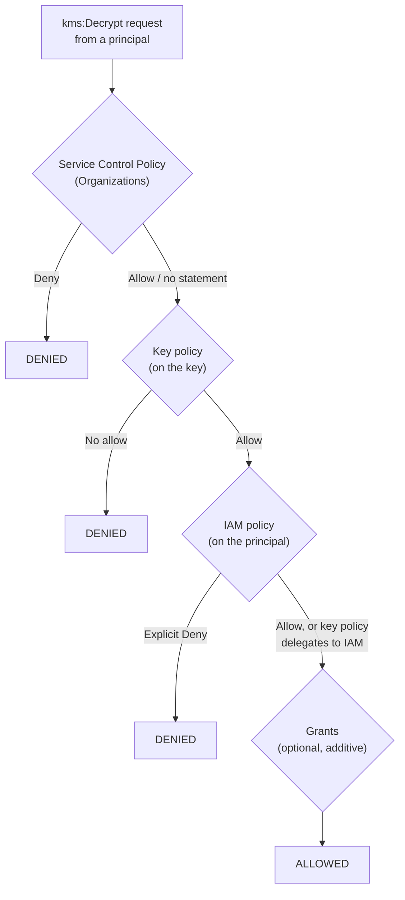

# Key Policies &amp; Access Control
{: .no_toc }

**Phase 3 — Build.** The authorization model is where key management is actually
won or lost. A key with a bad policy is worse than no key, because it looks like
a control.
{: .fs-5 .fw-300 }

## On this page
{: .no_toc .text-delta }

1. TOC
{:toc}

---

## The three-mechanism model

KMS authorization is unusual: **three independent mechanisms** must all agree
before a cryptographic operation succeeds.



| Mechanism | Attached to | Can it grant alone? | Can it deny? |
|:--|:--|:--|:--|
| **Key policy** | The KMS key | Yes — this is the primary control | Yes |
| **IAM policy** | The principal | Only if the key policy delegates to IAM | Yes (explicit deny always wins) |
| **Grant** | The key, for a specific principal | Yes, additively | No |
| **SCP** | An OU or account | No — SCPs only set a ceiling | Yes |

{: .important }
> **The rule that explains most "why is this denied?" tickets:** unlike almost
> every other AWS service, an IAM policy alone is *not* sufficient for KMS. The
> key policy must either name the principal directly, or contain the
> `EnableIAMUserPermissions` statement that delegates to IAM. A brand-new key
> created without `--policy` gets that delegation by default. A key created with
> a hand-written policy that omits it does not — and no IAM policy in the world
> will open it.

## Anatomy of the default key policy

```json
{
  "Version": "2012-10-17",
  "Id": "key-default-1",
  "Statement": [
    {
      "Sid": "Enable IAM User Permissions",
      "Effect": "Allow",
      "Principal": { "AWS": "arn:aws:iam::111122223333:root" },
      "Action": "kms:*",
      "Resource": "*"
    }
  ]
}
```

This says: *"any principal in account 111122223333 whose IAM policy allows a KMS
action may perform it on this key."* It delegates all decisions to IAM.

- **Advantage:** familiar, central, scales with your existing IAM tooling.
- **Disadvantage:** the key has no independent defence. Anyone who can write IAM
  policy in the account can grant themselves the key.

For high-value keys, **restrict the root delegation and name principals
explicitly** in the key policy. That way, adding a new consumer requires a change
to the key policy — which is a reviewable, alarmable, key-owner-approved event
rather than a routine IAM change.

## The production key policy, annotated

```json
{
  "Version": "2012-10-17",
  "Id": "key-policy-prod-payments-pci-chd",
  "Statement": [
    {
      "Sid": "AllowRootAccountToManagePolicyOnly",
      "Effect": "Allow",
      "Principal": { "AWS": "arn:aws:iam::111122223333:root" },
      "Action": [
        "kms:GetKeyPolicy", "kms:PutKeyPolicy",
        "kms:DescribeKey", "kms:ListResourceTags"
      ],
      "Resource": "*"
    },
    {
      "Sid": "AllowKeyAdministratorsLifecycleOnly",
      "Effect": "Allow",
      "Principal": {
        "AWS": "arn:aws:iam::111122223333:role/aws-reserved/sso.amazonaws.com/AWSReservedSSO_KeyAdministrator_abc123"
      },
      "Action": [
        "kms:Create*", "kms:Describe*", "kms:Enable*", "kms:List*",
        "kms:Put*", "kms:Update*", "kms:Revoke*", "kms:Disable*",
        "kms:Get*", "kms:TagResource", "kms:UntagResource",
        "kms:ScheduleKeyDeletion", "kms:CancelKeyDeletion"
      ],
      "Resource": "*",
      "Condition": {
        "Bool": { "aws:MultiFactorAuthPresent": "true" }
      }
    },
    {
      "Sid": "AllowPaymentServiceCryptographicUse",
      "Effect": "Allow",
      "Principal": {
        "AWS": "arn:aws:iam::444455556666:role/payment-service-task-role"
      },
      "Action": [
        "kms:Decrypt", "kms:GenerateDataKey", "kms:DescribeKey"
      ],
      "Resource": "*",
      "Condition": {
        "StringEquals": {
          "kms:EncryptionContext:application": "payments",
          "aws:PrincipalOrgID": "o-exampleorgid"
        },
        "IpAddress": {
          "aws:SourceIp": ["10.0.0.0/8"]
        }
      }
    },
    {
      "Sid": "DenyAllExceptWithinOrganization",
      "Effect": "Deny",
      "Principal": "*",
      "Action": "kms:*",
      "Resource": "*",
      "Condition": {
        "StringNotEquals": { "aws:PrincipalOrgID": "o-exampleorgid" }
      }
    },
    {
      "Sid": "DenyDeletionWithoutBreakGlass",
      "Effect": "Deny",
      "Principal": "*",
      "Action": ["kms:ScheduleKeyDeletion", "kms:DisableKey"],
      "Resource": "*",
      "Condition": {
        "StringNotLike": {
          "aws:PrincipalArn": "arn:aws:iam::111122223333:role/aws-reserved/sso.amazonaws.com/AWSReservedSSO_BreakGlassAdmin_*"
        }
      }
    }
  ]
}
```

Read the five statements as a set of decisions:

| Statement | Decision it encodes |
|:--|:--|
| 1 | The account root can fix the policy if it is broken, but cannot decrypt |
| 2 | Key admins manage lifecycle, **and only with MFA present** |
| 3 | Exactly one workload role may decrypt, only for its own application context, only from private IP space |
| 4 | Nobody outside the organization, ever — a confused-deputy backstop |
| 5 | Only break-glass can disable or destroy the key |

{: .warning }
> **Statement 1 is a deliberate trade-off.** By narrowing the root delegation to
> policy management only, no IAM policy in the account can grant use of this key
> — every consumer must be named in the key policy. That is the security win. The
> cost is that you *must* keep `kms:PutKeyPolicy` working for someone, or the key
> becomes unmanageable. Never remove the root's ability to modify the policy.

### The condition keys worth knowing

| Condition key | Type | What it does |
|:--|:--|:--|
| `kms:ViaService` | String | Only allow the request when it comes *through* a named AWS service (e.g. `s3.us-east-1.amazonaws.com`). Stops a principal from calling `Decrypt` directly |
| `kms:CallerAccount` | String | The account of the original caller — pairs with `ViaService` for cross-account |
| `kms:EncryptionContext:<key>` | String | Require a specific encryption context value. The multi-tenancy control |
| `kms:EncryptionContextKeys` | ArrayOfString | Require that certain context *keys* are present, whatever their value |
| `kms:GrantIsForAWSResource` | Bool | Only allow grant creation by AWS services acting on the caller's behalf |
| `kms:GrantOperations` | ArrayOfString | Limit which operations a grant may confer |
| `kms:KeySpec` / `kms:KeyUsage` / `kms:KeyOrigin` | String | Constrain `CreateKey` — e.g. deny creating anything but `SYMMETRIC_DEFAULT` |
| `kms:MultiRegion` | Bool | Constrain whether multi-Region keys may be created |
| `kms:ScheduleKeyDeletionPendingWindowInDays` | Numeric | Enforce a minimum deletion waiting period |
| `aws:PrincipalOrgID` | String | The organization the caller belongs to |
| `aws:MultiFactorAuthPresent` | Bool | Whether the session was authenticated with MFA |
| `aws:SourceVpce` / `aws:SourceVpc` | String | Require the request to arrive via a specific VPC endpoint |

### `kms:ViaService` — the most useful and most misunderstood

```json
{
  "Sid": "AllowUseOnlyThroughS3",
  "Effect": "Allow",
  "Principal": { "AWS": "arn:aws:iam::444455556666:role/data-pipeline" },
  "Action": ["kms:Decrypt", "kms:GenerateDataKey*", "kms:DescribeKey"],
  "Resource": "*",
  "Condition": {
    "StringEquals": {
      "kms:ViaService": "s3.us-east-1.amazonaws.com",
      "kms:CallerAccount": "444455556666"
    }
  }
}
```

With this statement, the `data-pipeline` role can read SSE-KMS-encrypted objects
from S3 — because S3 calls KMS on its behalf and KMS sees `ViaService = s3`. But
if that role's credentials are stolen and the attacker calls `kms:Decrypt`
directly with a ciphertext blob, **it is denied**, because a direct call carries
no `ViaService` value.

{: .tip }
> `kms:ViaService` converts a broad "can decrypt" grant into "can decrypt only in
> the course of using this specific service." It is the highest-value condition
> key in KMS and costs nothing to add. Use it on every service-integration grant.

## Grants — temporary, programmatic, revocable access

Key policies are for durable relationships. **Grants** are for the ones that come
and go: a Lambda that needs decrypt rights for the life of a job, an AWS service
attaching a key to a resource.

```bash
# Create a narrowly-scoped grant
GRANT=$(aws kms create-grant \
  --key-id alias/prod/platform/s3-general \
  --grantee-principal arn:aws:iam::444455556666:role/batch-processor \
  --operations Decrypt GenerateDataKey \
  --constraints "EncryptionContextSubset={application=reporting}" \
  --name "batch-processor-nightly" \
  --output json)

echo "$GRANT" | jq .
```

```json
{
  "GrantToken": "AQpAM2RiOTU4ZDAyMzNhO...truncated...",
  "GrantId": "0c237476b39f8bc44e45212e08498fbe3151305030726c0590dd8d3e9f3d6a60"
}
```

```bash
# List every grant on a key — an under-used audit query
aws kms list-grants --key-id alias/prod/platform/s3-general \
  --query 'Grants[].{Id:GrantId,Grantee:GranteePrincipal,Ops:Operations,Name:Name,Created:CreationDate}' \
  --output table

# Revoke when the job is decommissioned
aws kms revoke-grant \
  --key-id alias/prod/platform/s3-general \
  --grant-id 0c237476b39f8bc44e45212e08498fbe3151305030726c0590dd8d3e9f3d6a60
```

### Grant constraints

| Constraint | Behavior |
|:--|:--|
| `EncryptionContextSubset` | The request's context must *contain* these pairs (may have more) |
| `EncryptionContextEquals` | The request's context must match *exactly* |

{: .warning }
> **Grants are the blind spot in most key access reviews.** They are created
> programmatically — often by AWS services on your behalf — do not appear in the
> key policy, and accumulate silently. A key with a pristine policy can still have
> two hundred grants on it. Run `list-grants` on every key as part of your
> quarterly access review, and diff it against the previous quarter. The
> `key_inventory.py` script in [5.5 Python SDK]() can
> be extended to collect them.

### Grant tokens and eventual consistency

A newly created grant is **eventually consistent** — a `Decrypt` call issued
immediately after `CreateGrant` may fail with `AccessDeniedException`. The
`GrantToken` returned by `CreateGrant` solves this: pass it on the request and
KMS honors the grant immediately.

```python
grant = kms.create_grant(
    KeyId="alias/prod/platform/s3-general",
    GranteePrincipal=role_arn,
    Operations=["Decrypt", "GenerateDataKey"],
)

# Use the token for immediate calls; after ~5 minutes it is unnecessary
kms.generate_data_key(
    KeyId="alias/prod/platform/s3-general",
    KeySpec="AES_256",
    GrantTokens=[grant["GrantToken"]],
)
```

## Service Control Policies — the organization-wide ceiling

SCPs cannot grant anything. They define the maximum permissions available in an
account, and an SCP `Deny` cannot be overridden by any key policy, IAM policy, or
grant. That makes them the right place for absolute rules.

### Prevent key deletion outside break-glass

`policies/scp/deny-key-deletion.json`

```json
{
  "Version": "2012-10-17",
  "Statement": [
    {
      "Sid": "DenyKMSKeyDeletionAndDisable",
      "Effect": "Deny",
      "Action": [
        "kms:ScheduleKeyDeletion",
        "kms:DisableKey",
        "kms:DisableKeyRotation",
        "kms:DeleteImportedKeyMaterial",
        "kms:DeleteCustomKeyStore",
        "kms:DisconnectCustomKeyStore"
      ],
      "Resource": "*",
      "Condition": {
        "ArnNotLike": {
          "aws:PrincipalARN": [
            "arn:aws:iam::*:role/aws-reserved/sso.amazonaws.com/*/AWSReservedSSO_BreakGlassAdmin_*"
          ]
        }
      }
    }
  ]
}
```

### Force encryption in transit and constrain key creation

`policies/scp/require-kms-encryption.json`

```json
{
  "Version": "2012-10-17",
  "Statement": [
    {
      "Sid": "DenyKMSOverInsecureTransport",
      "Effect": "Deny",
      "Action": "kms:*",
      "Resource": "*",
      "Condition": {
        "Bool": { "aws:SecureTransport": "false" }
      }
    },
    {
      "Sid": "DenyUnapprovedKeySpecs",
      "Effect": "Deny",
      "Action": "kms:CreateKey",
      "Resource": "*",
      "Condition": {
        "StringNotEquals": {
          "kms:KeySpec": [
            "SYMMETRIC_DEFAULT",
            "ECC_NIST_P384",
            "RSA_4096",
            "HMAC_256"
          ]
        }
      }
    },
    {
      "Sid": "DenyShortDeletionWindows",
      "Effect": "Deny",
      "Action": "kms:ScheduleKeyDeletion",
      "Resource": "*",
      "Condition": {
        "NumericLessThan": {
          "kms:ScheduleKeyDeletionPendingWindowInDays": "30"
        }
      }
    },
    {
      "Sid": "DenyUnencryptedS3Uploads",
      "Effect": "Deny",
      "Action": "s3:PutObject",
      "Resource": "*",
      "Condition": {
        "StringNotEquals": {
          "s3:x-amz-server-side-encryption": "aws:kms"
        },
        "Null": {
          "s3:x-amz-server-side-encryption": "false"
        }
      }
    }
  ]
}
```

Attach it:

```bash
ROOT_ID=$(aws organizations list-roots --query 'Roots[0].Id' --output text)
WORKLOADS_OU=$(aws organizations list-organizational-units-for-parent \
  --parent-id "$ROOT_ID" \
  --query "OrganizationalUnits[?Name=='Workloads'].Id" --output text)

POLICY_ID=$(aws organizations create-policy \
  --name "deny-kms-key-deletion" \
  --description "Only break-glass may disable or delete KMS keys" \
  --type SERVICE_CONTROL_POLICY \
  --content file://policies/scp/deny-key-deletion.json \
  --query 'Policy.PolicySummary.Id' --output text)

aws organizations attach-policy \
  --policy-id "$POLICY_ID" --target-id "$WORKLOADS_OU"
```

{: .warning }
> **Test SCPs in a sandbox OU first.** An SCP mistake locks out every principal
> in every attached account simultaneously, including the automation that would
> fix it. The management account is exempt from SCPs, which is your escape hatch
> — but only if the SCP is not attached to the root.

## Testing your access model

Do not assume the policy does what you meant. Simulate it.

```bash
# Simulate the workload role attempting a direct Decrypt (should be DENIED
# if you used kms:ViaService)
aws iam simulate-principal-policy \
  --policy-source-arn arn:aws:iam::444455556666:role/data-pipeline \
  --action-names kms:Decrypt \
  --resource-arns "arn:aws:kms:us-east-1:111122223333:key/1234abcd-12ab-34cd-56ef-1234567890ab" \
  --query 'EvaluationResults[].{Action:EvalActionName,Decision:EvalDecision}' \
  --output table

# Simulate the same call *through* S3 (should be ALLOWED)
aws iam simulate-principal-policy \
  --policy-source-arn arn:aws:iam::444455556666:role/data-pipeline \
  --action-names kms:Decrypt \
  --resource-arns "arn:aws:kms:us-east-1:111122223333:key/1234abcd-12ab-34cd-56ef-1234567890ab" \
  --context-entries \
    'ContextKeyName=kms:ViaService,ContextKeyValues=s3.us-east-1.amazonaws.com,ContextKeyType=string' \
  --query 'EvaluationResults[].{Action:EvalActionName,Decision:EvalDecision}' \
  --output table
```

{: .note }
> `simulate-principal-policy` evaluates **IAM policies only** — it does not
> evaluate the KMS key policy or SCPs. It will tell you the caller's IAM side is
> correct; it will not tell you the key policy agrees. For the full picture, use
> **IAM Access Analyzer** policy validation plus an actual round-trip test in a
> non-production account.

### IAM Access Analyzer for external access

```bash
# Create an analyzer scoped to the organization
aws accessanalyzer create-analyzer \
  --analyzer-name org-external-access \
  --type ORGANIZATION

# Findings on KMS keys reachable from outside the organization
aws accessanalyzer list-findings \
  --analyzer-arn "arn:aws:access-analyzer:us-east-1:111122223333:analyzer/org-external-access" \
  --filter '{"resourceType":{"eq":["AWS::KMS::Key"]}}' \
  --query 'findings[].{Resource:resource,Principal:principal,Action:action,Status:status}' \
  --output table
```

```bash
# Validate a policy document before you apply it
aws accessanalyzer validate-policy \
  --policy-document file:///tmp/key-policy-s3-general.json \
  --policy-type RESOURCE_POLICY \
  --query 'findings[].{Type:findingType,Issue:issueCode,Detail:findingDetails}' \
  --output table
```

## Access review checklist

Run this quarterly and keep the output as evidence.

| # | Question | Command |
|:--|:--|:--|
| 1 | Which principals appear in each key policy? | `aws kms get-key-policy --policy-name default` |
| 2 | What grants exist, and who created them? | `aws kms list-grants --key-id …` |
| 3 | Are any keys reachable from outside the org? | Access Analyzer findings, filtered to `AWS::KMS::Key` |
| 4 | Do key admins still lack decrypt? | `aws iam simulate-principal-policy` against the admin role |
| 5 | Which keys were actually *used* last quarter? | Athena query in [Logging &amp; SIEM]() |
| 6 | Are there keys with no usage at all? | Same query — unused keys are candidates for retirement |
| 7 | Did any key policy change? | CloudTrail `PutKeyPolicy` events |

---

[Next: 7. Key Operations](){: .btn .btn-primary }
