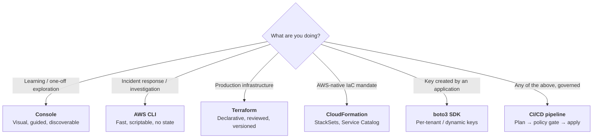

# Creating Keys
{: .no_toc }

**Phase 3 — Build.** One key, six ways. The Console for understanding, the CLI
for operations, Terraform and CloudFormation for repeatability, the SDK for
applications, and CI/CD for governance.
{: .fs-5 .fw-300 }

---

## The key you are about to build

Every page in this section produces the **same logical resource**, so you can
compare the mechanics directly:

| Attribute | Value |
|:--|:--|
| Description | `Prod platform key for general S3 object encryption` |
| Key spec | `SYMMETRIC_DEFAULT` (AES-256-GCM) |
| Key usage | `ENCRYPT_DECRYPT` |
| Origin | `AWS_KMS` |
| Alias | `alias/prod/platform/s3-general` |
| Rotation | Enabled, 365-day period |
| Deletion window | 30 days |
| Key policy | Root account admin + explicit key-admin role + workload-account use |
| Tags | `Environment=prod`, `DataClass=confidential`, `Owner=platform@…`, `ManagedBy=…` |

## Which method to use when

{: .important }
> **Pick one system of record and stick to it.** A key created in the Console and
> later imported into Terraform is fine. A key edited in *both* places is a
> guaranteed outage: the next `terraform apply` will silently revert the Console
> change, and if that change was a key policy grant, you will break production
> decryption. Tag every key with `ManagedBy` and mean it.

## Pages in this section

| Page | What it covers |
|:--|:--|
| [5.1 Console]() | The click-path, with every field explained |
| [5.2 AWS CLI]() | `create-key`, aliases, rotation, and a full idempotent script |
| [5.3 Terraform]() | A reusable module, plan/apply, and importing existing keys |
| [5.4 CloudFormation]() | Template, parameters, StackSets for multi-account rollout |
| [5.5 Python SDK (boto3)]() | Programmatic creation, idempotency, and an inventory exporter |

Access control — key policies, IAM, and grants — is substantial enough to have
its own page: [6. Key Policies &amp; Access Control]().
