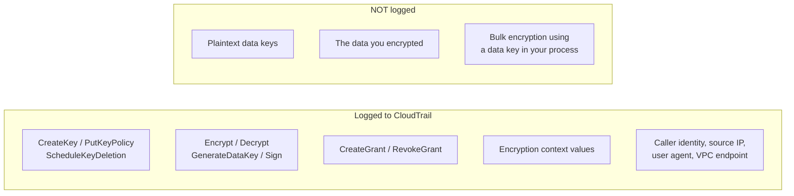
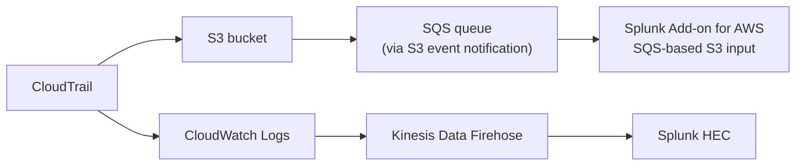

# Logging, Forensics &amp; SIEM Integration
{: .no_toc }

**Phase 6 — Observe.** Every use of a key is an API call, and every API call is
evidence. Getting that evidence somewhere durable and queryable is what turns key
management into an auditable control.
{: .fs-5 .fw-300 }

## On this page
{: .no_toc .text-delta }

1. TOC
{:toc}

---

## What gets logged, and what does not



{: .important }
> **The gap that matters for forensics:** one `GenerateDataKey` call can produce a
> data key your application then uses to encrypt ten million records. CloudTrail
> shows one event. If your investigation needs per-record attribution, you must
> log it yourself in the application — CloudTrail cannot see it. This is the
> direct cost of envelope encryption's performance benefit, and it should shape
> how you set your data key cache limits.

## CloudTrail configuration

### The full organization trail

```bash
LOG_ACCOUNT="222233334444"
TRAIL_BUCKET="org-cloudtrail-${LOG_ACCOUNT}"
ORG_ID=$(aws organizations describe-organization --query 'Organization.Id' --output text)
```

The bucket must be created with Object Lock enabled — it cannot be added later:

```bash
# Run in the Log Archive account
aws s3api create-bucket --bucket "$TRAIL_BUCKET" --region us-east-1 \
  --object-lock-enabled-for-bucket

aws s3api put-bucket-versioning --bucket "$TRAIL_BUCKET" \
  --versioning-configuration Status=Enabled

aws s3api put-object-lock-configuration --bucket "$TRAIL_BUCKET" \
  --object-lock-configuration '{
    "ObjectLockEnabled":"Enabled",
    "Rule":{"DefaultRetention":{"Mode":"COMPLIANCE","Days":2555}}
  }'

aws s3api put-public-access-block --bucket "$TRAIL_BUCKET" \
  --public-access-block-configuration \
  "BlockPublicAcls=true,IgnorePublicAcls=true,BlockPublicPolicy=true,RestrictPublicBuckets=true"
```

The bucket policy CloudTrail requires:

```bash
cat > /tmp/trail-bucket-policy.json <<POLICY
{
  "Version": "2012-10-17",
  "Statement": [
    {
      "Sid": "AWSCloudTrailAclCheck",
      "Effect": "Allow",
      "Principal": { "Service": "cloudtrail.amazonaws.com" },
      "Action": "s3:GetBucketAcl",
      "Resource": "arn:aws:s3:::${TRAIL_BUCKET}",
      "Condition": {
        "StringEquals": { "aws:SourceOrgID": "${ORG_ID}" }
      }
    },
    {
      "Sid": "AWSCloudTrailWrite",
      "Effect": "Allow",
      "Principal": { "Service": "cloudtrail.amazonaws.com" },
      "Action": "s3:PutObject",
      "Resource": "arn:aws:s3:::${TRAIL_BUCKET}/AWSLogs/${ORG_ID}/*",
      "Condition": {
        "StringEquals": {
          "s3:x-amz-acl": "bucket-owner-full-control",
          "aws:SourceOrgID": "${ORG_ID}"
        }
      }
    },
    {
      "Sid": "DenyInsecureTransport",
      "Effect": "Deny",
      "Principal": "*",
      "Action": "s3:*",
      "Resource": [
        "arn:aws:s3:::${TRAIL_BUCKET}",
        "arn:aws:s3:::${TRAIL_BUCKET}/*"
      ],
      "Condition": { "Bool": { "aws:SecureTransport": "false" } }
    }
  ]
}
POLICY

aws s3api put-bucket-policy --bucket "$TRAIL_BUCKET" \
  --policy file:///tmp/trail-bucket-policy.json
```

Create the trail from the management account:

```bash
aws cloudtrail create-trail \
  --name org-management-trail \
  --s3-bucket-name "$TRAIL_BUCKET" \
  --is-organization-trail \
  --is-multi-region-trail \
  --enable-log-file-validation \
  --kms-key-id alias/prod/platform/cloudtrail \
  --cloud-watch-logs-log-group-arn "arn:aws:logs:us-east-1:${LOG_ACCOUNT}:log-group:/aws/cloudtrail/org:*" \
  --cloud-watch-logs-role-arn "arn:aws:iam::${LOG_ACCOUNT}:role/CloudTrail_CloudWatchLogs_Role"

aws cloudtrail start-logging --name org-management-trail
aws cloudtrail get-trail-status --name org-management-trail \
  --query '{Logging:IsLogging,LastDelivery:LatestDeliveryTime,Error:LatestDeliveryError}'
```

{: .warning }
> **Encrypting the CloudTrail bucket with a CMK creates a circular dependency you
> must think through.** If the key protecting your audit log is itself deleted or
> disabled, you lose the ability to read the log that would tell you who did it.
> Use a *dedicated* CloudTrail key, protect it with an SCP that denies deletion
> outright, and keep it in the Log Archive account — separate from the keys it is
> auditing.

### Verify log integrity

```bash
aws cloudtrail validate-logs \
  --trail-arn "arn:aws:cloudtrail:us-east-1:111122223333:trail/org-management-trail" \
  --start-time "$(date -u -d '7 days ago' +%Y-%m-%dT%H:%M:%SZ)"
```

```text
Validating log files for trail arn:aws:cloudtrail:...:trail/org-management-trail
between 2026-08-11T00:00:00Z and 2026-08-18T00:00:00Z

Results requested for 2026-08-11T00:00:00Z to 2026-08-18T00:00:00Z
Results found for 2026-08-11T03:14:00Z to 2026-08-18T19:22:00Z:
168/168 digest files valid
4,412/4,412 log files valid
```

{: .tip }
> Run `validate-logs` monthly and keep the output. "168/168 digest files valid"
> is a one-line, cryptographically meaningful answer to an auditor asking whether
> your logs could have been tampered with. Very few controls give you evidence
> that clean.

## Athena — the forensic query layer

### Create the table

```sql
CREATE EXTERNAL TABLE IF NOT EXISTS cloudtrail_logs (
    eventversion      STRING,
    useridentity      STRUCT<
        type: STRING, principalid: STRING, arn: STRING, accountid: STRING,
        invokedby: STRING, accesskeyid: STRING, username: STRING,
        sessioncontext: STRUCT<
            attributes: STRUCT<mfaauthenticated: STRING, creationdate: STRING>,
            sessionissuer: STRUCT<type: STRING, principalid: STRING, arn: STRING,
                                  accountid: STRING, username: STRING>>>,
    eventtime         STRING,
    eventsource       STRING,
    eventname         STRING,
    awsregion         STRING,
    sourceipaddress   STRING,
    useragent         STRING,
    errorcode         STRING,
    errormessage      STRING,
    requestparameters STRING,
    responseelements  STRING,
    requestid         STRING,
    eventid           STRING,
    resources         ARRAY<STRUCT<arn: STRING, accountid: STRING, type: STRING>>,
    eventtype         STRING,
    recipientaccountid STRING,
    vpcendpointid     STRING
)
PARTITIONED BY (account_id STRING, region STRING, dt STRING)
ROW FORMAT SERDE 'com.amazon.emr.hive.serde.CloudTrailSerde'
STORED AS INPUTFORMAT  'com.amazon.emr.cloudtrail.CloudTrailInputFormat'
          OUTPUTFORMAT 'org.apache.hadoop.hive.ql.io.HiveIgnoreKeyTextOutputFormat'
LOCATION 's3://org-cloudtrail-222233334444/AWSLogs/o-exampleorgid/'
TBLPROPERTIES (
  'projection.enabled'             = 'true',
  'projection.account_id.type'     = 'injected',
  'projection.region.type'         = 'enum',
  'projection.region.values'       = 'us-east-1,us-west-2,eu-west-1',
  'projection.dt.type'             = 'date',
  'projection.dt.range'            = '2026/01/01,NOW',
  'projection.dt.format'           = 'yyyy/MM/dd',
  'projection.dt.interval'         = '1',
  'projection.dt.interval.unit'    = 'DAYS',
  'storage.location.template'      =
    's3://org-cloudtrail-222233334444/AWSLogs/o-exampleorgid/${account_id}/CloudTrail/${region}/${dt}/'
);
```

{: .tip }
> **Partition projection is what makes this affordable.** Without it, Athena
> scans the whole bucket on every query and you get a surprising bill. With it,
> a query filtered by `dt` reads only the days it needs.

### The queries that matter

**Who used which key, and how much?**

```sql
SELECT element_at(resources, 1).arn      AS key_arn,
       useridentity.arn                  AS principal,
       eventname,
       count(*)                          AS operations,
       min(eventtime)                    AS first_seen,
       max(eventtime)                    AS last_seen
FROM   cloudtrail_logs
WHERE  eventsource = 'kms.amazonaws.com'
  AND  eventname IN ('Decrypt','Encrypt','GenerateDataKey',
                     'GenerateDataKeyWithoutPlaintext','ReEncrypt','Sign')
  AND  dt >= '2026/07/01'
GROUP  BY 1, 2, 3
ORDER  BY operations DESC
LIMIT  100;
```

**Keys with no usage at all — retirement candidates**

```sql
WITH used AS (
  SELECT DISTINCT element_at(resources, 1).arn AS key_arn
  FROM   cloudtrail_logs
  WHERE  eventsource = 'kms.amazonaws.com'
    AND  dt >= '2026/05/01'
)
SELECT k.key_arn
FROM   key_inventory k              -- from scripts/key_inventory.py
LEFT   JOIN used u ON k.key_arn = u.key_arn
WHERE  u.key_arn IS NULL;
```

**Denied KMS calls — misconfiguration or reconnaissance**

```sql
SELECT eventtime, useridentity.arn AS principal, eventname,
       errorcode, sourceipaddress,
       element_at(resources, 1).arn AS key_arn
FROM   cloudtrail_logs
WHERE  eventsource = 'kms.amazonaws.com'
  AND  errorcode IS NOT NULL
  AND  dt >= date_format(current_date - interval '7' day, '%Y/%m/%d')
ORDER  BY eventtime DESC
LIMIT  200;
```

**Every administrative change to a key**

```sql
SELECT eventtime, eventname,
       useridentity.arn AS principal,
       useridentity.sessioncontext.attributes.mfaauthenticated AS mfa,
       sourceipaddress,
       element_at(resources, 1).arn AS key_arn,
       requestparameters
FROM   cloudtrail_logs
WHERE  eventsource = 'kms.amazonaws.com'
  AND  eventname IN ('CreateKey','PutKeyPolicy','ScheduleKeyDeletion',
                     'CancelKeyDeletion','DisableKey','EnableKey',
                     'CreateGrant','RevokeGrant','UpdateAlias',
                     'DisableKeyRotation','ImportKeyMaterial',
                     'DeleteImportedKeyMaterial','ReplicateKey')
  AND  dt >= '2026/07/01'
ORDER  BY eventtime DESC;
```

**Decrypt calls outside expected encryption context — a tenancy-violation hunt**

```sql
SELECT eventtime,
       useridentity.arn AS principal,
       json_extract_scalar(requestparameters, '$.encryptionContext.tenant') AS tenant,
       count(*) OVER (PARTITION BY useridentity.arn) AS principal_total,
       sourceipaddress
FROM   cloudtrail_logs
WHERE  eventsource = 'kms.amazonaws.com'
  AND  eventname = 'Decrypt'
  AND  json_extract_scalar(requestparameters, '$.encryptionContext.tenant')
       NOT IN (SELECT tenant_id FROM authorized_tenants)
  AND  dt >= date_format(current_date - interval '30' day, '%Y/%m/%d')
ORDER  BY eventtime DESC;
```

**Decrypt volume anomaly — bulk exfiltration signature**

```sql
SELECT date_trunc('hour', from_iso8601_timestamp(eventtime)) AS hour,
       useridentity.arn AS principal,
       count(*) AS decrypts
FROM   cloudtrail_logs
WHERE  eventsource = 'kms.amazonaws.com'
  AND  eventname = 'Decrypt'
  AND  dt >= date_format(current_date - interval '14' day, '%Y/%m/%d')
GROUP  BY 1, 2
HAVING count(*) > 10000
ORDER  BY decrypts DESC;
```

{: .important }
> **That last query is the one that finds a breach.** Normal applications have a
> characteristic decrypt rate. A principal that suddenly issues 50,000 `Decrypt`
> calls in an hour is either a new batch job somebody forgot to tell you about,
> or somebody reading your entire dataset. Baseline it, alert on deviation, and
> make sure the on-call knows which applications are expected to spike.

## Streaming to a SIEM

### Splunk



The SQS-based S3 input is the recommended path — it scales, it does not miss
files, and it handles retries.

```bash
# 1. Queue for new-object notifications
QUEUE_URL=$(aws sqs create-queue --queue-name splunk-cloudtrail-ingest \
  --attributes '{"MessageRetentionPeriod":"1209600","VisibilityTimeout":"300"}' \
  --query QueueUrl --output text)
QUEUE_ARN=$(aws sqs get-queue-attributes --queue-url "$QUEUE_URL" \
  --attribute-names QueueArn --query 'Attributes.QueueArn' --output text)

# 2. Allow S3 to publish to it
aws sqs set-queue-attributes --queue-url "$QUEUE_URL" --attributes "{
  \"Policy\": \"{\\\"Version\\\":\\\"2012-10-17\\\",\\\"Statement\\\":[{
    \\\"Effect\\\":\\\"Allow\\\",\\\"Principal\\\":{\\\"Service\\\":\\\"s3.amazonaws.com\\\"},
    \\\"Action\\\":\\\"sqs:SendMessage\\\",\\\"Resource\\\":\\\"${QUEUE_ARN}\\\",
    \\\"Condition\\\":{\\\"ArnLike\\\":{\\\"aws:SourceArn\\\":\\\"arn:aws:s3:::${TRAIL_BUCKET}\\\"}}}]}\"
}"

# 3. Notify on new CloudTrail objects
aws s3api put-bucket-notification-configuration --bucket "$TRAIL_BUCKET" \
  --notification-configuration "{
    \"QueueConfigurations\": [{
      \"QueueArn\": \"${QUEUE_ARN}\",
      \"Events\": [\"s3:ObjectCreated:*\"],
      \"Filter\": {\"Key\": {\"FilterRules\": [{\"Name\": \"suffix\", \"Value\": \".json.gz\"}]}}
    }]
  }"

# 4. Read-only role for the Splunk add-on to assume
aws iam create-role --role-name SplunkCloudTrailReader \
  --assume-role-policy-document file://splunk-trust-policy.json
aws iam put-role-policy --role-name SplunkCloudTrailReader \
  --policy-name read-trail --policy-document "{
    \"Version\":\"2012-10-17\",\"Statement\":[
      {\"Effect\":\"Allow\",\"Action\":[\"s3:GetObject\",\"s3:ListBucket\"],
       \"Resource\":[\"arn:aws:s3:::${TRAIL_BUCKET}\",\"arn:aws:s3:::${TRAIL_BUCKET}/*\"]},
      {\"Effect\":\"Allow\",\"Action\":[\"sqs:ReceiveMessage\",\"sqs:DeleteMessage\",
       \"sqs:GetQueueAttributes\",\"sqs:GetQueueUrl\"],\"Resource\":\"${QUEUE_ARN}\"},
      {\"Effect\":\"Allow\",\"Action\":\"kms:Decrypt\",
       \"Resource\":\"arn:aws:kms:us-east-1:222233334444:key/CLOUDTRAIL-KEY-ID\"}
    ]}"
```

Useful Splunk searches:

```text
# Key administrative changes, last 24 hours
index=aws sourcetype=aws:cloudtrail eventSource=kms.amazonaws.com
  (eventName=PutKeyPolicy OR eventName=ScheduleKeyDeletion
   OR eventName=DisableKey OR eventName=CreateGrant)
| table _time eventName userIdentity.arn sourceIPAddress requestParameters.keyId
| sort -_time

# Decrypt rate per principal, with a 7-day baseline comparison
index=aws sourcetype=aws:cloudtrail eventSource=kms.amazonaws.com eventName=Decrypt
| bin _time span=1h
| stats count AS decrypts BY _time, userIdentity.arn
| eventstats avg(decrypts) AS baseline, stdev(decrypts) AS sd BY userIdentity.arn
| eval z = (decrypts - baseline) / sd
| where z > 3
| table _time userIdentity.arn decrypts baseline z

# Access denied to KMS — grouped, to separate noise from a real probe
index=aws sourcetype=aws:cloudtrail eventSource=kms.amazonaws.com errorCode=*
| stats count BY errorCode, userIdentity.arn, requestParameters.keyId
| sort -count
```

### Amazon OpenSearch / Security Lake

```bash
# Security Lake normalizes CloudTrail into OCSF Parquet — easier for
# cross-source correlation than raw CloudTrail JSON
aws securitylake create-data-lake \
  --configurations '[{
    "region":"us-east-1",
    "encryptionConfiguration":{"kmsKeyId":"alias/prod/platform/securitylake"},
    "lifecycleConfiguration":{"transitions":[{"storageClass":"GLACIER","days":90}],
                              "expiration":{"days":2555}}
  }]' \
  --meta-store-manager-role-arn "arn:aws:iam::222233334444:role/AmazonSecurityLakeMetaStoreManager"

aws securitylake create-aws-log-source \
  --sources '[{"regions":["us-east-1"],"sourceName":"CLOUD_TRAIL_MGMT","sourceVersion":"2.0"}]'
```

## CloudHSM audit logs

The HSM's own log is a separate stream and covers what CloudTrail cannot see.

```bash
aws logs start-query \
  --log-group-name "/aws/cloudhsm/${CLUSTER_ID}" \
  --start-time "$(date -u -d '24 hours ago' +%s)" \
  --end-time "$(date -u +%s)" \
  --query-string 'fields @timestamp, @message
    | filter @message like /CN_LOGIN|CN_LOGOUT|CN_CREATE_USER|CN_DELETE_USER|CN_SET_M_VALUE|CN_GENERATE_KEY|CN_DELETE_KEY/
    | sort @timestamp desc
    | limit 200'
```

| HSM event | What it means | Alert? |
|:--|:--|:--|
| `CN_LOGIN` (CO role) | A Crypto Officer logged in | Yes — should be rare and planned |
| `CN_CREATE_USER` / `CN_DELETE_USER` | HSM user management | **Yes — always** |
| `CN_SET_M_VALUE` | Quorum requirement changed | **Yes — always** |
| `CN_GENERATE_KEY` | New key in the HSM | Yes, outside a change window |
| `CN_DELETE_KEY` | Key destroyed in the HSM | **Yes — always** |
| `CN_LOGIN` failures | Repeated failures precede lockout | Yes, on threshold |

{: .warning }
> **Ship the CloudHSM audit log off the cluster and retain it.** It is the only
> record of what happened *inside* the HSM boundary, and for a FIPS-relevant or
> PCI assessment it is the log the assessor actually wants. Retain it for at
> least as long as your CloudTrail retention — the default CloudWatch retention
> is "never expire," but the log group is created per-cluster, so a cluster
> rebuild will orphan the old one.

---

[Next: 11. Monitoring &amp; Alerting](){: .btn .btn-primary }
