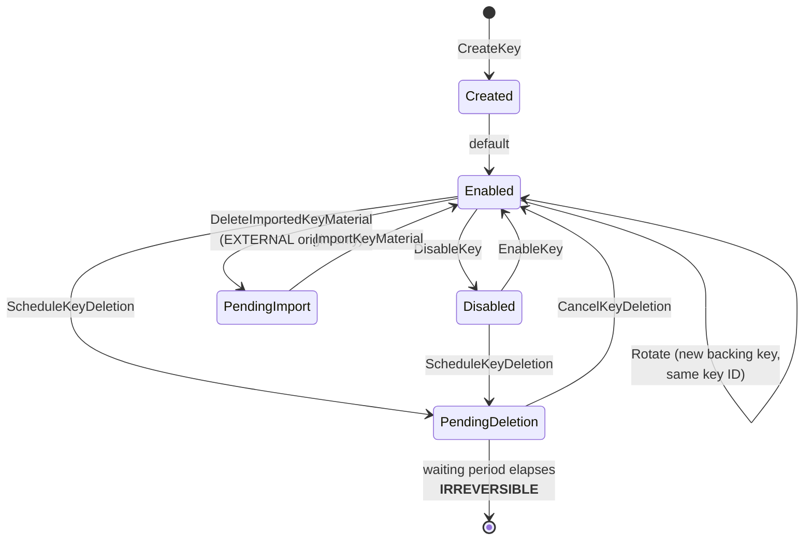

# Key Operations
{: .no_toc }

**Phase 4 — Operate.** Keys exist. Now put them to work and keep them healthy
through their whole lifecycle.
{: .fs-5 .fw-300 }

---

## The key lifecycle

Every state transition is a CloudTrail event, and the last one is permanent. The
pages in this section walk each operational concern in the order you will meet
it.

## Pages in this section

| Page | What it covers |
|:--|:--|
| [7.1 Envelope Encryption]() | Data keys in application code, the AWS Encryption SDK, and key caching |
| [7.2 Service Integrations]() | S3, EBS, RDS, Secrets Manager, DynamoDB, EFS, Lambda, SNS/SQS |
| [7.3 Rotation]() | Automatic rotation, on-demand rotation, and manual key replacement |
| [7.4 Import &amp; BYOK]() | Importing your own key material, wrapping, and expiry |
| [7.5 Multi-Region Keys]() | Replicas, cross-Region DR, and primary promotion |

Backup, recovery, and deletion are covered separately in
[9. Backup, DR &amp; Deletion](), because they span
both KMS and CloudHSM.
