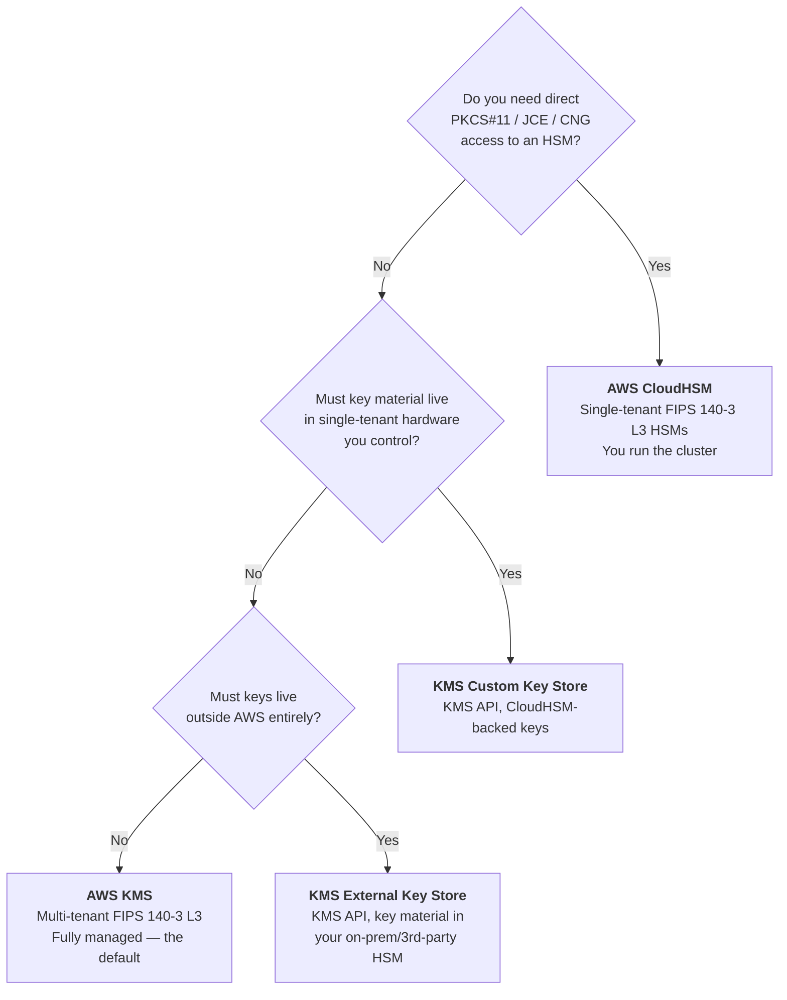
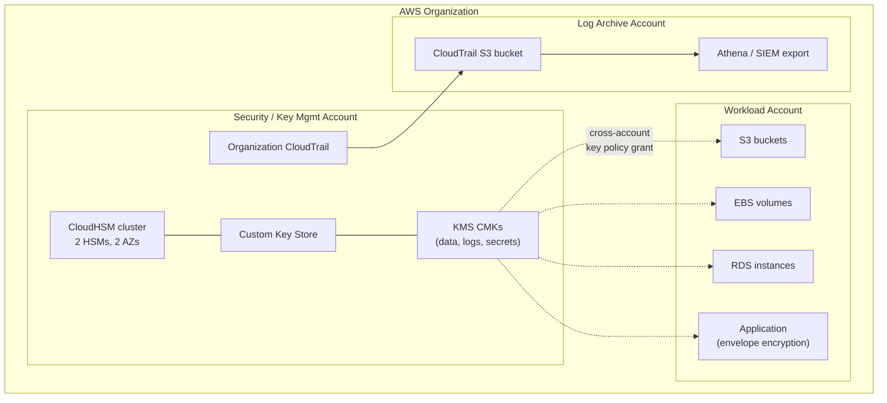

# Overview &amp; Service Selection
{: .no_toc }

**Phase 1 — Plan.** Before you create a single key, decide which AWS key
management service you are actually buying into. That decision drives cost,
latency, compliance posture, and operational burden for years.
{: .fs-5 .fw-300 }

## On this page
{: .no_toc .text-delta }

1. TOC
{:toc}

---

## The problem key management solves

Encryption is easy. **Key management is the hard part.** Any encryption scheme
reduces the problem of "protect this data" to "protect this key" — which means
the security of a terabyte of customer records collapses down to the security of
a 32-byte value, and to the correctness of the rules about who may use it.

A cloud key management service exists to answer five questions, continuously and
provably:

| Question | What the service must provide |
|:--|:--|
| Where does the key live? | A hardened boundary the key never leaves in plaintext |
| Who may use it? | An authorization model — policy, IAM, and grants |
| What was it used for? | A tamper-evident audit trail of every cryptographic operation |
| How does it change over time? | Rotation, versioning, import, and destruction with safeguards |
| How do I prove all of the above? | Attestation, certification, and exportable evidence |

Everything in this guide is in service of those five questions.

## The AWS key management landscape

AWS offers four distinct options, and they are **not** interchangeable. They
differ in who controls the hardware, who holds the key material, and how much
operational work you inherit.



### Side-by-side comparison

| Dimension | AWS KMS | KMS Custom Key Store | KMS External Key Store (XKS) | AWS CloudHSM |
|:--|:--|:--|:--|:--|
| **Tenancy** | Multi-tenant | Single-tenant (your cluster) | Your external HSM | Single-tenant |
| **Where key material lives** | AWS-operated HSMs | Your CloudHSM cluster | Your HSM, outside AWS | Your CloudHSM cluster |
| **FIPS validation** | 140-3 Level 3 | 140-3 Level 3 | Whatever your HSM holds | 140-3 Level 3 |
| **API surface** | KMS API | KMS API (identical) | KMS API (identical) | PKCS#11, JCE, OpenSSL, CNG/KSP |
| **Integrates with S3/EBS/RDS natively** | Yes | Yes | Yes | No — not directly |
| **Who patches the HSM** | AWS | AWS | You | AWS (you schedule) |
| **Who handles HA/backup** | AWS | You (cluster sizing) | You | You |
| **Latency** | Lowest | Low | Highest (network hop to you) | Low |
| **Availability risk you own** | None | Cluster health | Your proxy + HSM + network | Cluster health |
| **Typical unit cost** | Lowest | Cluster hours dominate | Cluster/proxy + KMS request cost | Cluster hours dominate |
| **Operational burden** | Minimal | Moderate | High | High |

{: .tip }
> **Start with AWS KMS unless you have a written requirement that forbids it.**
> The overwhelming majority of workloads are correctly served by KMS with
> customer managed keys. Every step up this ladder buys control and costs
> availability, money, and staff time. The reasons to climb it are real —
> regulatory single-tenancy mandates, key-custody requirements, contractual
> hold-your-own-key clauses — but they should be *written down* before you build.

### What "customer managed" actually means

Within KMS there are three flavors of key, and the distinction matters for both
cost and audit:

| Key type | Who creates it | Policy control | Rotation control | Cost | Shows in your CloudTrail |
|:--|:--|:--|:--|:--|:--|
| **AWS owned key** | AWS | None | AWS | Free | No |
| **AWS managed key** (`aws/s3`, `aws/ebs`, …) | AWS on first use | None (read-only) | AWS, yearly | Free | Yes |
| **Customer managed key (CMK)** | You | Full | Full | Monthly + per-request | Yes |

This guide is about **customer managed keys**. AWS managed keys are convenient
and free, but you cannot write a key policy for them, cannot control their
rotation cadence, and cannot deny a principal access to them independently of
the service — which makes them unusable for most separation-of-duties
requirements.

## Key specs and what they are for

A CMK has a **key spec** (the algorithm) and a **key usage** (what operations it
permits). They are immutable after creation — choose deliberately.

| Key spec | Usage | Use it for |
|:--|:--|:--|
| `SYMMETRIC_DEFAULT` (AES-256-GCM) | `ENCRYPT_DECRYPT` | The default. Envelope encryption, all native AWS service integrations |
| `RSA_2048` / `RSA_3072` / `RSA_4096` | `ENCRYPT_DECRYPT` or `SIGN_VERIFY` | Interop with systems that require RSA; code signing; asymmetric handoff |
| `ECC_NIST_P256` / `P384` / `P521` | `SIGN_VERIFY` | Compact signatures, JWT/JWS signing, document signing |
| `ECC_SECG_P256K1` | `SIGN_VERIFY` | Blockchain / cryptocurrency signing |
| `SM2` | `ENCRYPT_DECRYPT` or `SIGN_VERIFY` | China Regions only — GB/T standard compliance |
| `HMAC_224` / `256` / `384` / `512` | `GENERATE_VERIFY_MAC` | Message authentication codes, token integrity, tamper-evident receipts |

{: .warning }
> **Only symmetric `SYMMETRIC_DEFAULT` keys work with the native AWS service
> integrations** (S3 SSE-KMS, EBS volume encryption, RDS storage encryption,
> Secrets Manager, and so on). If you create an RSA key expecting to encrypt an
> S3 bucket with it, the integration will simply not offer it. Asymmetric keys
> exist for application-level and interop use cases.

## Regional scope

A KMS key is a **Regional** resource. A key created in `us-east-1` cannot decrypt
data encrypted in `eu-west-1` unless it is a **multi-Region key** with a replica
there. This has three consequences you must plan for now:

1. **Every Region you operate in needs its own keys** (or replicas), its own key
   policies, and its own Terraform state.
2. **Cross-Region disaster recovery of encrypted data requires multi-Region
   keys** — you cannot restore an EBS snapshot into a Region whose KMS has no
   key that can unwrap it. See [Multi-Region Keys]().
3. **CloudHSM clusters are Regional too**, and their HSMs are Availability
   Zone-scoped, which is what drives the minimum-two-HSM design in
   [CloudHSM Provisioning]().

## The reference design this guide builds

Everything from here forward builds one concrete, opinionated target so the
commands have somewhere to land:



**Why keys live in a separate account.** Putting CMKs in a dedicated security
account, and granting workload accounts *use* (not *administer*) rights via key
policy, gives you a structural separation of duties: a compromised workload
account cannot delete, disable, or re-policy the keys protecting its own data. It
is the single highest-leverage design decision in this guide.

## Naming and tagging convention

Adopt one before you create key #1; retrofitting aliases across accounts is
painful.

```text
Alias:  alias/<env>/<domain>/<purpose>
        alias/prod/payments/pci-cardholder-data
        alias/prod/platform/s3-general
        alias/dev/analytics/warehouse

Tags:   Environment  = prod | stage | dev
        DataClass    = restricted | confidential | internal | public
        Owner        = team-email@example.com
        CostCenter   = CC-4417
        Compliance   = pci | hipaa | sox | none
        ManagedBy    = terraform | cloudformation | console
```

{: .note }
> **Always reference keys by alias, never by key ID, in application code and
> service configuration.** An alias is a stable pointer you can retarget; a key
> ID is not. This is what makes emergency key replacement possible without a
> code deploy — see [Rotation]().

---

## Where to next

You have chosen a service tier. Next, understand the cryptographic structure
underneath it before you build.

[Next: Architecture &amp; Key Hierarchy](){: .btn .btn-primary }
