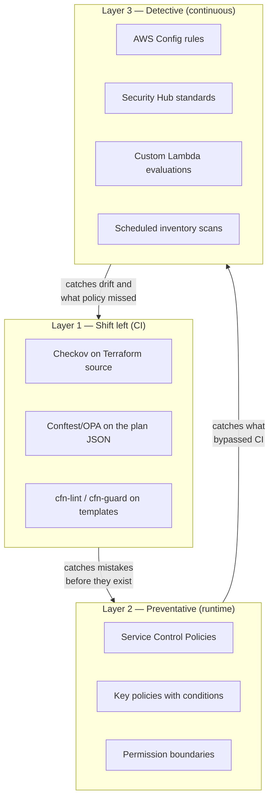

# Policy as Code — Preventative &amp; Detective Guardrails
{: .no_toc }

**Phase 7 — Govern.** Three layers: stop it in CI, stop it at the API, and catch
it if it happens anyway.
{: .fs-5 .fw-300 }

## On this page
{: .no_toc .text-delta }

1. TOC
{:toc}

---

## The three layers



No single layer is sufficient. CI is bypassable (someone uses the Console). SCPs
are coarse (they cannot express "rotation must be enabled"). Config is
after-the-fact. Together they close the loop.

## Layer 1 — OPA/Rego on the Terraform plan

Scanning source catches syntax-level problems; scanning the **plan** catches what
will actually happen, including values that come from variables and data sources.

`policies/opa/kms.rego`

```rego
package main

import future.keywords.contains
import future.keywords.if
import future.keywords.in

# ---------------------------------------------------------------------------
# Helpers
# ---------------------------------------------------------------------------
kms_keys[r] {
    r := input.resource_changes[_]
    r.type in {"aws_kms_key", "aws_kms_replica_key", "aws_kms_external_key"}
    r.change.actions[_] in {"create", "update"}
}

after(r) := r.change.after

is_symmetric(r) if {
    v := after(r)
    v.customer_master_key_spec == "SYMMETRIC_DEFAULT"
}
is_symmetric(r) if {
    v := after(r)
    not v.customer_master_key_spec        # default is symmetric
}

# ---------------------------------------------------------------------------
# DENY rules — these fail the build
# ---------------------------------------------------------------------------

deny contains msg if {
    r := kms_keys[_]
    is_symmetric(r)
    not after(r).enable_key_rotation
    not after(r).custom_key_store_id      # rotation unsupported there
    msg := sprintf(
        "%s: automatic key rotation must be enabled on symmetric KMS-origin keys",
        [r.address])
}

deny contains msg if {
    r := kms_keys[_]
    window := after(r).deletion_window_in_days
    window < 30
    msg := sprintf(
        "%s: deletion_window_in_days is %d; the standard requires 30",
        [r.address, window])
}

deny contains msg if {
    r := kms_keys[_]
    required := {"Environment", "DataClass", "Owner"}
    present := {k | some k, _ in after(r).tags}
    missing := required - present
    count(missing) > 0
    msg := sprintf("%s: missing required tags %v", [r.address, missing])
}

deny contains msg if {
    r := kms_keys[_]
    desc := after(r).description
    count(desc) < 15
    msg := sprintf(
        "%s: description must be at least 15 characters and explain the key's purpose",
        [r.address])
}

# A key policy that allows kms:* to a wildcard principal
deny contains msg if {
    r := kms_keys[_]
    policy := json.unmarshal(after(r).policy)
    st := policy.Statement[_]
    st.Effect == "Allow"
    st.Principal == "*"
    not st.Condition
    msg := sprintf(
        "%s: key policy allows a wildcard principal with no Condition",
        [r.address])
}

# Cross-account root principals must be constrained
deny contains msg if {
    r := kms_keys[_]
    policy := json.unmarshal(after(r).policy)
    st := policy.Statement[_]
    st.Effect == "Allow"
    p := principals(st)[_]
    endswith(p, ":root")
    not st.Condition
    msg := sprintf(
        "%s: statement '%s' grants an account root principal with no Condition (add kms:ViaService, kms:CallerAccount, or aws:PrincipalOrgID)",
        [r.address, object.get(st, "Sid", "<no Sid>")])
}

principals(st) := ps if {
    is_array(st.Principal.AWS)
    ps := st.Principal.AWS
}
principals(st) := [st.Principal.AWS] if {
    is_string(st.Principal.AWS)
}

# Never destroy a key from CI
deny contains msg if {
    r := input.resource_changes[_]
    r.type in {"aws_kms_key", "aws_kms_replica_key", "aws_cloudhsm_v2_cluster"}
    "delete" in r.change.actions
    msg := sprintf(
        "%s: plan would DESTROY a key resource — use the break-glass deletion runbook",
        [r.address])
}

# CloudHSM clusters must be FIPS mode
deny contains msg if {
    r := input.resource_changes[_]
    r.type == "aws_cloudhsm_v2_cluster"
    r.change.actions[_] in {"create", "update"}
    r.change.after.mode != "FIPS"
    msg := sprintf("%s: CloudHSM clusters must run in FIPS mode", [r.address])
}

# ---------------------------------------------------------------------------
# WARN rules — visible, but do not fail the build
# ---------------------------------------------------------------------------

warn contains msg if {
    r := kms_keys[_]
    after(r).multi_region == true
    msg := sprintf(
        "%s: multi-Region key — confirm cross-Region decryption is a documented requirement",
        [r.address])
}

warn contains msg if {
    r := kms_keys[_]
    period := after(r).rotation_period_in_days
    period > 365
    msg := sprintf(
        "%s: rotation period is %d days; review against your documented cryptoperiod",
        [r.address, period])
}
```

```bash
terraform plan -out=tfplan
terraform show -json tfplan > tfplan.json
conftest test --policy policies/opa tfplan.json
```

```text
FAIL - tfplan.json - main - module.analytics_scratch.aws_kms_key.this: automatic key rotation must be enabled on symmetric KMS-origin keys
FAIL - tfplan.json - main - module.analytics_scratch.aws_kms_key.this: missing required tags {"DataClass", "Owner"}
WARN - tfplan.json - main - module.rds_primary.aws_kms_key.this: multi-Region key — confirm cross-Region decryption is a documented requirement

3 tests, 1 passed, 1 warning, 2 failures
```

### Unit-testing the policy

Policies are code and deserve tests.

`policies/opa/kms_test.rego`

```rego
package main

import future.keywords.if

test_rotation_required_fails if {
    result := deny with input as {
        "resource_changes": [{
            "address": "module.test.aws_kms_key.this",
            "type": "aws_kms_key",
            "change": {
                "actions": ["create"],
                "after": {
                    "customer_master_key_spec": "SYMMETRIC_DEFAULT",
                    "enable_key_rotation": false,
                    "deletion_window_in_days": 30,
                    "description": "a sufficiently long description",
                    "tags": {"Environment": "prod", "DataClass": "confidential",
                             "Owner": "a@b.com"},
                    "policy": "{\"Statement\":[]}"
                }
            }
        }]
    }
    count(result) == 1
}

test_compliant_key_passes if {
    result := deny with input as {
        "resource_changes": [{
            "address": "module.test.aws_kms_key.this",
            "type": "aws_kms_key",
            "change": {
                "actions": ["create"],
                "after": {
                    "customer_master_key_spec": "SYMMETRIC_DEFAULT",
                    "enable_key_rotation": true,
                    "deletion_window_in_days": 30,
                    "description": "Prod platform key for S3 object encryption",
                    "tags": {"Environment": "prod", "DataClass": "confidential",
                             "Owner": "a@b.com"},
                    "policy": "{\"Statement\":[]}"
                }
            }
        }]
    }
    count(result) == 0
}
```

```bash
opa test policies/opa -v
```

## Layer 1b — Checkov

Checkov catches a broad set of known-bad patterns without you writing anything.

```bash
checkov -d . --framework terraform \
  --compact --quiet \
  --check CKV_AWS_7,CKV_AWS_33,CKV_AWS_119,CKV_AWS_145,CKV_AWS_158
```

| Check | What it enforces |
|:--|:--|
| `CKV_AWS_7` | KMS key rotation enabled |
| `CKV_AWS_33` | ECR repositories are encrypted |
| `CKV_AWS_119` | DynamoDB tables use a CMK |
| `CKV_AWS_145` | S3 buckets are encrypted with KMS |
| `CKV_AWS_158` | CloudWatch log groups are encrypted with a CMK |

A custom Checkov check when the built-ins do not cover your standard:

`policies/checkov/KMSKeyDescriptionRequired.py`

```python
from checkov.common.models.enums import CheckCategories, CheckResult
from checkov.terraform.checks.resource.base_resource_check import BaseResourceCheck


class KMSKeyDescriptionRequired(BaseResourceCheck):
    def __init__(self) -> None:
        super().__init__(
            name="Ensure KMS keys carry a meaningful description",
            id="CKV_CUSTOM_KMS_1",
            categories=[CheckCategories.ENCRYPTION],
            supported_resources=["aws_kms_key", "aws_kms_replica_key"],
        )

    def scan_resource_conf(self, conf) -> CheckResult:
        desc = conf.get("description", [None])[0]
        if isinstance(desc, str) and len(desc.strip()) >= 15:
            return CheckResult.PASSED
        return CheckResult.FAILED


check = KMSKeyDescriptionRequired()
```

```bash
checkov -d . --external-checks-dir policies/checkov
```

## Layer 2 — Preventative SCPs

Covered in detail in [Key Policies](#service-control-policies--the-organization-wide-ceiling).
The set worth deploying:

| SCP | Effect |
|:--|:--|
| `deny-key-deletion` | Only break-glass may `ScheduleKeyDeletion` / `DisableKey` |
| `require-secure-transport` | Deny all `kms:*` when `aws:SecureTransport` is false |
| `deny-unapproved-key-specs` | `CreateKey` only with approved specs |
| `deny-short-deletion-windows` | Minimum 30-day pending window |
| `deny-replication-outside-regions` | Constrain `kms:ReplicaRegion` |
| `deny-unencrypted-storage` | Deny `s3:PutObject` and volume creation without KMS |

```bash
# Deploy the whole set idempotently
for FILE in policies/scp/*.json; do
  NAME=$(basename "$FILE" .json)
  EXISTING=$(aws organizations list-policies --filter SERVICE_CONTROL_POLICY \
    --query "Policies[?Name=='$NAME'].Id" --output text)

  if [ -n "$EXISTING" ]; then
    aws organizations update-policy --policy-id "$EXISTING" \
      --content "file://$FILE" >/dev/null
    echo "updated: $NAME ($EXISTING)"
  else
    ID=$(aws organizations create-policy --name "$NAME" \
      --description "Key management guardrail: $NAME" \
      --type SERVICE_CONTROL_POLICY --content "file://$FILE" \
      --query 'Policy.PolicySummary.Id' --output text)
    echo "created: $NAME ($ID)"
  fi
done
```

## Layer 3 — AWS Config rules

### Managed rules

```bash
# Rotation enabled on every CMK
aws configservice put-config-rule --config-rule '{
  "ConfigRuleName": "cmk-backing-key-rotation-enabled",
  "Description": "Checks that automatic key rotation is enabled for customer managed keys",
  "Source": { "Owner": "AWS", "SourceIdentifier": "CMK_BACKING_KEY_ROTATION_ENABLED" },
  "MaximumExecutionFrequency": "TwentyFour_Hours"
}'

# No key silently pending deletion
aws configservice put-config-rule --config-rule '{
  "ConfigRuleName": "kms-cmk-not-scheduled-for-deletion",
  "Source": { "Owner": "AWS", "SourceIdentifier": "KMS_CMK_NOT_SCHEDULED_FOR_DELETION" }
}'

# Encrypted-at-rest checks that depend on your keys
for RULE in encrypted-volumes rds-storage-encrypted \
            s3-bucket-server-side-encryption-enabled \
            dynamodb-table-encrypted-kms \
            cloudwatch-log-group-encrypted \
            sns-encrypted-kms sqs-queue-encrypted \
            secretsmanager-using-cmk efs-encrypted-check; do
  ID=$(echo "$RULE" | tr 'a-z-' 'A-Z_')
  aws configservice put-config-rule --config-rule "{
    \"ConfigRuleName\": \"$RULE\",
    \"Source\": { \"Owner\": \"AWS\", \"SourceIdentifier\": \"$ID\" }
  }" && echo "rule: $RULE"
done
```

### A custom rule for what the managed set misses

`policies/config-rules/custom-cmk-standard.py`

```python
"""AWS Config custom rule: customer managed keys meet the internal standard.

Evaluates each KMS key for:
  * required tags
  * rotation enabled (symmetric, KMS-origin keys only)
  * no wildcard principal without a Condition in the key policy
  * an alias assigned
"""
import json
from datetime import datetime, timezone

import boto3

REQUIRED_TAGS = {"Environment", "DataClass", "Owner", "ManagedBy"}

config = boto3.client("config")
kms = boto3.client("kms")


def evaluate_key(key_id: str) -> tuple[str, str]:
    reasons: list[str] = []

    meta = kms.describe_key(KeyId=key_id)["KeyMetadata"]
    if meta["KeyManager"] != "CUSTOMER":
        return "NOT_APPLICABLE", "AWS managed key"
    if meta["KeyState"] in ("PendingDeletion", "PendingReplicaDeletion"):
        return "NON_COMPLIANT", f"key state is {meta['KeyState']}"

    # 1. Tags
    tags = {t["TagKey"] for t in kms.list_resource_tags(KeyId=key_id).get("Tags", [])}
    if missing := REQUIRED_TAGS - tags:
        reasons.append(f"missing tags: {','.join(sorted(missing))}")

    # 2. Rotation, where applicable
    if meta["KeySpec"] == "SYMMETRIC_DEFAULT" \
            and meta["Origin"] == "AWS_KMS" \
            and not meta.get("CustomKeyStoreId"):
        if not kms.get_key_rotation_status(KeyId=key_id).get("KeyRotationEnabled"):
            reasons.append("automatic rotation disabled")

    # 3. Alias
    if not kms.list_aliases(KeyId=key_id).get("Aliases"):
        reasons.append("no alias assigned")

    # 4. Wildcard principal without a Condition
    policy = json.loads(kms.get_key_policy(KeyId=key_id, PolicyName="default")["Policy"])
    for st in policy.get("Statement", []):
        if st.get("Effect") != "Allow":
            continue
        principal = st.get("Principal")
        wildcard = principal == "*" or (
            isinstance(principal, dict) and principal.get("AWS") == "*"
        )
        if wildcard and not st.get("Condition"):
            reasons.append(
                f"statement '{st.get('Sid','<no Sid>')}' allows * with no Condition")

    return ("NON_COMPLIANT", "; ".join(reasons)) if reasons else ("COMPLIANT", "meets the standard")


def lambda_handler(event, context):
    invoking = json.loads(event["invokingEvent"])
    result_token = event["resultToken"]
    evaluations = []

    for page in kms.get_paginator("list_keys").paginate():
        for entry in page["Keys"]:
            key_id = entry["KeyId"]
            try:
                compliance, annotation = evaluate_key(key_id)
            except kms.exceptions.AccessDeniedException:
                continue
            if compliance == "NOT_APPLICABLE":
                continue
            evaluations.append({
                "ComplianceResourceType": "AWS::KMS::Key",
                "ComplianceResourceId": key_id,
                "ComplianceType": compliance,
                "Annotation": annotation[:256],
                "OrderingTimestamp": invoking.get(
                    "notificationCreationTime",
                    datetime.now(timezone.utc).isoformat()),
            })

    # PutEvaluations accepts at most 100 per call
    for i in range(0, len(evaluations), 100):
        config.put_evaluations(
            Evaluations=evaluations[i:i + 100], ResultToken=result_token)

    return {"evaluated": len(evaluations)}
```

```bash
# Package and deploy
zip -j /tmp/custom-cmk-standard.zip policies/config-rules/custom-cmk-standard.py

aws lambda create-function \
  --function-name config-rule-cmk-standard \
  --runtime python3.12 --handler custom-cmk-standard.lambda_handler \
  --role arn:aws:iam::111122223333:role/config-rule-lambda-role \
  --zip-file fileb:///tmp/custom-cmk-standard.zip \
  --timeout 300 --memory-size 256

aws lambda add-permission \
  --function-name config-rule-cmk-standard \
  --statement-id config-invoke --action lambda:InvokeFunction \
  --principal config.amazonaws.com \
  --source-account 111122223333

aws configservice put-config-rule --config-rule '{
  "ConfigRuleName": "cmk-meets-internal-standard",
  "Description": "CMKs carry required tags, rotation, an alias, and no unconditional wildcard grants",
  "Source": {
    "Owner": "CUSTOM_LAMBDA",
    "SourceIdentifier": "arn:aws:lambda:us-east-1:111122223333:function:config-rule-cmk-standard",
    "SourceDetails": [
      {"EventSource": "aws.config", "MessageType": "ScheduledNotification",
       "MaximumExecutionFrequency": "TwentyFour_Hours"}
    ]
  },
  "MaximumExecutionFrequency": "TwentyFour_Hours"
}'
```

### Conformance pack — deploy the whole set organization-wide

`policies/config-rules/key-management-conformance-pack.yaml`

```yaml
Parameters:
  RequiredTagKeys:
    Type: String
    Default: "Environment,DataClass,Owner,ManagedBy"

Resources:
  CmkRotationEnabled:
    Type: AWS::Config::ConfigRule
    Properties:
      ConfigRuleName: cmk-backing-key-rotation-enabled
      Source: { Owner: AWS, SourceIdentifier: CMK_BACKING_KEY_ROTATION_ENABLED }

  CmkNotScheduledForDeletion:
    Type: AWS::Config::ConfigRule
    Properties:
      ConfigRuleName: kms-cmk-not-scheduled-for-deletion
      Source: { Owner: AWS, SourceIdentifier: KMS_CMK_NOT_SCHEDULED_FOR_DELETION }

  EncryptedVolumes:
    Type: AWS::Config::ConfigRule
    Properties:
      ConfigRuleName: encrypted-volumes
      Source: { Owner: AWS, SourceIdentifier: ENCRYPTED_VOLUMES }

  RdsStorageEncrypted:
    Type: AWS::Config::ConfigRule
    Properties:
      ConfigRuleName: rds-storage-encrypted
      Source: { Owner: AWS, SourceIdentifier: RDS_STORAGE_ENCRYPTED }

  S3BucketSseEnabled:
    Type: AWS::Config::ConfigRule
    Properties:
      ConfigRuleName: s3-bucket-server-side-encryption-enabled
      Source: { Owner: AWS, SourceIdentifier: S3_BUCKET_SERVER_SIDE_ENCRYPTION_ENABLED }

  CloudTrailEncryption:
    Type: AWS::Config::ConfigRule
    Properties:
      ConfigRuleName: cloud-trail-encryption-enabled
      Source: { Owner: AWS, SourceIdentifier: CLOUD_TRAIL_ENCRYPTION_ENABLED }
```

```bash
aws configservice put-organization-conformance-pack \
  --organization-conformance-pack-name key-management-baseline \
  --template-body file://policies/config-rules/key-management-conformance-pack.yaml \
  --delivery-s3-bucket keymgmt-artifacts-111122223333

aws configservice get-organization-conformance-pack-detailed-status \
  --organization-conformance-pack-name key-management-baseline \
  --query 'OrganizationConformancePackDetailedStatuses[].{Account:AccountId,Status:Status}' \
  --output table
```

## Auto-remediation — carefully

```bash
# Automatically enable rotation on any non-compliant key.
# This is safe: enabling rotation never breaks anything.
aws configservice put-remediation-configurations --remediation-configurations '[{
  "ConfigRuleName": "cmk-backing-key-rotation-enabled",
  "TargetType": "SSM_DOCUMENT",
  "TargetId": "AWSConfigRemediation-EnableKeyRotation",
  "Parameters": {
    "AutomationAssumeRole": {
      "StaticValue": {"Values": ["arn:aws:iam::111122223333:role/config-remediation-role"]}
    },
    "KeyId": { "ResourceValue": {"Value": "RESOURCE_ID"} }
  },
  "Automatic": true,
  "MaximumAutomaticAttempts": 3,
  "RetryAttemptSeconds": 60
}]'
```

{: .warning }
> **Auto-remediate only operations that cannot cause an outage.** Enabling
> rotation is safe. Automatically *disabling* a key that fails a compliance check,
> or automatically re-applying a key policy, is not — you will eventually
> auto-remediate your way into a production incident at 4 a.m. For anything that
> can break access, open a ticket instead and let a human decide.

## Compliance reporting

```bash
# Overall posture
aws configservice describe-compliance-by-config-rule \
  --config-rule-names cmk-backing-key-rotation-enabled \
                      kms-cmk-not-scheduled-for-deletion \
                      cmk-meets-internal-standard \
  --query 'ComplianceByConfigRules[].{Rule:ConfigRuleName,Status:Compliance.ComplianceType}' \
  --output table

# The specific resources that fail, with the reason
aws configservice get-compliance-details-by-config-rule \
  --config-rule-name cmk-meets-internal-standard \
  --compliance-types NON_COMPLIANT \
  --query 'EvaluationResults[].{Key:EvaluationResultIdentifier.EvaluationResultQualifier.ResourceId,Reason:Annotation}' \
  --output table
```

```text
------------------------------------------------------------------------------
|                    GetComplianceDetailsByConfigRule                        |
+--------------------------------------+-------------------------------------+
|                 Key                  |               Reason                |
+--------------------------------------+-------------------------------------+
|  a1b2c3d4-1111-2222-3333-444455556666|  missing tags: DataClass,Owner      |
|  f9e8d7c6-9999-8888-7777-666655554444|  automatic rotation disabled;       |
|                                      |  no alias assigned                  |
+--------------------------------------+-------------------------------------+
```

---

[Next: 14. Governance &amp; Compliance](){: .btn .btn-primary }
