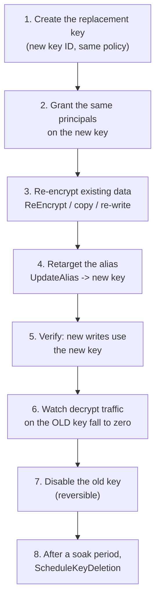

# Key Rotation
{: .no_toc }

What KMS rotation actually does, what it does not do, and the manual rotation
you still need for the cases it does not cover.
{: .fs-5 .fw-300 }

## On this page
{: .no_toc .text-delta }

1. TOC
{:toc}

---

## What automatic rotation really is

This is the most commonly misunderstood feature in KMS.

```text
BEFORE rotation                      AFTER rotation
┌──────────────────────────┐        ┌──────────────────────────┐
│  KMS key                 │        │  KMS key                 │
│  ID: 1234abcd-…          │        │  ID: 1234abcd-…  (SAME)  │
│  ARN: arn:…:key/1234…    │        │  ARN: arn:…:key/1234…    │
│  alias/prod/platform/s3  │        │  alias/prod/platform/s3  │
│                          │        │                          │
│  backing key v1  ◀── new │        │  backing key v1  (kept!) │
│                  writes  │        │  backing key v2  ◀── new │
└──────────────────────────┘        │                  writes  │
                                    └──────────────────────────┘
```

| What changes | What does **not** change |
|:--|:--|
| A new backing key (HSM key material) is generated | The key ID |
| New encrypt operations use the new backing key | The key ARN |
| | The alias |
| | The key policy, grants, and tags |
| | **Existing ciphertext** — it is not re-encrypted |

Old backing keys are **retained indefinitely** so that data encrypted under them
remains decryptable. KMS selects the right backing key automatically from
metadata embedded in the ciphertext blob.

{: .important }
> **Automatic rotation does not re-encrypt your data.** Data encrypted three
> rotations ago is still protected by the three-rotations-ago backing key. If
> your requirement is "no data is protected by key material older than N months"
> — which is what some readings of PCI DSS and internal standards ask for — then
> automatic rotation alone does not satisfy it. You need re-encryption, covered
> below. Get this straight before you write it into a control description.

## Enabling automatic rotation

```bash
aws kms enable-key-rotation \
  --key-id alias/prod/platform/s3-general \
  --rotation-period-in-days 365

aws kms get-key-rotation-status --key-id alias/prod/platform/s3-general
```

```json
{
    "KeyRotationEnabled": true,
    "KeyId": "arn:aws:kms:us-east-1:111122223333:key/1234abcd-12ab-34cd-56ef-1234567890ab",
    "RotationPeriodInDays": 365,
    "NextRotationDate": "2027-08-18T14:22:31.000000-04:00",
    "OnDemandRotationCount": 0
}
```

| Parameter | Range | Notes |
|:--|:--|:--|
| `--rotation-period-in-days` | 90–2,560 | Default 365 |

### Where automatic rotation is not available

| Key type | Automatic rotation | Alternative |
|:--|:--|:--|
| Symmetric, `Origin=AWS_KMS` | ✅ Supported | — |
| Asymmetric (RSA, ECC) | ❌ Not supported | Manual replacement + alias retarget |
| HMAC | ❌ Not supported | Manual replacement |
| Imported material (`Origin=EXTERNAL`) | ❌ Not supported | Re-import new material |
| Custom key store (CloudHSM-backed) | ❌ Not supported | Manual replacement |
| External key store (XKS) | ❌ Not supported | Rotate in your external HSM |
| Multi-Region **primary** | ✅ Supported | Propagates to replicas |
| Multi-Region **replica** | ❌ Managed by the primary | — |

## On-demand rotation

Rotate immediately, without waiting for the schedule — the right response to a
suspected exposure of anything derived from the key.

```bash
aws kms rotate-key-on-demand --key-id alias/prod/platform/s3-general
```

```json
{
    "KeyId": "arn:aws:kms:us-east-1:111122223333:key/1234abcd-12ab-34cd-56ef-1234567890ab"
}
```

```bash
# Inspect the full rotation history
aws kms list-key-rotations --key-id alias/prod/platform/s3-general \
  --query 'Rotations[].{Date:RotationDate,Type:RotationType}' --output table
```

```text
-----------------------------------------------
|               ListKeyRotations              |
+---------------------------+-----------------+
|           Date            |      Type       |
+---------------------------+-----------------+
|  2026-02-14T09:12:44Z     |  AUTOMATIC      |
|  2026-06-30T22:03:11Z     |  ON_DEMAND      |
+---------------------------+-----------------+
```

{: .note }
> On-demand rotations are subject to a per-key lifetime limit (10 at the time of
> writing) and do **not** reset the automatic rotation schedule. Treat on-demand
> rotation as an incident-response tool, not a substitute for the schedule.

## Enabling rotation everywhere, and proving it

```bash
#!/usr/bin/env bash
# scripts/rotate_report.sh — audit and remediate rotation across Regions
set -euo pipefail

REGIONS="${REGIONS:-us-east-1 us-west-2 eu-west-1}"
FIX="${FIX:-false}"          # FIX=true to enable rotation where missing
PERIOD="${PERIOD:-365}"

printf '%-14s %-42s %-12s %s\n' REGION ALIAS ROTATION ACTION
printf '%.0s-' {1..90}; echo

for REGION in $REGIONS; do
  for KEY in $(aws kms list-keys --region "$REGION" \
               --query 'Keys[].KeyId' --output text); do

    META=$(aws kms describe-key --region "$REGION" --key-id "$KEY" \
      --query 'KeyMetadata.{Mgr:KeyManager,Spec:KeySpec,State:KeyState,Origin:Origin,CKS:CustomKeyStoreId}' \
      --output json 2>/dev/null) || continue

    [ "$(jq -r .Mgr    <<<"$META")" = "CUSTOMER"          ] || continue
    [ "$(jq -r .State  <<<"$META")" = "Enabled"           ] || continue
    [ "$(jq -r .Spec   <<<"$META")" = "SYMMETRIC_DEFAULT" ] || continue
    [ "$(jq -r .Origin <<<"$META")" = "AWS_KMS"           ] || continue
    [ "$(jq -r '.CKS // "null"' <<<"$META")" = "null"     ] || continue

    ALIAS=$(aws kms list-aliases --region "$REGION" --key-id "$KEY" \
      --query 'Aliases[0].AliasName' --output text 2>/dev/null)
    [ "$ALIAS" = "None" ] && ALIAS="<no alias>"

    ROT=$(aws kms get-key-rotation-status --region "$REGION" --key-id "$KEY" \
      --query 'KeyRotationEnabled' --output text)

    ACTION="-"
    if [ "$ROT" != "True" ]; then
      if [ "$FIX" = "true" ]; then
        aws kms enable-key-rotation --region "$REGION" \
          --key-id "$KEY" --rotation-period-in-days "$PERIOD"
        ACTION="ENABLED"
      else
        ACTION="NEEDS-ROTATION"
      fi
    fi

    printf '%-14s %-42s %-12s %s\n' "$REGION" "$ALIAS" "$ROT" "$ACTION"
  done
done
```

```bash
./scripts/rotate_report.sh              # report only
FIX=true ./scripts/rotate_report.sh     # report and remediate
```

{: .tip }
> The filter chain in that loop is the interesting part. Naively calling
> `enable-key-rotation` on every key produces a wall of
> `UnsupportedOperationException` for asymmetric, imported, and custom-key-store
> keys — which then hides the genuine findings. Filter first, act second.

## Manual rotation — replacing a key entirely

Use this when automatic rotation is unavailable (asymmetric, HMAC, imported,
custom key store) or when your requirement is genuinely "retire the old key
material," not "add new material."



### Steps 1–2: create the replacement

```bash
OLD_ARN=$(aws kms describe-key --key-id alias/prod/signing/artifact-sign \
  --query 'KeyMetadata.Arn' --output text)

# Reuse the old key's policy verbatim so nothing about access changes
aws kms get-key-policy --key-id "$OLD_ARN" --policy-name default \
  --query Policy --output text > /tmp/policy.json

NEW_ARN=$(aws kms create-key \
  --description "Build artifact signing key (rotation $(date -u +%Y-%m))" \
  --key-spec ECC_NIST_P384 --key-usage SIGN_VERIFY \
  --policy file:///tmp/policy.json \
  --tags TagKey=Environment,TagValue=prod \
         TagKey=ManagedBy,TagValue=cli \
         TagKey=RotationOf,TagValue="$OLD_ARN" \
  --query 'KeyMetadata.Arn' --output text)

echo "old: $OLD_ARN"
echo "new: $NEW_ARN"
```

### Step 3: re-encrypt existing data

For KMS-encrypted blobs, `ReEncrypt` moves ciphertext from one key to another
**without the plaintext ever leaving KMS**:

```bash
aws kms re-encrypt \
  --ciphertext-blob fileb:///tmp/old-ciphertext.bin \
  --source-key-id "$OLD_ARN" \
  --destination-key-id "$NEW_ARN" \
  --source-encryption-context tenant=acme-corp \
  --destination-encryption-context tenant=acme-corp \
  --query CiphertextBlob --output text | base64 -d > /tmp/new-ciphertext.bin
```

For data encrypted with the envelope pattern, re-encrypting the **data key** is
usually enough — the bulk ciphertext does not change:

```python
import boto3
kms = boto3.client("kms")

def rewrap(envelope_blob: bytes, old_key: str, new_key: str,
           context: dict[str, str]) -> bytes:
    """Re-wrap only the encrypted data key; bulk ciphertext is untouched."""
    env = Envelope.deserialize(envelope_blob)          # from 7.1
    resp = kms.re_encrypt(
        CiphertextBlob=env.encrypted_data_key,
        SourceKeyId=old_key,
        DestinationKeyId=new_key,
        SourceEncryptionContext=context,
        DestinationEncryptionContext=context,
    )
    env.encrypted_data_key = resp["CiphertextBlob"]
    return env.serialize()
```

For service-managed encryption, re-encryption means rewriting the resource:

| Service | Re-encryption method |
|:--|:--|
| S3 | `aws s3 cp s3://b/k s3://b/k --sse aws:kms --sse-kms-key-id NEW` (copy in place), or S3 Batch Operations for scale |
| EBS | Snapshot → `copy-snapshot --kms-key-id NEW` → new volume |
| RDS | Snapshot → `copy-db-snapshot --kms-key-id NEW` → restore |
| DynamoDB | `update-table --sse-specification` (AWS re-encrypts in the background) |
| Secrets Manager | `update-secret --kms-key-id NEW` then `put-secret-value` |

```bash
# S3 at scale: an S3 Batch Operations copy job re-encrypts every object
aws s3control create-job \
  --account-id 444455556666 \
  --operation '{"S3PutObjectCopy":{"TargetResource":"arn:aws:s3:::prod-customer-documents-444455556666","SSEAwsKmsKeyId":"'"$NEW_ARN"'"}}' \
  --manifest file://manifest.json \
  --report '{"Bucket":"arn:aws:s3:::batch-reports","Format":"Report_CSV_20180820","Enabled":true,"Prefix":"reencrypt","ReportScope":"AllTasks"}' \
  --priority 10 \
  --role-arn arn:aws:iam::444455556666:role/s3-batch-role \
  --no-confirmation-required
```

### Step 4: retarget the alias

This is the cutover. Because every consumer references the alias, no application
change is needed.

```bash
aws kms update-alias \
  --alias-name alias/prod/signing/artifact-sign \
  --target-key-id "$NEW_ARN"

aws kms describe-key --key-id alias/prod/signing/artifact-sign \
  --query 'KeyMetadata.Arn' --output text     # should print $NEW_ARN
```

{: .important }
> **This is why "always reference the alias" is a rule, not a style preference.**
> If any consumer hard-coded the key ID, it keeps using the old key after the
> cutover and you will not notice until you disable it. Before rotating, grep
> your infrastructure and application code for raw key UUIDs.

### Steps 6–8: confirm and retire

```bash
# Is anything still using the old key? Athena over CloudTrail:
#   SELECT eventname, useridentity.arn, count(*) FROM cloudtrail_logs
#   WHERE resources[1].arn = '<OLD_ARN>' AND eventtime > <cutover>
#   GROUP BY 1,2 ORDER BY 3 DESC
# (full query in the Logging & SIEM section)

# Disable first — reversible, and it surfaces any consumer you missed
aws kms disable-key --key-id "$OLD_ARN"

# ... soak for at least one full business cycle (30 days is typical) ...

# Then schedule deletion with the maximum window
aws kms schedule-key-deletion --key-id "$OLD_ARN" --pending-window-in-days 30
```

{: .warning }
> **Never skip the disable-and-soak step.** Deletion is irreversible after the
> waiting period, and the failure mode is silent: a quarterly batch job that
> reads year-old archives will not fail until the quarter turns. A 30-day disable
> makes that job fail loudly, while `cancel-key-deletion` is still an option.

## Rotation policy — what to actually write down

| Key purpose | Automatic rotation | Period | Manual replacement |
|:--|:--|:--|:--|
| General data-at-rest (S3, EBS, RDS) | Enabled | 365 d | On compromise only |
| Regulated data (PCI, PHI) | Enabled | 365 d | Annually, with re-encryption, if your standard requires retiring old material |
| Signing keys (asymmetric) | N/A | — | Annually, or on certificate lifecycle |
| HMAC / token integrity | N/A | — | Quarterly, with dual-key acceptance during the overlap |
| Imported (BYOK) | N/A | — | Per the source system's schedule, on `ValidTo` expiry |
| CloudHSM-backed | N/A | — | Per your HSM key ceremony schedule |

{: .note }
> **A note on "annual key rotation" in compliance frameworks.** PCI DSS v4.0
> requires that cryptographic keys be changed "at the end of their defined
> cryptoperiod," and lets *you* define that period based on documented risk
> analysis — it does not mandate 12 months. Write the cryptoperiod down, justify
> it, and make rotation match it. Being able to show the reasoning is what passes
> the assessment; a number with no rationale behind it is what fails it.

---

[Next: 7.4 Import &amp; BYOK](){: .btn .btn-primary }
