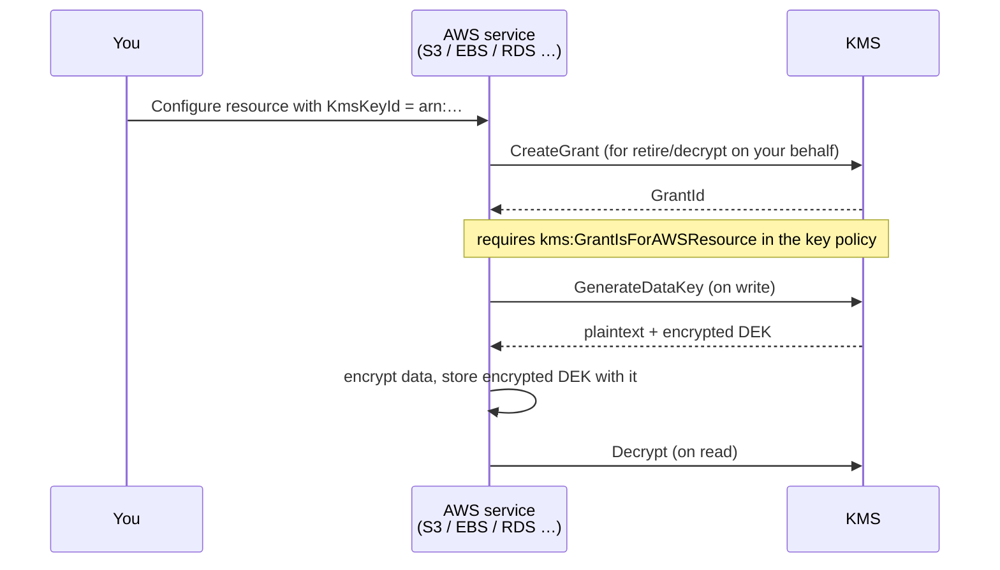

# Wiring CMKs into AWS Services
{: .no_toc }

Every integration follows the same shape: point the service at a key ARN, make
sure the key policy allows that service to use it, and confirm the service
actually created its grant.
{: .fs-5 .fw-300 }

## On this page
{: .no_toc .text-delta }

1. TOC
{:toc}

---

## The universal pattern



If an integration fails, the diagnosis order is almost always:

1. Does the key policy allow the **caller's account** (`kms:CallerAccount`)?
2. Does it allow the **service** (`kms:ViaService`)?
3. Does it allow **grant creation** (`kms:GrantIsForAWSResource`)?
4. Does the caller's **IAM policy** allow the KMS action too?
5. Is the key in the **same Region** as the resource?

## Amazon S3

### Default bucket encryption with a CMK

```bash
BUCKET="prod-customer-documents-444455556666"
KEY_ARN=$(aws kms describe-key --key-id alias/prod/platform/s3-general \
  --query 'KeyMetadata.Arn' --output text)

aws s3api put-bucket-encryption \
  --bucket "$BUCKET" \
  --server-side-encryption-configuration "{
    \"Rules\": [{
      \"ApplyServerSideEncryptionByDefault\": {
        \"SSEAlgorithm\": \"aws:kms\",
        \"KMSMasterKeyID\": \"$KEY_ARN\"
      },
      \"BucketKeyEnabled\": true
    }]
  }"

aws s3api get-bucket-encryption --bucket "$BUCKET"
```

### Force it with a bucket policy

Default encryption applies when the client does not specify anything. To
*require* your CMK, deny everything else:

```json
{
  "Version": "2012-10-17",
  "Statement": [
    {
      "Sid": "DenyUnencryptedObjectUploads",
      "Effect": "Deny",
      "Principal": "*",
      "Action": "s3:PutObject",
      "Resource": "arn:aws:s3:::prod-customer-documents-444455556666/*",
      "Condition": {
        "StringNotEquals": { "s3:x-amz-server-side-encryption": "aws:kms" }
      }
    },
    {
      "Sid": "DenyWrongKey",
      "Effect": "Deny",
      "Principal": "*",
      "Action": "s3:PutObject",
      "Resource": "arn:aws:s3:::prod-customer-documents-444455556666/*",
      "Condition": {
        "StringNotEquals": {
          "s3:x-amz-server-side-encryption-aws-kms-key-id":
            "arn:aws:kms:us-east-1:111122223333:key/1234abcd-12ab-34cd-56ef-1234567890ab"
        }
      }
    },
    {
      "Sid": "DenyInsecureTransport",
      "Effect": "Deny",
      "Principal": "*",
      "Action": "s3:*",
      "Resource": [
        "arn:aws:s3:::prod-customer-documents-444455556666",
        "arn:aws:s3:::prod-customer-documents-444455556666/*"
      ],
      "Condition": { "Bool": { "aws:SecureTransport": "false" } }
    }
  ]
}
```

{: .important }
> **S3 Bucket Keys are effectively mandatory at scale.** Without them, S3 calls
> `GenerateDataKey` once *per object*. A bucket receiving 10 million objects a
> month generates 10 million KMS requests. With `BucketKeyEnabled`, S3 derives
> object keys from a short-lived bucket-level key, cutting KMS requests by up to
> ~99%. The catch: the CloudTrail record then shows the *bucket* ARN in the
> encryption context rather than the object key, which slightly reduces forensic
> granularity. That is nearly always the right trade.

### Terraform

```hcl
resource "aws_s3_bucket" "documents" {
  bucket = "prod-customer-documents-${data.aws_caller_identity.current.account_id}"
}

resource "aws_s3_bucket_server_side_encryption_configuration" "documents" {
  bucket = aws_s3_bucket.documents.id

  rule {
    apply_server_side_encryption_by_default {
      sse_algorithm     = "aws:kms"
      kms_master_key_id = data.aws_ssm_parameter.s3_key_arn.value
    }
    bucket_key_enabled = true
  }
}

data "aws_ssm_parameter" "s3_key_arn" {
  name = "/keymgmt/prod/s3-general/arn"
}
```

## Amazon EBS

### Set an account-wide default

```bash
KEY_ARN=$(aws kms describe-key --key-id alias/prod/platform/ebs-default \
  --query 'KeyMetadata.Arn' --output text)

# Every new volume in this Region gets encrypted by default
aws ec2 enable-ebs-encryption-by-default
aws ec2 modify-ebs-default-kms-key-id --kms-key-id "$KEY_ARN"

aws ec2 get-ebs-default-kms-key-id
aws ec2 get-ebs-encryption-by-default
```

{: .warning }
> **`enable-ebs-encryption-by-default` is per-Region and per-account.** Setting it
> in `us-east-1` does nothing for `us-west-2`. Loop over every Region you operate
> in, and add it to your account-baseline automation so new Regions are covered
> the day they are opened.

```bash
for R in us-east-1 us-west-2 eu-west-1 ap-southeast-2; do
  aws ec2 enable-ebs-encryption-by-default --region "$R" >/dev/null
  echo "$R: $(aws ec2 get-ebs-encryption-by-default --region "$R" \
    --query EbsEncryptionByDefault --output text)"
done
```

### Encrypt an existing unencrypted volume

There is no in-place conversion. The procedure is snapshot → copy with
encryption → create volume → swap.

```bash
VOL_ID="vol-0123456789abcdef0"
KEY_ARN=$(aws kms describe-key --key-id alias/prod/platform/ebs-default \
  --query 'KeyMetadata.Arn' --output text)

SNAP=$(aws ec2 create-snapshot --volume-id "$VOL_ID" \
  --description "pre-encryption snapshot of $VOL_ID" \
  --query SnapshotId --output text)
aws ec2 wait snapshot-completed --snapshot-ids "$SNAP"

ENC_SNAP=$(aws ec2 copy-snapshot \
  --source-region us-east-1 --source-snapshot-id "$SNAP" \
  --encrypted --kms-key-id "$KEY_ARN" \
  --description "encrypted copy of $SNAP" \
  --query SnapshotId --output text)
aws ec2 wait snapshot-completed --snapshot-ids "$ENC_SNAP"

NEW_VOL=$(aws ec2 create-volume \
  --snapshot-id "$ENC_SNAP" \
  --availability-zone us-east-1a \
  --volume-type gp3 \
  --query VolumeId --output text)

echo "Stop the instance, detach $VOL_ID, attach $NEW_VOL at the same device name."
```

## Amazon RDS

```bash
KEY_ARN=$(aws kms describe-key --key-id alias/prod/data/rds-primary \
  --query 'KeyMetadata.Arn' --output text)

aws rds create-db-instance \
  --db-instance-identifier prod-orders \
  --db-instance-class db.r6g.xlarge \
  --engine postgres \
  --engine-version 16.3 \
  --allocated-storage 200 \
  --master-username dbadmin \
  --manage-master-user-password \
  --master-user-secret-kms-key-id "$KEY_ARN" \
  --storage-encrypted \
  --kms-key-id "$KEY_ARN" \
  --backup-retention-period 30 \
  --enable-performance-insights \
  --performance-insights-kms-key-id "$KEY_ARN" \
  --no-publicly-accessible
```

{: .warning }
> **RDS storage encryption cannot be enabled on an existing unencrypted
> instance.** The only path is: snapshot → copy snapshot with `--kms-key-id` →
> restore to a new instance → cut over. Plan the downtime. This is the single
> most common "we'll encrypt it later" trap in AWS, and "later" means a
> maintenance window and a DNS change.

Note the three separate key parameters above — RDS encrypts storage,
Performance Insights data, and the managed master-user secret independently. All
three should point at a CMK; leaving any of them unset falls back to an AWS
managed key.

## AWS Secrets Manager

```bash
aws secretsmanager create-secret \
  --name prod/payments/stripe-api-key \
  --description "Stripe live secret key for the payments service" \
  --kms-key-id alias/prod/secrets/app-secrets \
  --secret-string '{"api_key":"sk_live_REPLACE_ME"}' \
  --tags Key=Environment,Value=prod Key=Owner,Value=payments@yourcompany.com

# Automatic rotation via a Lambda rotation function
aws secretsmanager rotate-secret \
  --secret-id prod/payments/stripe-api-key \
  --rotation-lambda-arn arn:aws:lambda:us-east-1:444455556666:function:rotate-stripe-key \
  --rotation-rules "AutomaticallyAfterDays=30"
```

The equivalent for Parameter Store:

```bash
aws ssm put-parameter \
  --name /prod/payments/webhook-secret \
  --type SecureString \
  --key-id alias/prod/secrets/app-secrets \
  --value "whsec_REPLACE_ME" \
  --tier Advanced
```

## Amazon DynamoDB

```bash
aws dynamodb create-table \
  --table-name prod-cardholders \
  --attribute-definitions AttributeName=pk,AttributeType=S \
  --key-schema AttributeName=pk,KeyType=HASH \
  --billing-mode PAY_PER_REQUEST \
  --sse-specification Enabled=true,SSEType=KMS,KMSMasterKeyId=alias/prod/payments/pci-chd
```

{: .tip }
> DynamoDB's server-side encryption protects data at rest on AWS's disks. It does
> **not** protect individual attribute values from a principal that can read the
> table. For field-level protection — so that a `Scan` returns ciphertext even to
> an authorized reader — use the **DynamoDB Encryption Client**, which applies
> the envelope pattern per item. That is the control PCI DSS expects for stored
> PAN.

## Other integrations, briefly

| Service | Parameter | Notes |
|:--|:--|:--|
| **EFS** | `--kms-key-id` on `create-file-system` | Set at creation only |
| **FSx** | `--kms-key-id` on `create-file-system` | Set at creation only |
| **Lambda** | `--kms-key-arn` on `create-function` | Encrypts environment variables at rest |
| **SNS** | `KmsMasterKeyId` topic attribute | Encrypts messages at rest in the topic |
| **SQS** | `KmsMasterKeyId` + `KmsDataKeyReusePeriodSeconds` | The reuse period is a cost lever, 60–86,400 s |
| **CloudWatch Logs** | `associate-kms-key --log-group-name` | Retroactively encrypts new events only |
| **EKS** | `encryptionConfig` on the cluster | Envelope-encrypts Kubernetes Secrets in etcd |
| **ECR** | `--encryption-configuration` on `create-repository` | Set at creation only |
| **Redshift** | `--kms-key-id` on `create-cluster` | Can be enabled on an existing cluster (resize) |
| **Kinesis** | `--encryption-type KMS --key-id` | Per-stream |
| **Systems Manager** | `--key-id` on SecureString parameters | Advanced tier for larger values |

```bash
# CloudWatch Logs — encrypt an existing log group
aws logs associate-kms-key \
  --log-group-name /aws/lambda/payment-processor \
  --kms-key-id "arn:aws:kms:us-east-1:111122223333:key/1234abcd-…"

# EKS secrets envelope encryption (cluster creation)
aws eks create-cluster \
  --name prod-platform \
  --role-arn arn:aws:iam::444455556666:role/eks-cluster-role \
  --resources-vpc-config subnetIds=subnet-aaa,subnet-bbb \
  --encryption-config '[{"provider":{"keyArn":"arn:aws:kms:us-east-1:111122223333:key/1234abcd-…"},"resources":["secrets"]}]'

# SQS — encrypt a queue and set a 5-minute data key reuse window
aws sqs set-queue-attributes \
  --queue-url https://sqs.us-east-1.amazonaws.com/444455556666/payments \
  --attributes KmsMasterKeyId=alias/prod/platform/s3-general,KmsDataKeyReusePeriodSeconds=300
```

{: .note }
> **`KmsDataKeyReusePeriodSeconds` is the SQS equivalent of an S3 Bucket Key.**
> At the 60-second minimum, a busy queue generates a KMS call every minute per
> producer/consumer pair. At 86,400 it generates roughly one a day. The security
> difference is how long one data key protects messages; the cost difference can
> be three orders of magnitude.

## Verifying an integration actually used your key

Do not trust the configuration API — check the grant and the CloudTrail record.

```bash
# 1. The service should have created a grant
aws kms list-grants --key-id alias/prod/data/rds-primary \
  --query 'Grants[].{Grantee:GranteePrincipal,Service:GranteePrincipal,Ops:Operations,Name:Name}' \
  --output table

# 2. The resource should report the CMK, not an AWS managed key
aws rds describe-db-instances --db-instance-identifier prod-orders \
  --query 'DBInstances[0].{Encrypted:StorageEncrypted,KmsKeyId:KmsKeyId}'

# 3. CloudTrail should show the service calling KMS on your behalf
aws cloudtrail lookup-events \
  --lookup-attributes AttributeKey=ResourceName,AttributeValue=alias/prod/data/rds-primary \
  --max-results 5 \
  --query 'Events[].{Time:EventTime,Name:EventName,User:Username}' \
  --output table
```

If step 2 returns an ARN containing `alias/aws/rds`, the integration fell back to
the AWS managed key — your `--kms-key-id` was ignored or rejected, and you have
no policy control over that key.

---

[Next: 7.3 Rotation](){: .btn .btn-primary }
