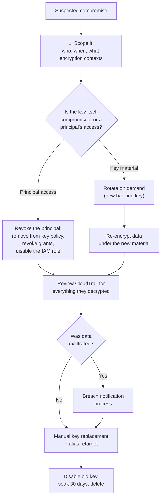

# Verification &amp; Operational Runbook
{: .no_toc }

**Phase 8 — Verify.** Prove the build works, then keep proving it.
{: .fs-5 .fw-300 }

## On this page
{: .no_toc .text-delta }

1. TOC
{:toc}

---

## The acceptance test suite

Run this end to end before declaring the build complete. Every check is
executable; none of them depend on reading a console screen.

```bash
#!/usr/bin/env bash
# scripts/verify_key_management.sh — end-to-end acceptance tests
set -uo pipefail

PASS=0; FAIL=0; SKIP=0
GREEN=$'\033[0;32m'; RED=$'\033[0;31m'; YEL=$'\033[1;33m'; NC=$'\033[0m'

check () {           # check <description> <command...>
  local desc="$1"; shift
  if "$@" >/dev/null 2>&1; then
    printf "  ${GREEN}PASS${NC}  %s\n" "$desc"; PASS=$((PASS+1))
  else
    printf "  ${RED}FAIL${NC}  %s\n" "$desc"; FAIL=$((FAIL+1))
  fi
}

expect_fail () {     # expect_fail <description> <command...>
  local desc="$1"; shift
  if "$@" >/dev/null 2>&1; then
    printf "  ${RED}FAIL${NC}  %s (succeeded but should have been denied)\n" "$desc"
    FAIL=$((FAIL+1))
  else
    printf "  ${GREEN}PASS${NC}  %s\n" "$desc"; PASS=$((PASS+1))
  fi
}

section () { printf "\n${YEL}== %s ==${NC}\n" "$1"; }

# ---------------------------------------------------------------------------
section "1. Identity and separation of duties"
# ---------------------------------------------------------------------------
check "caller identity resolves" aws sts get-caller-identity
check "key admin can list keys"  aws kms list-keys --max-items 1
expect_fail "key admin CANNOT decrypt" \
  aws kms decrypt --ciphertext-blob fileb:///dev/null

# ---------------------------------------------------------------------------
section "2. Key existence and configuration"
# ---------------------------------------------------------------------------
for ALIAS in prod/platform/s3-general prod/platform/ebs-default \
             prod/data/rds-primary prod/secrets/app-secrets; do
  check "alias/$ALIAS exists" aws kms describe-key --key-id "alias/$ALIAS"

  STATE=$(aws kms describe-key --key-id "alias/$ALIAS" \
    --query 'KeyMetadata.KeyState' --output text 2>/dev/null || echo MISSING)
  if [ "$STATE" = "Enabled" ]; then
    printf "  ${GREEN}PASS${NC}  alias/%s is Enabled\n" "$ALIAS"; PASS=$((PASS+1))
  else
    printf "  ${RED}FAIL${NC}  alias/%s state is %s\n" "$ALIAS" "$STATE"; FAIL=$((FAIL+1))
  fi

  ROT=$(aws kms get-key-rotation-status --key-id "alias/$ALIAS" \
    --query KeyRotationEnabled --output text 2>/dev/null || echo n/a)
  if [ "$ROT" = "True" ]; then
    printf "  ${GREEN}PASS${NC}  alias/%s rotation enabled\n" "$ALIAS"; PASS=$((PASS+1))
  elif [ "$ROT" = "n/a" ]; then
    printf "  ${YEL}SKIP${NC}  alias/%s rotation not applicable\n" "$ALIAS"; SKIP=$((SKIP+1))
  else
    printf "  ${RED}FAIL${NC}  alias/%s rotation DISABLED\n" "$ALIAS"; FAIL=$((FAIL+1))
  fi
done

# ---------------------------------------------------------------------------
section "3. Cryptographic round trips"
# ---------------------------------------------------------------------------
roundtrip () {
  local alias="$1" region="${2:-us-east-1}" dst="${3:-$2}"
  local ct pt
  ct=$(aws kms encrypt --region "$region" --key-id "alias/$alias" \
        --plaintext "$(echo -n verify-canary | base64)" \
        --encryption-context purpose=verify \
        --query CiphertextBlob --output text 2>/dev/null) || return 1
  echo "$ct" | base64 -d > /tmp/verify.bin
  pt=$(aws kms decrypt --region "${dst:-$region}" \
        --ciphertext-blob fileb:///tmp/verify.bin \
        --encryption-context purpose=verify \
        --query Plaintext --output text 2>/dev/null | base64 -d) || return 1
  rm -f /tmp/verify.bin
  [ "$pt" = "verify-canary" ]
}

check "s3-general round trip"        roundtrip prod/platform/s3-general
check "rds-primary round trip"       roundtrip prod/data/rds-primary
check "MRK cross-Region round trip"  roundtrip prod/data/rds-primary us-east-1 us-west-2

# Encryption context must be binding
ctx_must_bind () {
  local ct
  ct=$(aws kms encrypt --key-id alias/prod/platform/s3-general \
        --plaintext "$(echo -n ctx-test | base64)" \
        --encryption-context tenant=alpha \
        --query CiphertextBlob --output text)
  echo "$ct" | base64 -d > /tmp/ctx.bin
  ! aws kms decrypt --ciphertext-blob fileb:///tmp/ctx.bin \
      --encryption-context tenant=beta >/dev/null 2>&1
}
check "encryption context is binding" ctx_must_bind
rm -f /tmp/ctx.bin

# ---------------------------------------------------------------------------
section "4. Service integrations"
# ---------------------------------------------------------------------------
s3_uses_cmk () {
  local b="$1"
  aws s3api get-bucket-encryption --bucket "$b" \
    --query 'ServerSideEncryptionConfiguration.Rules[0].ApplyServerSideEncryptionByDefault.SSEAlgorithm' \
    --output text 2>/dev/null | grep -q 'aws:kms'
}
check "S3 bucket default encryption uses KMS" \
  s3_uses_cmk prod-customer-documents-444455556666

check "EBS encryption by default is on" \
  bash -c '[ "$(aws ec2 get-ebs-encryption-by-default --query EbsEncryptionByDefault --output text)" = "True" ]'

check "EBS default key is a CMK, not aws/ebs" \
  bash -c 'aws ec2 get-ebs-default-kms-key-id --query KmsKeyId --output text | grep -qv "alias/aws/ebs"'

# ---------------------------------------------------------------------------
section "5. Logging and monitoring"
# ---------------------------------------------------------------------------
check "organization trail is logging" \
  bash -c '[ "$(aws cloudtrail get-trail-status --name org-management-trail --query IsLogging --output text)" = "True" ]'

check "log file validation is enabled" \
  bash -c '[ "$(aws cloudtrail describe-trails --trail-name-list org-management-trail --query "trailList[0].LogFileValidationEnabled" --output text)" = "True" ]'

check "critical SNS topic exists" \
  bash -c 'aws sns list-topics --query "Topics[?contains(TopicArn,\`keymgmt-critical\`)]" --output text | grep -q keymgmt'

check "deletion EventBridge rule is enabled" \
  bash -c '[ "$(aws events describe-rule --name kms-destructive-operations --query State --output text)" = "ENABLED" ]'

# ---------------------------------------------------------------------------
section "6. CloudHSM (skipped if no cluster)"
# ---------------------------------------------------------------------------
CLUSTER=$(aws cloudhsmv2 describe-clusters \
  --query 'Clusters[0].ClusterId' --output text 2>/dev/null || echo None)

if [ "$CLUSTER" != "None" ] && [ -n "$CLUSTER" ]; then
  check "cluster is ACTIVE" \
    bash -c "[ \"\$(aws cloudhsmv2 describe-clusters --filters clusterIds=$CLUSTER --query 'Clusters[0].State' --output text)\" = 'ACTIVE' ]"
  check "cluster has >= 2 ACTIVE HSMs" \
    bash -c "[ \"\$(aws cloudhsmv2 describe-clusters --filters clusterIds=$CLUSTER --query 'length(Clusters[0].Hsms[?State==\`ACTIVE\`])' --output text)\" -ge 2 ]"
  check "HSMs span >= 2 AZs" \
    bash -c "[ \"\$(aws cloudhsmv2 describe-clusters --filters clusterIds=$CLUSTER --query 'Clusters[0].Hsms[].AvailabilityZone' --output text | tr '\t' '\n' | sort -u | wc -l)\" -ge 2 ]"
  check "a READY backup exists" \
    bash -c "aws cloudhsmv2 describe-backups --filters clusterIds=$CLUSTER --query 'Backups[?BackupState==\`READY\`]' --output text | grep -q backup-"

  CKS=$(aws kms describe-custom-key-stores \
    --query 'CustomKeyStores[0].CustomKeyStoreId' --output text 2>/dev/null || echo None)
  if [ "$CKS" != "None" ] && [ -n "$CKS" ]; then
    check "custom key store is CONNECTED" \
      bash -c "[ \"\$(aws kms describe-custom-key-stores --custom-key-store-id $CKS --query 'CustomKeyStores[0].ConnectionState' --output text)\" = 'CONNECTED' ]"
    check "HSM-backed key round trip" roundtrip prod/payments/pci-chd
  else
    printf "  ${YEL}SKIP${NC}  no custom key store configured\n"; SKIP=$((SKIP+1))
  fi
else
  printf "  ${YEL}SKIP${NC}  no CloudHSM cluster in this account/Region\n"; SKIP=$((SKIP+1))
fi

# ---------------------------------------------------------------------------
section "7. Guardrails"
# ---------------------------------------------------------------------------
check "SCPs are attached to the Workloads OU" \
  bash -c 'aws organizations list-policies --filter SERVICE_CONTROL_POLICY --query "Policies[?Name==\`deny-key-deletion\`]" --output text | grep -q deny'

check "rotation Config rule is COMPLIANT" \
  bash -c '[ "$(aws configservice describe-compliance-by-config-rule --config-rule-names cmk-backing-key-rotation-enabled --query "ComplianceByConfigRules[0].Compliance.ComplianceType" --output text)" = "COMPLIANT" ]'

check "no KMS keys are pending deletion" \
  bash -c '! aws kms list-keys --query "Keys[].KeyId" --output text | tr "\t" "\n" | while read -r k; do aws kms describe-key --key-id "$k" --query "KeyMetadata.KeyState" --output text 2>/dev/null; done | grep -q PendingDeletion'

# ---------------------------------------------------------------------------
printf "\n%s\n" "-----------------------------------------------"
printf "  ${GREEN}PASS: %d${NC}   ${RED}FAIL: %d${NC}   ${YEL}SKIP: %d${NC}\n" "$PASS" "$FAIL" "$SKIP"
printf "%s\n" "-----------------------------------------------"
[ "$FAIL" -eq 0 ] || exit 1
```

```bash
chmod +x scripts/verify_key_management.sh
./scripts/verify_key_management.sh
```

```text
== 1. Identity and separation of duties ==
  PASS  caller identity resolves
  PASS  key admin can list keys
  PASS  key admin CANNOT decrypt

== 2. Key existence and configuration ==
  PASS  alias/prod/platform/s3-general exists
  PASS  alias/prod/platform/s3-general is Enabled
  PASS  alias/prod/platform/s3-general rotation enabled
  ...

== 3. Cryptographic round trips ==
  PASS  s3-general round trip
  PASS  rds-primary round trip
  PASS  MRK cross-Region round trip
  PASS  encryption context is binding
  ...

-----------------------------------------------
  PASS: 31   FAIL: 0   SKIP: 2
-----------------------------------------------
```

## The dependency map

Before you can safely disable, rotate, or delete a key, you must know what
depends on it. Build this map now, not during the incident.

```bash
#!/usr/bin/env bash
# scripts/key_dependency_map.sh — what breaks if this key goes away?
set -euo pipefail
KEY_ALIAS="${1:?usage: key_dependency_map.sh alias/prod/platform/s3-general}"

KEY_ARN=$(aws kms describe-key --key-id "$KEY_ALIAS" \
  --query 'KeyMetadata.Arn' --output text)
echo "Dependencies on $KEY_ALIAS"
echo "  ($KEY_ARN)"
echo

echo "-- S3 buckets --------------------------------------------------------"
aws s3api list-buckets --query 'Buckets[].Name' --output text | tr '\t' '\n' \
| while read -r B; do
    K=$(aws s3api get-bucket-encryption --bucket "$B" 2>/dev/null \
      | jq -r '.ServerSideEncryptionConfiguration.Rules[0].ApplyServerSideEncryptionByDefault.KMSMasterKeyID // empty')
    [ "$K" = "$KEY_ARN" ] && echo "  s3://$B"
  done

echo "-- EBS volumes -------------------------------------------------------"
aws ec2 describe-volumes --filters "Name=encrypted,Values=true" \
  --query "Volumes[?KmsKeyId=='$KEY_ARN'].[VolumeId,Attachments[0].InstanceId]" \
  --output text | sed 's/^/  /'

echo "-- RDS instances -----------------------------------------------------"
aws rds describe-db-instances \
  --query "DBInstances[?KmsKeyId=='$KEY_ARN'].[DBInstanceIdentifier,Engine]" \
  --output text | sed 's/^/  /'

echo "-- Secrets Manager ---------------------------------------------------"
aws secretsmanager list-secrets \
  --query "SecretList[?KmsKeyId=='$KEY_ARN'].Name" --output text \
  | tr '\t' '\n' | sed 's/^/  /'

echo "-- DynamoDB tables ---------------------------------------------------"
aws dynamodb list-tables --query 'TableNames[]' --output text | tr '\t' '\n' \
| while read -r T; do
    K=$(aws dynamodb describe-table --table-name "$T" \
      --query 'Table.SSEDescription.KMSMasterKeyArn' --output text 2>/dev/null)
    [ "$K" = "$KEY_ARN" ] && echo "  $T"
  done

echo "-- CloudWatch log groups ---------------------------------------------"
aws logs describe-log-groups \
  --query "logGroups[?kmsKeyId=='$KEY_ARN'].logGroupName" --output text \
  | tr '\t' '\n' | sed 's/^/  /'

echo "-- Active grants -----------------------------------------------------"
aws kms list-grants --key-id "$KEY_ARN" \
  --query 'Grants[].{Grantee:GranteePrincipal,Ops:Operations}' --output text \
  | sed 's/^/  /'

echo "-- Principals that used it in the last 30 days -----------------------"
echo "  (run the Athena query in the Logging & SIEM section)"
```

{: .important }
> **This script covers configuration, not usage.** An application doing envelope
> encryption with `GenerateDataKey` will not appear anywhere in it — the only
> record of that dependency is CloudTrail. Always run both the configuration scan
> *and* the 90-day CloudTrail usage query before touching a production key.

## Incident runbooks

### Suspected key compromise



```bash
# --- Containment: fastest first ---------------------------------------------

# Option A — revoke one principal (surgical, no outage for others)
aws kms list-grants --key-id alias/prod/payments/pci-chd \
  --query "Grants[?GranteePrincipal=='arn:aws:iam::444455556666:role/compromised'].GrantId" \
  --output text | tr '\t' '\n' | while read -r G; do
    aws kms revoke-grant --key-id alias/prod/payments/pci-chd --grant-id "$G"
  done

# Option B — rotate the backing key immediately (no outage; new writes only)
aws kms rotate-key-on-demand --key-id alias/prod/payments/pci-chd

# Option C — disable the key (TOTAL OUTAGE for everything using it)
aws kms disable-key --key-id alias/prod/payments/pci-chd

# --- Investigation ----------------------------------------------------------
aws cloudtrail lookup-events \
  --lookup-attributes AttributeKey=ResourceName,AttributeValue=alias/prod/payments/pci-chd \
  --start-time "$(date -u -d '30 days ago' +%Y-%m-%dT%H:%M:%SZ)" \
  --query 'Events[].{Time:EventTime,Name:EventName,User:Username,Source:CloudTrailEvent}' \
  --output json > /tmp/incident-events.json

jq -r '.[] | select(.Name=="Decrypt") | .Source | fromjson
       | [.eventTime, .userIdentity.arn, .sourceIPAddress,
          (.requestParameters.encryptionContext | tostring)] | @tsv' \
  /tmp/incident-events.json | sort | uniq -c | sort -rn | head -50
```

{: .warning }
> **Choose containment option B or C deliberately.** `rotate-key-on-demand` adds
> new key material without breaking anything — but does **not** invalidate the
> attacker's ability to decrypt existing ciphertext, because the old backing key
> is retained. `disable-key` stops them immediately and stops you too. If the
> attacker has ongoing access to a principal that can decrypt, only `disable-key`
> or revoking that principal actually contains the incident.

### Custom key store disconnected

```bash
# 1. Why?
aws kms describe-custom-key-stores --custom-key-store-id "$CKS_ID" \
  --query 'CustomKeyStores[0].{State:ConnectionState,Error:ConnectionErrorCode}'

# 2. Cluster health
aws cloudhsmv2 describe-clusters --filters clusterIds="$CLUSTER_ID" \
  --query 'Clusters[0].{State:State,HSMs:Hsms[].{Id:HsmId,AZ:AvailabilityZone,State:State}}'

# 3. Common fixes by error code
#    INSUFFICIENT_CLOUDHSM_HSMS -> add an HSM
aws cloudhsmv2 create-hsm --cluster-id "$CLUSTER_ID" --availability-zone us-east-1c

#    INVALID_CREDENTIALS / USER_LOCKED_OUT -> reset kmsuser, update, reconnect
#    (see 8.5 "Rotating the kmsuser password")

# 4. Reconnect and wait
aws kms connect-custom-key-store --custom-key-store-id "$CKS_ID"
```

### Key accidentally scheduled for deletion

```bash
# Move fast — but the window gives you 7-30 days
aws kms cancel-key-deletion --key-id "$KEY_ARN"
aws kms enable-key --key-id "$KEY_ARN"        # cancel leaves it Disabled!

# Verify it works again
./scripts/verify_key_management.sh

# Then find out who and why
aws cloudtrail lookup-events \
  --lookup-attributes AttributeKey=EventName,AttributeValue=ScheduleKeyDeletion \
  --start-time "$(date -u -d '7 days ago' +%Y-%m-%dT%H:%M:%SZ)" \
  --query 'Events[].{Time:EventTime,User:Username,Event:CloudTrailEvent}' --output json \
  | jq -r '.[] | [.Time, .User, (.Event | fromjson | .sourceIPAddress)] | @tsv'
```

## Operational cadence

| Frequency | Task | Command / artifact |
|:--|:--|:--|
| Every 5 min | KMS canary round trip | Lambda from [Monitoring]() |
| Every 5 min | Custom key store connection check | `scripts/check_cks.sh` |
| Hourly | CloudHSM cluster health | CloudWatch alarm |
| Daily | Terraform drift detection | GitHub Actions workflow |
| Daily | KMS configuration backup | `scripts/backup_kms_config.sh` |
| Weekly | Rotation compliance report | `scripts/rotate_report.sh` |
| Weekly | Config non-compliance review | `describe-compliance-by-config-rule` |
| Monthly | CloudTrail integrity validation | `aws cloudtrail validate-logs` |
| Monthly | Unused-key report | Athena query |
| Quarterly | Key access review, including grants | [Access review checklist](#access-review-checklist) |
| Quarterly | Evidence pack for the auditor | `scripts/collect_audit_evidence.sh` |
| Semi-annually | CloudHSM credential rotation | [8.3]() |
| Annually | DR restore exercise, RTO recorded | [Backup &amp; DR]() |
| Annually | Trust anchor CA expiry review | `openssl x509 -enddate` |
| Annually | Cryptoperiod and policy review | Key management policy document |

## Final acceptance checklist

| # | Criterion | Verified by |
|:--|:--|:--|
| 1 | Key administrators cannot perform cryptographic operations | `verify_key_management.sh` §1 |
| 2 | Every production key exists, is enabled, and rotates | §2 |
| 3 | Encrypt/decrypt round trips succeed in every Region | §3 |
| 4 | Encryption context is cryptographically binding | §3 |
| 5 | Multi-Region keys decrypt cross-Region | §3 |
| 6 | Service integrations use CMKs, not AWS managed keys | §4 |
| 7 | CloudTrail is logging with validation enabled | §5 |
| 8 | Alarms exist and route to a pager | §5 |
| 9 | CloudHSM cluster is ACTIVE with ≥ 2 HSMs in ≥ 2 AZs | §6 |
| 10 | Custom key store is CONNECTED and its keys work | §6 |
| 11 | SCPs are attached and Config rules are compliant | §7 |
| 12 | No key is unexpectedly pending deletion | §7 |
| 13 | The dependency map has been produced for every production key | `key_dependency_map.sh` |
| 14 | A DR restore has been performed and the RTO recorded | DR test record |
| 15 | The evidence pack generates cleanly | `collect_audit_evidence.sh` |

---

[Next: Cost Model](){: .btn .btn-primary }
