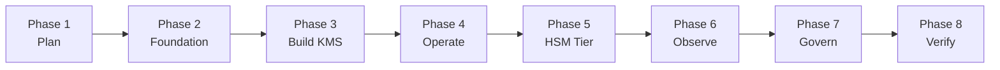

# AWS KMS &amp; CloudHSM — Key Management Deployment Guide
{: .fs-9 }

A sequential, command-level walkthrough for standing up cryptographic key
management on AWS from an empty account through to a governed, monitored,
HSM-backed production service — with the exact commands, the Console click-paths,
the Terraform and CloudFormation to codify it, and an explanation of *what each
step actually does* and *why it matters*.
{: .fs-6 .fw-300 }

[Start with the Overview](){: .btn .btn-primary .fs-5 .mb-4 .mb-md-0 .mr-2 }
[Jump to Account Setup](){: .btn .fs-5 .mb-4 .mb-md-0 }

---

## Who this guide is for

Security engineers, platform teams, cloud architects, and GRC practitioners who
need to design and build a key management capability on AWS — not just create a
key, but decide **which** key service to use, **who** is allowed to use it,
**how** it is provisioned repeatably, **where** its usage is logged, and **how**
it is proven compliant.

It assumes comfort with a terminal and general AWS concepts (IAM, VPC, regions).
It explains the KMS- and CloudHSM-specific pieces in full.

## What you'll accomplish

By the end of this guide you will have:

1. A **planned key hierarchy** with a documented decision for KMS vs. CloudHSM
   vs. a custom key store vs. an external key store.
2. An **account and identity foundation** — AWS Organizations, IAM Identity
   Center, and a dedicated security/key-management account.
3. **Customer managed keys** created six different ways — Console, AWS CLI,
   Terraform, CloudFormation, the Python SDK (boto3), and a CI/CD pipeline.
4. **Key policies and grants** that enforce least privilege and separation of
   duties between key administrators and key users.
5. **Envelope encryption** implemented in application code, plus CMK-backed
   encryption wired into S3, EBS, RDS, Secrets Manager, and DynamoDB.
6. A **CloudHSM cluster**, initialized through the full trust-anchor signing
   ceremony, with users, keys, and PKCS#11/JCE/OpenSSL application integration.
7. A **KMS custom key store** backed by that CloudHSM cluster, and the design for
   an **external key store (XKS)** for hold-your-own-key scenarios.
8. **Rotation, import (BYOK), multi-Region replication, backup, and deletion**
   procedures for the full key lifecycle.
9. **Audit logging into a SIEM**, CloudWatch alarms, and Athena queries over
   CloudTrail for key-usage forensics.
10. **Preventative and detective guardrails** as code — SCPs, AWS Config rules,
    and OPA/Conftest policy in CI — mapped to NIST 800-53, ISO 27001, SOC 2, and
    PCI DSS.

## How to read this guide

The guide is **sequential**. Each phase builds on the one before it, and the
"Where you are" banner at the top of each page shows your position in the
overall sequence.

| Phase | Section | What it covers |
|:--|:--|:--|
| 1 | [Overview]() | The AWS key management service landscape and how to choose between the options |
| 1 | [Architecture &amp; Key Hierarchy]() | Root of trust, envelope encryption, the KEK/DEK model, and reference topologies |
| 2 | [Account Setup]() | **Account creation and service enablement** — Organizations, IAM Identity Center, security account |
| 2 | [Toolchain Setup]() | AWS CLI v2, SSO login, Terraform, CloudFormation, boto3, and the repo layout |
| 3 | [Creating Keys]() | The same CMK built six ways: Console, CLI, Terraform, CloudFormation, SDK, CI/CD |
| 3 | [Key Policies &amp; Access Control]() | Key policies, IAM policies, grants, condition keys, and separation of duties |
| 4 | [Key Operations]() | Envelope encryption, service integrations, rotation, import, multi-Region |
| 5 | [CloudHSM &amp; HSM-Backed Tiers]() | Cluster provisioning, the initialization ceremony, users, apps, custom key stores, XKS |
| 4 | [Backup, DR &amp; Deletion]() | Resilience, recovery, key deletion, and the irreversibility problem |
| 6 | [Logging &amp; SIEM]() | CloudTrail, log sinks, Athena forensics, Splunk/OpenSearch integration |
| 6 | [Monitoring &amp; Alerting]() | CloudWatch metrics, alarms, EventBridge rules, and the on-call runbook |
| 7 | [CI/CD Automation]() | GitHub Actions with OIDC federation, plan/apply gates, and drift detection |
| 7 | [Policy as Code]() | SCPs, AWS Config rules, Checkov, and OPA/Conftest guardrails |
| 7 | [Governance &amp; Compliance]() | FIPS posture and control mappings to NIST, ISO 27001, SOC 2, PCI DSS |
| 8 | [Verification &amp; Runbook]() | End-to-end acceptance tests proving the build actually works |
| — | [Cost Model]() | What each component costs and how the bill is shaped |
| — | [Sources]() | Official AWS documentation for every claim in this guide |

{: .warning }
> **Cloud services change fast.** Commands, API shapes, Console navigation, and
> pricing in this guide reflect publicly documented behavior at the time of
> writing. Treat every command as a *template* — verify against the
> [official AWS documentation]() for your Region and
> account before running anything in production.

{: .important }
> **Some steps cannot be automated.** Creating an AWS account, accepting an
> Organizations invitation, signing a CloudHSM cluster CSR with your own offline
> CA, and holding quorum key ceremonies are inherently human steps. They are
> marked throughout with an **Account / Portal step** callout so you can plan for
> them in a change window.

## Companion guides

This is one of three parallel guides covering cloud-native key management:

- **AWS KMS &amp; CloudHSM** — this guide
- [Azure Key Vault &amp; Managed HSM](https://steven-smith-itnet.github.io/azure-key-vault-managed-hsm-key-management-guide/)
- [Google Cloud KMS &amp; Cloud HSM](https://steven-smith-itnet.github.io/gcp-cloud-kms-hsm-key-management-guide/)

They share a structure deliberately, so the same concept can be compared across
providers.
